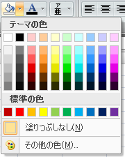
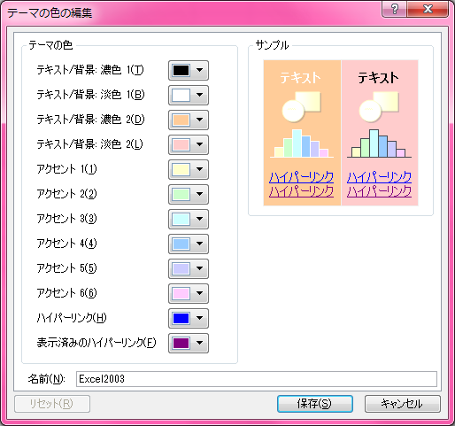

表題のとおり。

こんな感じの配色をカラーパレットに置くまでの手順。Excel 2007・Excel 2010 で試した。

## 配色を作る

「ページ レイアウト」リボンメニュー → 「配色」 → 「新しい配色パターンの作成」に進む。

上の画像のように、薄い7色を以下のように設定する。

| テーマの色            | 選択する色 |
|-----------------------|------------|
| テキスト/背景: 濃色 2 | オレンジ   |
| テキスト/背景: 淡色 2 | 赤         |
| アクセント 1          | 黄色       |
| アクセント 2          | 黄緑       |
| アクセント 3          | 水色       |
| アクセント 4          | 薄青       |
| アクセント 5          | 薄紫       |
| アクセント 6          | ピンク     |

- 選択する薄い色は、「色の設定」の「標準」タブに表示されるハニカムの集合体みたいな所から、中央に近い所から選ぶ。画像を見ながら適当に選んでください。
- ポイントは「赤」と「オレンジ」を、ココでの並び順としては逆にすること (赤→オレンジ、と並べたいが、オレンジ→赤、とする)。

## 配色を指定したブックをテンプレートにする

新規ブックを開き、作成した配色を選択したら、「名前を付けて保存」ダイアログを開き、「ファイルの種類」より「Excel テンプレート」を選択する。

保存先フォルダを `%ProgramFiles%\Microsoft Office\Office14\XLSTART\` にし、`Book.xltx` という名前で保存する。

Excel を一度閉じ、再度開くと、先ほど保存したテンプレートブックの状態で新規ブックが開かれるので、カラーパレットが淡い配色になった状態で、新規ブックを作れる。

## 参考

- [Excel 2007 で Excel 2003 のカラーを使用する方法: ある SE のつぶやき](http://fnya.cocolog-nifty.com/blog/2009/02/excel-2007-exce.html)
- [Excelのちょい効き!ワザ - 新規作成されるファイルの書式をいろいろとカスタマイズするには | マイナビニュース](http://news.mynavi.jp/articles/2012/08/17/exceltips/)
