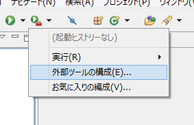

今まで Eclipse の GUI 上から「プロジェクト設定に従い WAR ファイルを作成する」を選択して WAR を作っていて、ンー気持ち悪いな！と思い、でも新たなツールも導入できない劣悪な環境なので、その場に転がっていた Ant を使うことにした。

**Ant** は Java のビルドツール。`build.xml` という XML ファイルに、コンパイルしろやらファイルをコピーしろやら WAR ファイルを作れやら処理を書いてあげれば、以降はその設定ファイルを使って自動でビルドできる、というモノ。今は Maven というもっと便利なツールがあって、ビルド以外のこともできるし、ビルドもサクッとできちゃう便利ヤーツ。残念ながら Ant しかないので Ant を頑張って書く！Ant のインストール等は今回は触れない。

さて、この Ant を Eclipse 上から `Alt + Shift + X → Q` で実行すると、コンソールに結果が表示されるのだが、`echo` 要素で書いた日本語のメッセージが出力されない。

サンプルソースは以下 (`build.xml`)。

```xml
<?xml version="1.0" encoding="UTF-8"?>
<project name="testProject" default="all" basedir=".">
  <target name="all">
    <echo message="日本語で Echo を出力"/>
  </target>
</project>
```

この「日本語で Echo を出力」というメッセージがコンソールに全く出てこない。

調べてみると、ちょうど答えがあった。

- 参考：[Eclipse 3.5 のantからコンソールへ日本語表示ができない - @yanaginの日記](http://d.hatena.ne.jp/n593977/20100125/1264417034)

> 解決策としては、「外部ツールの構成」⇒「JRE」で「ランタイムJRE」を「ワークスペースと同じJREで実行」を選択する。

「外部ツールの構成」というのは、右向きの三角「▲」マーク (ビデオの再生マークみたいな) ヤツの右下に茶色いカバンが書いてあるアイコンのメニューから選べる。

↓コレ。(「[Android NDKを使った開発環境の構築 - Yahoo!知恵袋](http://note.chiebukuro.yahoo.co.jp/detail/n136598)」より画像を拝借しました)



これで OK。コンソールが日本語表示になった上に、日本語の Echo メッセージも正しく出力された。
