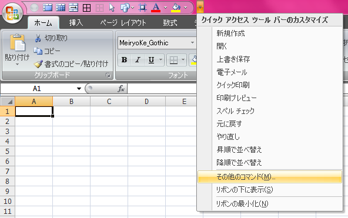
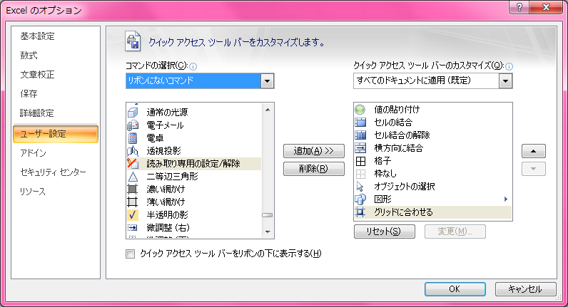

Excel 2003 以前はツールバーの並び順を比較的自由に変えられたが、Excel 2007 以降の「リボン」は並び替えなどができない。その代わりに「*クイックアクセスツールバー*」というものがあって、ココにショートカットアイコンを置いておくと、`Alt → (数字)` でアクセスできるようになる。

「クイックアクセスツールバー」に置けるショートカットは、リボンにあるものからリボンにないものまで様々。今回は「リボンになくて、あると便利なモノ」や「リボンにもあるけどよりアクセスしやすくなるモノ」を紹介する。

## その前にまず「クイックアクセスツールバー」の設定方法を。

「クイックアクセスツールバー」とは、コレ。右端にある「▼」記号を押すと設定メニューが出てくる。

「その他のコマンド」を選ぶと詳細にコマンドを追加・削除・並び替えできる。「コマンドの選択」で「すべてのコマンド」を選ぶと全てのコマンドが確認できる。並びは A to Z なので、日本語・漢字のメニューが探しづらいが、文字コードの並びを覚えていればなんとかなるかも。

クイックアクセスツールバーに設定したコマンドにアクセスするショートカットキーは `Alt → (数字)` と話したが、これはクイックアクセスツールバーに登録した並び順に沿って `1` から振られる。10個以上置いた場合は `09` など、2回キー入力が必要になる。

そういや、自分がよく書くショートカットキーの表記について、`Ctrl + Shift + F8` と `Alt → HFC` は打ち方が違うのでご注意を。プラス記号「`+`」の時は同時押し。矢印「`→`」の時は、手前のキーは離してから次のキーを順に打つ。

`Alt` を押したときに画面上のショートカットキーがツールチップ表示されるので、これをよく見ておいてほしい。…言葉で説明するの難しいなぁ…。

## クイックアクセスツールバーで設定しておきたいショートカット

さて、では便利コマンドの紹介。

- 値の貼り付け
- 書式の貼り付け

`Alt → ES` で「形式を選択して貼り付け」ダイアログを出して `V` (値のみ貼り付け) か `T` (書式のみ貼り付け) を選択するでも良いが、ダイアログすら出さずに貼り付けたいときのために。

- セルの結合
- セル結合の解除
- 横方向に結合
- (個人用マクロを作って設定) 縦方向に結合

デフォルトの「リボン」ツールバーだと、「ホーム」タブの「配置」グループに、「セルを結合して中央揃え」が見えている。これの右側にある「▼」を選ぶと、これらのコマンドも入力できるが、あまり知られていないのと、ここを操作するのがめんどくさい。「セルの書式設定」からいちいち「セルを結合する」を選択するのもトロくさくて嫌なので、これらはクイックアクセスツールバーに置いておく。

ちなみに、「縦方向に結合」というコマンドはデフォルトにはない。個人用マクロにでも作っておき、「コマンドの選択」から「マクロ」を選択して追加するなどして代替することは可能。別途紹介しよう。

- [Excel でセルを縦方向に結合するマクロ](/blog/2017/03/03-02.html)

---

- 格子
- 外枠
- 枠なし

「ホーム」タブ→「フォント」グループ→「罫線」メニューから選択したり、「セルの書式設定」の「罫線」タブで個別に入力したりできるが、この辺はよく使うと思うので、置いておく。

- 読み取り専用の設定/解除

グループで同じブックを触る時は必須。開いているブックを読み取り専用にしたり、元に戻したりするショートカット。なぜこれが「リボンにないコマンド」に降格されているのか分からない。

- オブジェクトの選択

オブジェクトを移動したりするときに使う。また、マウスで範囲をドラッグすると、選択範囲内のオブジェクトを複数選択したりできる。デフォルトのリボンツールバーにはないので置いてある。オブジェクトの選択モードをキャンセルするときは `Esc` なり、オブジェクトがない場所でダブルクリックなりすると解除できる。

- グリッドに合わせる

これもデフォルトのリボンにはなく、既に置かれているオブジェクトをクリックすると表示される「描画ツール」の「書式」タブ→「配置」グループ→「配置」メニュー→「枠線に合わせる」を選択すれば同じものが選べるが、めんどくさい。ｗ

これを選ぶとセルの罫線に沿ってオブジェクトを移動・配置できる。

- トリミング

図を操作する関係のショートカットは、オブジェクトを選択するまで「図ツール」の「書式」タブが表示されない関係で、「サイズ」グループの「トリミング」を選択するまでがややこしい。マァ要するにリボン使いづれぇ、ってことなので、これも置いておく。クイックアクセスツールバーは `Alt → (数字)` でのアクセスがデフォだが、どのリボンタブを開いていてもマウス1クリックでコマンドが使えるというところでも、こうしたコマンドは置いておくが吉。

- カメラ

選択範囲のセルを図 (リンクされた図) として別の場所に配置できるショートカット。「リボンにないコマンド」にあることからも分かるように、Excel 2007 以降は隠しメニューになっていた。

リンクされた図として別のところに置いた図は、元のセル内容を書き換えても図の方に反映される。拡大・縮小の関係で表示がちょっと汚くなるのが欠点だが、既存シートのセル幅に関係なく、図として配置できるので、使い道はありそう。

---

このぐらいかな。その他の操作は基本的にキーボードショートカットでアクセスできるので、自分はこの10数個で十分。みなさんはどんなコマンドを設定していますか？
