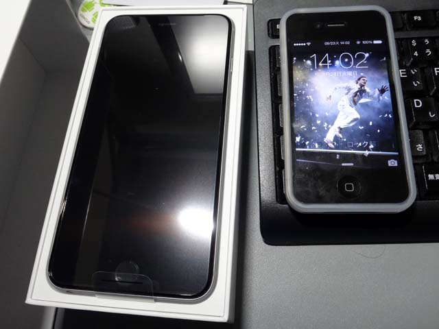
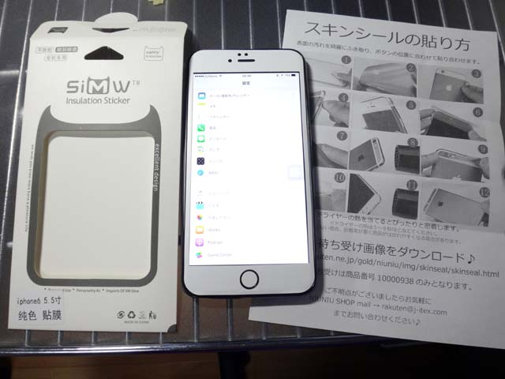
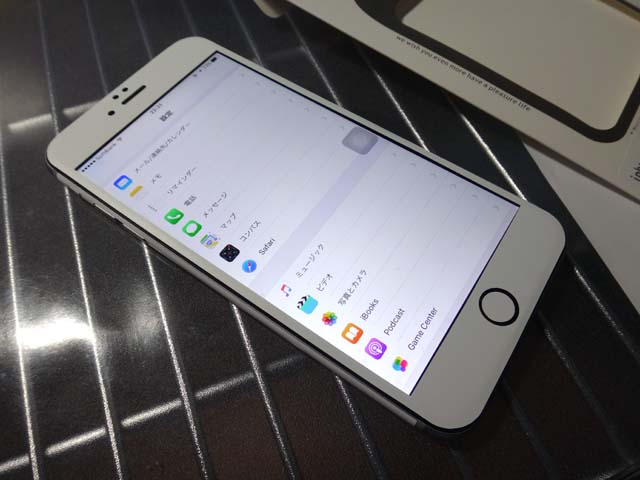
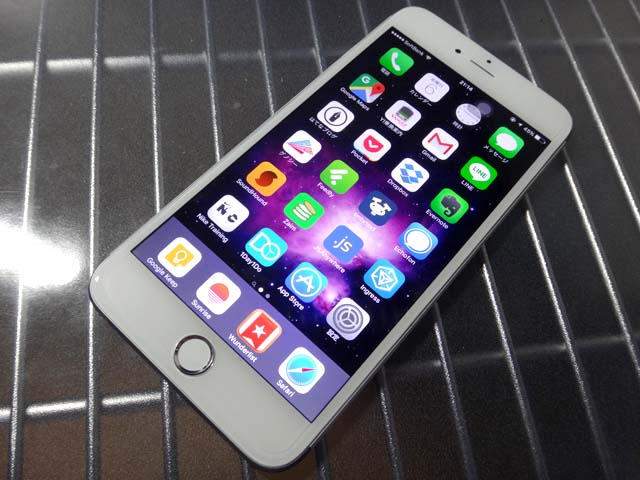
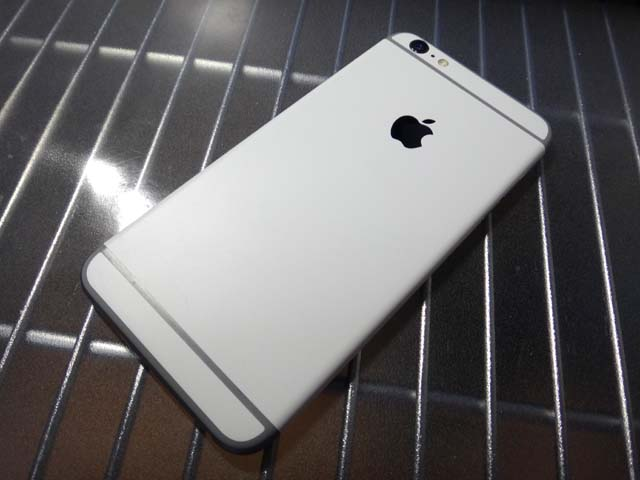
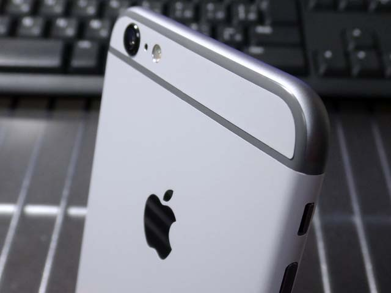
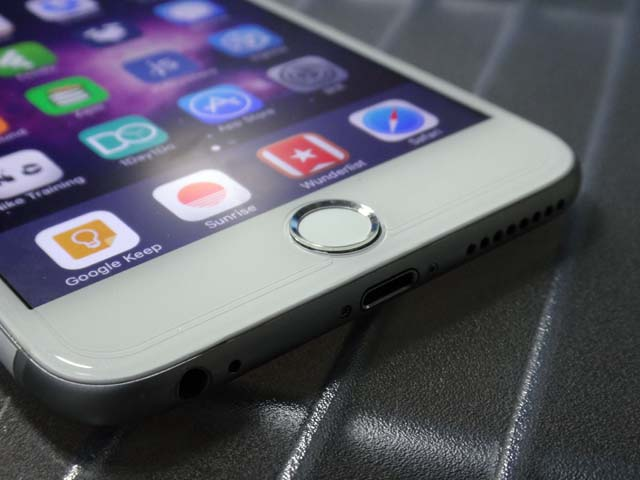

前回の記事で、「スキンシール」というものをスペースグレイで黒ベゼルの iPhone6Plus の前面に貼って、擬似白ベゼルを手に入れた、という話をした、その続き。

- [iPhone6Plus にスキンシールを貼ってみた](06-01.html)

---

まずは初期状態をおさらい。

これは2014年9月に購入したときの写真。右側はそれまで使っていた iPhone4 で、待ち受けはフエルサブルータのランニングマン。スペースグレイは黒ベゼル、ということが改めて確認できる。

---

そして次に、前回の記事で紹介したスキンシールを貼ったもの。実際は先に保護シールを貼り、その上から液晶のフチに沿って白いシールを貼っている。

貼り直しは利くが、ドライヤーで温めると伸びるようで、伸びてしまったものの調整が難しく、なんというか素人工作感が否めない。

---

これではイマイチだ、ということで、スキンシールを貼った翌日の今日、フロントパネルを交換してもらうため、iPhone の修理をやっているところに持って行くことにした。

ぼくが使ったのは「[iPhone 修理工房](http://u-phone.net/)」というお店。事前に電話で聞いたら「_Apple の修理保証が受けられなくなる_けどフロントパネルを交換することはできる」「_ホームボタンの交換も可能だが、Touch ID (指紋認証) が使えなくなる_」とのことだったので、ホームボタンは変えずに、フロントパネルだけ換えてもらうことにした。

お店に持ち込んだら1時間ほどでフロントパネルを取り替えてくれた。修理代は1万2700円ちょっと。

動作確認ということで、ロックパスワードを書かされたり、「設定」や「カメラ」のアプリを色々触られたりするので、あまり人に見られたくない情報が入っている人は要注意。

出来も自然で、総合的に不満なし。割れたフロントパネルを交換してくれるサービスがあるお店なら、多分カスタマイズ目的で壊れていないものを持ち込んでもやってくれると思う。軽く電話で聞いてみよう。

---

それと、以下のようなホームボタン用のシールを買って、保護シールと一緒にビックカメラで貼り付けてもらった。Touch ID も有効な状態で貼れるシールが割と売っているので、好きに選ぶとよろし。

ビックカメラでは保護シール貼り付けサービス (500数十円とか) に15分ほど待たされた。こちらも、自分が選んだ保護シールが少し小さかったためにちょいと不格好ではあるが、それでも綺麗に貼ってくれているので特に不満なし。

---

そんなこんなで完成したのが以下の iPhone6Plus。

ホワイトのフロントパネルで良い感じです。

裏面にはスキンシールを残しているので、裏面も見た感じはホワイトカラー？みたいに見える。裏面はシールなので剥がせば元のスペースグレイです。

寄ってみるとシール感が伝わるかと。ちょっと指が引っ掛かったくらいでは剥がれないが、ぐにゅっとしわが寄ってしまうかもしれない感じ。まぁたかがシールだし、普段はこれにシリコンカバーかぶせてるから裏面とかそんな見ないし、しばらくはこのまんまで行こう。ちなみに上部と下部のシールもあったが、角の曲面が綺麗に貼れず断念。ここにスペースグレイの面影が残る。

フロントパネルの寄り。保護シールのフチが見えているが、交換したフロントパネル自体は自然な仕上がり。ホームボタンのシールがほんのわずかに小さいようだ。隙間から黒い元のホームボタンが見えているような…。

---

結局、この2日間でかけた大体のお金は以下のとおり。

- _スキンシール_ … 約580円。楽天市場にて楽天ポイントで購入。現在は裏面のシールのみ貼り付け。
- _フロントパネル交換_ … 約12700円。「iPhone 修理工房」にて1時間待ちで、白いベゼルのフロントパネルに交換してもらった。
- _ホームボタンシール_ … 約500円。ビックカメラにてビックポイントのみで購入。保護シール貼り付けサービスの時に一緒に貼ってもらった。
- _保護シール_ … 約800円。ビックカメラにてビックポイントのみで購入。適当に選んだのでなんというヤツだったか覚えていない。最近はフロント全面に貼れるヤツがあるので、ケチらず綺麗な結果になるものを選んだほうが良さげ。
- _保護シール貼り付けサービス_ … 約550円。ビックカメラで保護シールを買うと追加ワンコインちょっとでやってくれるサービス。ホームボタンシールも一緒に貼ってもらって、15分待ちぐらいでできた。
- __合計__ … 約15130円。15k ぐらい、2万円かからないぐらいで、白いベゼルを手に入れることができた。

スペースグレイなのにベゼルが白い、みたいな、ちょっとしたレア感も演出できてるし、良い感じ。

あとはこの表・裏両面をアピールできて、Suica をしまえるようなケースがあると良いなぁ。今は黒のシリコンカバーの中に Suica をセロハンテープで貼り付けた板を仕込んで、iPhone 本体と挟んで使ってる。とても貧乏くさいのです…。

いじょ～。
