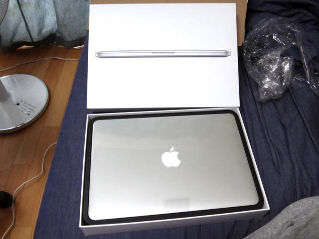
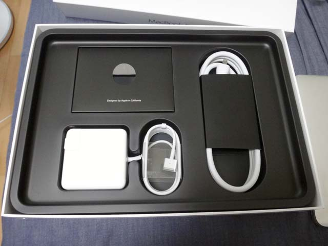
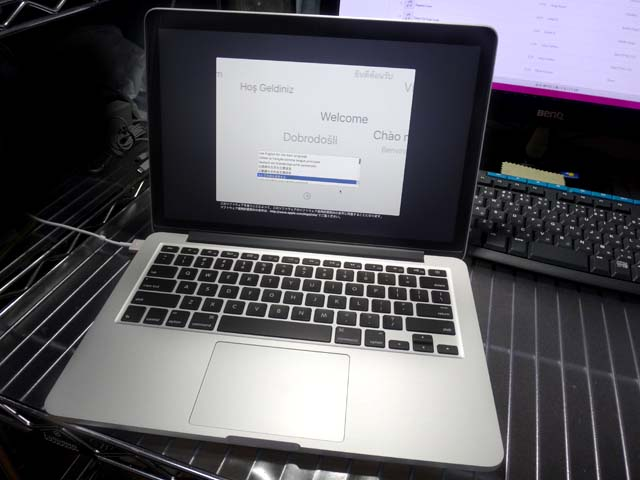
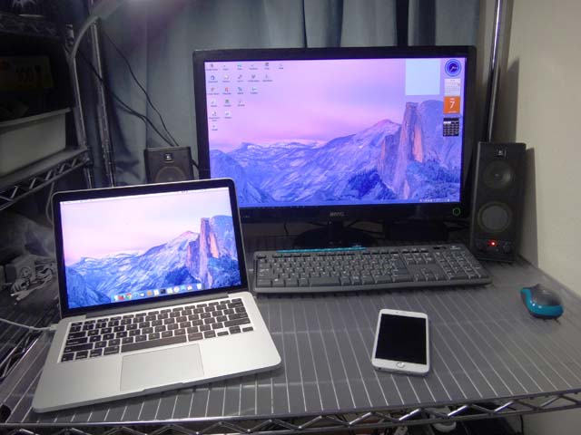

- [MacBook Pro をポチりました](01-01.html)

6月の WWDC を待ち切れず、5/1 にポチってしまった MacBook Pro が、5/7 届きました。開封から初期設定までのレポートです。

## スペック

- 参考：[MacBook Pro (Retina, 13-inch, Early 2015) - 技術仕様](https://support.apple.com/kb/SP715?viewlocale=ja_JP&locale=ja_JP)

公式の製品情報から、今回カスタムしたところを踏まえて紹介。

- Retina ディスプレイ：IPS テクノロジー搭載13.3インチ (対角) LED バックライトディスプレイ
- **3.1GHz デュアルコア Intel Core i7 (Turbo Boost 使用時最大 3.4GHz)、4MB 共有 L3 キャッシュ**
- **16GB 1,866MHz LPDDR3 オンボードメモリ**
- 512GB PCIe ベースフラッシュストレージ
- Intel Iris Graphics 6100
- **US キーボード**
- OS X El Capitan

13インチ MBP (MacBook Pro) の中では、SSD の容量以外最高スペックにした。256GB だと少なそうだけど、別に 1TB は要らないかなーというのと、単純に高いから、ということで。CPU とメモリは不満が残らないよう一番良いヤツにした。あと US キーボード初挑戦。

iPhone の Apple Store アプリから購入。配送状況とかを逐一メールくれて、5/7 到着予定ってことでワクワクしてた。

## 開封

予言どおり、5/7 の午前中に到着。段ボールに空間が開くように四隅を押さえる三角の段ボール入ってた (説明下手)。

段ボールから取り出して箱を開けたところ。ついにキター。

MacBook Pro 本体を取り出すと、下には付属品が。写真左上には説明書と Apple ロゴのシールが入った封筒が。

左下に見えるのが、MagSafe っていう、磁力でピタッとくっつく充電コードが付いてる。先端の四角いのは 60W の AC アダプタ。5世代目の iPod Video とかまではこういうデカい AC アダプタ付いてきてたよねぇ。

右側にある電源ケーブルは AC ウォールプラグというもの。MagSafe の先端にある AC アダプタのコンセント部分が取り外せるようになっていて、ココに接続すると、延長ケーブルになる仕組み。最初使い方が分からなくてむむ～？となってたけど、要するに延長ケーブルなので、コンセントまでの距離が稼げているなら特に使わなくて良い。

## 初期設定

さて、本体を充電しつつ起動。初期設定をする画面。ウ～ン! イイネ!!

キーボードの入力設定は、US キーボードだが「日本語」を選んでおけば良い。なんかネットで探してみるとココで「ことえり」っていう IME が選べたようだが、El Capitan からはなくなったのか？見当たらなかった。とりあえず「日本語」で進めた (あとで「Google 日本語入力」を入れたからもう使ってないけど)。

自宅の Wi-Fi に繋いだり、Apple ID を入れたりして設定を済ませると、デスクトップが表示された。初期設定はひとまずこれで OK。Wi-Fi でネットにも繋がっている。

Windows デスクトップマシンと、前回の記事で白ベゼルに改造したスペースグレイの iPhone6Plus と。

- [iPhone6Plus のフロントパネルをホワイトカラーのものに変更してもらった](07-01.html)

壁紙を「Yosemite 4」というものにしてみた。Windows マシンの方は、以下のサイトから同じ壁紙をダウンロードできたので同じモノに設定。

- [Wallpaper yosemite, 5k, 4k wallpaper, forest, OSX, apple, mountains, sunset, snow, Nature #182](http://wallpapershome.com/nature/yosemite-5k-wallpapers-forest-osx-apple-mountains-sunset-182.html)

ちなみに、デスクトップマシンは Aspire M5811 ASM5811-A61 というヤツで、もうかれこれ5・6年ぐらい使っているだろうか。CPU は Core i5 750 2.66GHz で、MacBook Pro の Core i7 に完全負けてるし、メモリも元々 2GB だったのをチップセットの上限である 8GB にまで増設しているが、MBP は 16GB と倍。ビデオカードを GeForce 310 から GeForce GTX 550Ti に換装しているので、設定低めでなんとか Grand Theft Auto V がプレイできているって感じ。細かい比較はしないけど、デスクトップマシンを凌駕する勢いのスペックで驚いてる。

- 参考：[価格.com - Acer Aspire M5811 ASM5811-A61 スペック・仕様](http://kakaku.com/item/K0000083095/spec/?lid=spec_anchorlink_details#tab)

初期設定を終えてから、色々な設定を行ったり、アプリを入れたりしているので、順に記事を書いていこうと思う。
