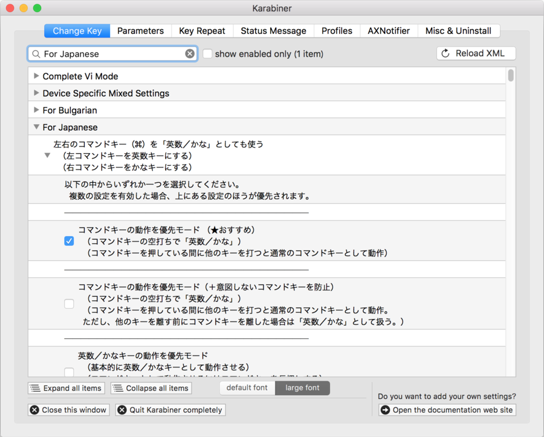
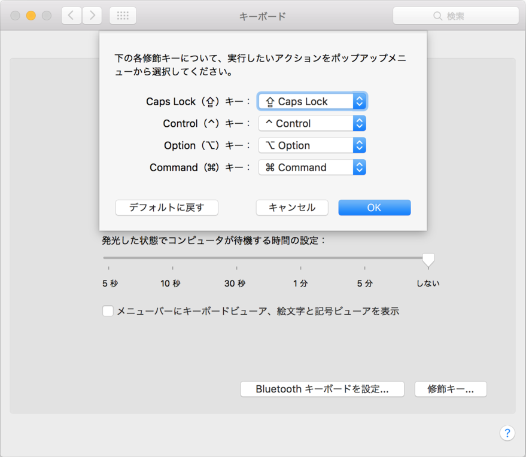

MacBook Pro を買ったので、OS X El Capitan の設定をいじくって環境を整えているところ。

「システム環境設定」を眺めていくと、トラックパッドの使い方だとか、Mac OS X の基本機能だとかが分かってくるので、まずは「システム環境設定」を眺めていくとよろし。

そして今回は、US キーボード環境向けに行った設定を紹介する。

## まずは Google 日本語入力をインストール

- [Google 日本語入力 – Google](https://www.google.co.jp/ime/)

巷で便利だ優れてると評判なので入れてみる。上のサイトからダウンロード・インストール。

インストール後、「システム環境設定」→「キーボード」→「入力ソース」タブへと進み、元あった「日本語」は「-」ボタンで削除。「ひらがな (Google)」と「英数 (Google)」だけを残すようにした。これは要するに、`Control + Space` で切り替えられる入力モードを、この2つにするということ。

Google 日本語入力の設定は、「Finder」の「アプリケーション」から「Google 日本語入力」フォルダの「ConfigDialog.app」を開いて設定できる。とはいっても基本的にいじっていない。個人的に必ず半角入力するカッコ記号とかだけ、「半角・全角」のところを設定した程度。

## Karabiner で Command キーを使って英数・かな切り替えをできるようにする

- <https://pqrs.org/osx/karabiner/index.html.ja>

これも巷でなんだかんだ紹介されている定番ツール。インストール後、「For Japanese」で検索し、「左右のコマンドキー (⌘) を「英数／かな」としても使う」から「コマンドキーの動作を優先モード (★おすすめ)」にチェックを入れる。

すると、キーボードの左のコマンドキーのみを押すと英数モードになり、右のコマンドキーのみを押すとかなモードになる。もちろん、`Command + C` など、キーボードショートカットの操作を行うときは入力モードは切り替わらない。これで `Control + Space` でなくても入力モードが切り替えられるようになる。便利。

- 参考 : [Mac用のセパレートキーボードを購入した - Qiita](http://qiita.com/k-yamada@github/items/0e88359726048ae86141)
  - こちらの記事など、他のサイトの記事では別の項目で同様の設定をしている。Karabiner は機能が多いので、自分に合った項目が選べていればいいと思う。
- 参考 : [Mac用 Apple英字配列キーボードにおける日本語入力切替のおすすめ : Commandキーのみで実現 - Qiita](http://qiita.com/daichi87gi/items/ded35e9d9a54c8fcb9d6)
  - 設定情報と、US キーボードのメリデメ。

## CapsLock は Control に変えてない

巷では CapsLock 撲滅キャンペーンみたいな勢いで、CapsLock を Control キーにしている設定を多く見かける。「システム環境設定」→「キーボード」→「キーボード」タブ→「修飾キー」ボタンから設定ができるようだ。

だが、CapsLock を Control に変更するメリットがよく分からないので自分は設定していない。

確かに CapsLock の使用頻度は少ないが、「CapsLock」と刻印されているキーが「Control」キーになってしまう、というのは違和感がある。左右の Command キーを英数・かなモード切り替えに使うのは、JIS キーボード配列の「無変換」と「変換」「カタカナ・ひらがな・ローマ字」キーに位置が良く似てるし、それらを変更する「Command」キー、というのでまだ理由付けができる気がする。

よくよく調べてみると、Mac の JIS キーボードは、Windows 環境でよく使う JIS キーボードと少し違って、一番左下に Caps キーがあって、CapsLock の位置に Control キーがあるのだ。Mac 系の JIS 配列に慣れている人間が、Mac の US キーボードに移行するとなると、確かに US キーボードの CapsLock キーが Control キーとして機能してほしいのかもしれない。でもそれって Mac の JIS 配列から脱却できてないんじゃ…？

Windows 系の JIS 配列は、左下が Ctrl で、Shift の上が CapsLock なので、Mac の US キーボードに移行してもそこまで違和感がない。というか自分は今、Mac の US キーボードと Windows の JIS キーボードを頻繁に行き来しているが、それぞれで全く困っていないしストレスなく入力できているので、何ら問題ない。それぞれ違うモノとして適応できている。

## というワケで

結局ぼくがやったのは、

- 「Google 日本語入力」のインストール
- 「Karabiner」で Command キーに英数・かな切り替え機能を付与

の2点だけ。これでなんとかなってる。
