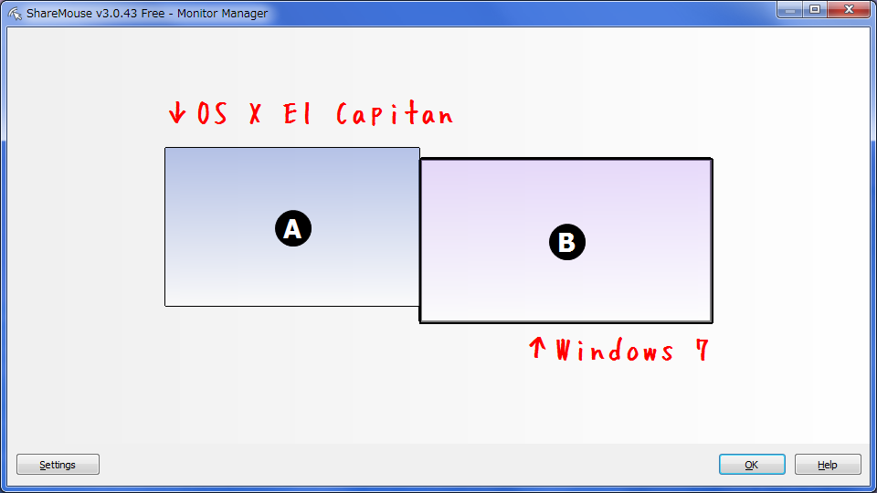
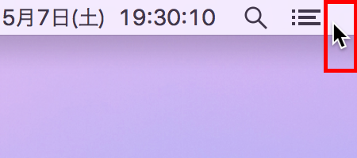

デュアルモニタを触るような感覚で、MacBook のトラックパッド操作で Windows へアクセスしたり、Windows マシンに接続されているキーボードで MacBook 側のアプリでテキストを入力したり、行ったり来たりしたい。

ちょうどそれを叶える「**Share Mouse**」というアプリがあった。同じネットワーク内にあるマシン同士で、マウスとキーボードを共有できるアプリ。

有料版もあるが、無料版でも2台の PC を接続できる。自分は無料版のまま不自由なく使ってる。

## Share Mouse のインストール

- [Share Mouse and Keyboard with multiple Computers](http://www.keyboard-and-mouse-sharing.com/)

まずは Windows マシンと MacBook のそれぞれで、上のサイトから Share Mouse をダウンロードしてインストールする。

インストール時やアプリの起動時にファイアウォールによる制限がかけられてしまうかもしれない。その場合は適宜解除して動作させる。どうやらこのアプリ、勝手にどこかのポートを使って、マウスとキーボードを LAN 内で使えるようにしているっぽいので、ときにファイアウォールがそれをはじいてしまうようだ。

基本的には、両方の端末に Share Mouse をインストールして両方で Share Mouse を立ち上げておけば、それだけでマウスとキーボードが共有できる。ネットワークの設定などは一切しなくても、勝手に LAN 内の Share Mouse を検知しあって作動してくれるのだ。

以下は環境設定など。

## モニタの並べ方の設定

タスクトレイやメニューバーに収まっている Share Mouse のアイコンから「Monitor Manager」を選択する。ココでモニタ同士の並べ方を設定できる。

自分は上の写真のように、左側に MacBook Pro、右側に Windows マシンのモニタを置いているので、以下のように配置した。

この時、*MacBook の方を少し上にズラして配置しておくと使いやすかった*。というのは、左に Mac・右に Windows という並びの時、Windows のスタートメニューにマウスを持っていこうとしたときに、そのまま左端を突き抜けて Mac 側にマウスが飛んでしまうことがよくあった。一方、Mac 側も右上の通知センターを選択しようとしてそのまま画面右側に飛んで行ってしまうこともあった。

そこで、左に配置した Mac 側を、Windows 機より少し上側に配置することで、Mac の右上と Windows の左下部分 (以下のそれぞれの赤枠部分) からマウスが突き抜けないようにしているのだ。

これでも微妙な場合は、左側にある Mac の右下の角に、Windows 機の左上の角を当てるような置き方にして、Windows の画面左上から、MacBook の画面右下へ飛ぶようにしておくと、誤ってモニタをまたいでしまうことが減らせると思う。

## 2台を同時に使えるようにする

初期設定だと、マウスが有効になっているモニタのみ操作でき、もう一方のモニタは薄暗くなってしまう。この挙動を解除し、2台のマウス・キーボードを別々に操作できるようにしておく。

各種設定はタスクトレイのアイコンの「Settings」より変更できる。この「Settings」から「Miscellaneous」に飛び、*「Dim inactive monitors:」のチェックを外す。*これで薄暗くなる設定が解除できた。

2台を同時に使いたいときは、それぞれのマウスを両手で同時に動かしてあげると、それぞれの画面にマウスが戻って別々に動かせるようになる。

## キーボードに関する注意

Windows に接続されているマウスで Mac 側を触り、テキスト入力を開始するとき、Windows に接続されているキーボードから文字が入力できるが、この時のキー配列は Mac 側の環境に依存するので注意。

つまり自分の環境の場合、MacBook は US 配列、Windows は JIS 配列なので、Windows キーボードで Mac を触る時は、左上の「半角/全角」キーが「チルダ」になるし、キーボード上に「`@`」の刻印があるキーではカギカッコ「`「`」が入力されることになる。  
コピーのショートカットキーは `Command + C` であるが、Windows キーボードからそれを操作する場合は `Win + C` キーを押すことになる。Windows のノリで `Ctrl + C` は効かないので注意。

一方、MacBook のトラックパッドで Windows マシンを触り、文字入力を開始した時は、実際に叩いている MacBook のキーボードが US 配列であっても、JIS 配列のつもりでキー入力する必要がある。`Shift + 2` では `@` ではなくダブルクォート `"` が入力されるワケだ。

ただし、Mac 版の Share Mouse は、Windows 版にはない設定項目があり、不便な点が少し緩和される。「Settings」に「Keys」というメニューがあり、Windows マシンのキーと Mac 側で押下するキーの対応付けを変えられるのだ。デフォルトは

- Mac で `Control` を押せば Windows マシンでは `Ctrl` キーが押されたことにする
- Mac で `Option` を押せば Windows マシンでは `Alt` キーが押されたことにする
- Mac で `Command` を押せば Windows マシンでは `Win` キーが押されたことにする

という設定になっているので、MacBook 上のキー刻印と、Windows のキーボードの意味とがだいぶ近いものになっていると思う。ただ、位置関係としては Alt (Option) と Win (Command) の位置が逆になるので、自分の好きな方に合わせるとよろし。なんで Windows 版の Share Mouse にはこの設定項目ないんだろう…。

## その他

- 「Miscellaneous」で確認・設定変更できるが、*Esc キーを2回押すことでマウス・キーボードの共有を中止できる。*再度 Esc キーを2回押せばまた共有を開始できる。
- ときどき、どちらかのマウスが元のデバイスの方に戻ってこれなくなることがある。そんな時は Esc キーを2回押して共有を一時停止することで復帰できる。
- Windows 版では「Settings」→「Data exchange」にある「Clipboard Synchronization」、Mac 版では「Settings」→「Sharing」→「Enable Pasteboard Synchronisation」(シンクロのスペリングがそれぞれで違うっすね) をチェックすると、*クリップボードの内容を別のデバイスと共有できる。*とても便利。
- 設定画面で `[Demo]` と書いてあるのは有料版の機能みたい。特段不要なので無視してる。何ができるか知りたい場合は以下の参考サイトなどをドウゾ。

## その他参考

- [ShareMouse - ｋ本的に無料ソフト・フリーソフト](http://www.gigafree.net/internet/remote/sharemouse.html) - 設定画面の詳しい説明などがある。
- [マウスとキーボードLANで共有する「Share Mouse」 | スターフィールド株式会社](http://sterfield.co.jp/officer/%E3%83%9E%E3%82%A6%E3%82%B9%E3%81%A8%E3%82%AD%E3%83%BC%E3%83%9C%E3%83%BC%E3%83%89lan%E3%81%A7%E5%85%B1%E6%9C%89%E3%81%99%E3%82%8B%E3%80%8Cshare-mouse%E3%80%8D/)
