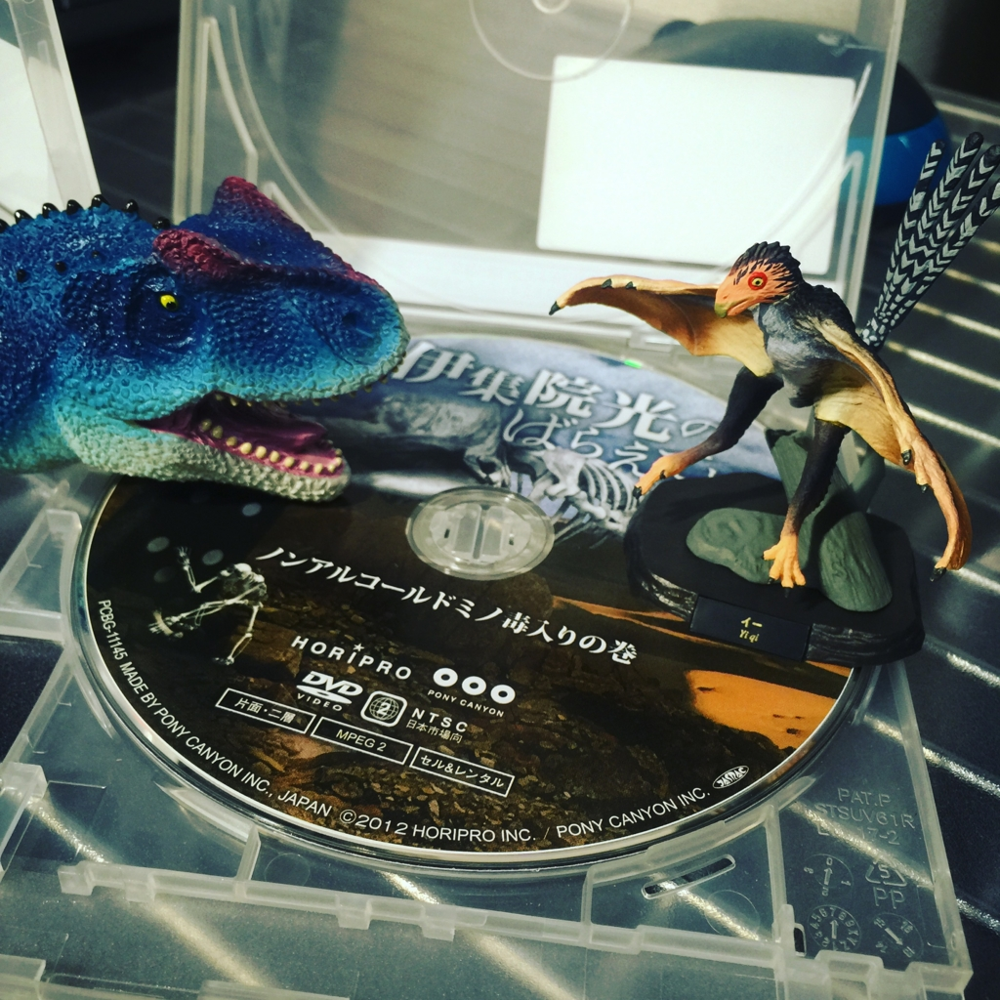

2016-05-22 (日)

上野の国立科学博物館でやってる[恐竜博2016](http://dino2016.jp/)に行ってきた。

元々は「伊集院光とらじおと」で知った。

恐竜の祖先とかいうアシリサウルス、ちっちゃくてカワイイネ～。

当時は花を咲かせる植物がまだなかった、とかいうの地味に驚いた。

ジュラシックパーク3に出てきたスピノサウルスの全身骨格とかあったよ～。あいつ泳ぐとかマジか…。

日曜に行ったからか、子供いっぱいいて混んでたなぁ～。騒いでてあんまり見てない子供は別の場所に隔離できませんかねぇ…。

鳥みたいな「イー」ってやつをガチャガチャで1回で引き当てました～！あと恐竜の生首ことマグネットも買いました。会社に飾ろうｗ

とっても楽しかったです。まる。
