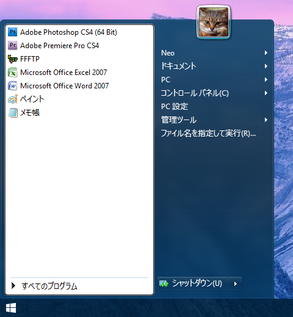

Windows10 のスタートメニューなんなん？タイルとかいう不要なアプリのショートカットしかないヤツ。使い方よく分かんないし便利そうな気がしないのでやめた。

__Classic Shell__ というアプリを入れると、スタートメニューを変更できる。

- [Classic Shell - Start menu and other Windows enhancements](http://www.classicshell.net/)

こういう感じに戻してみた。

もともと何のアプリをショートカットに置いていたか思い出せないのでまだ途中。

このアプリを入れると、なんか Explorer とか IE とかの設定も少し変えられるみたい。
