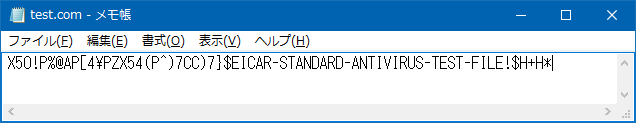
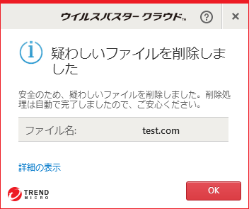

*EICAR テストファイル*という、アンチウイルスソフトの反応を試すための、いわばテストウイルスといえるものがある。

- [EICARテストファイル - Wikipedia](https://ja.wikipedia.org/wiki/EICAR%E3%83%86%E3%82%B9%E3%83%88%E3%83%95%E3%82%A1%E3%82%A4%E3%83%AB)

上の Wikipedia に実際のコードが書いてある (うっかりアンチウイルスソフトに誤反応されたら嫌なので Wikipedia を見てください)。

英数字や記号で構成された68文字のコードをテキストエディタで書いて、「`.com`」という拡張子で保存する。

すると、自分の場合はウイルスバスタークラウドがファイルを保存した直後にウイルスとして検知してくれた。

アンチウイルスソフトを導入した時の動作チェックや、イタズラ目的にドウゾ (ダメ)。
