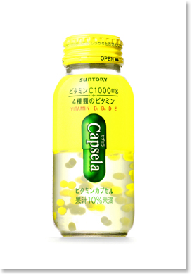

自分が高校生ぐらいの時に、バイト先のスーパーで買って帰っていた、つぶつぶの入ってる酸っぱくて美味しいレモンドリンク。名前が思い出せなかったんだけど、サントリーの「カプセラ」というやつだったようだ。

- [Suntory News Release No.9786](http://www.suntory.co.jp/news/2007/9786.html)

2007年頃売られていたようだ。いつ頃なくなったんだろう。また売って欲しい。
