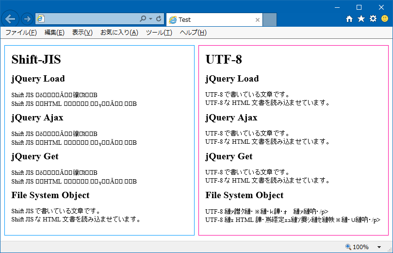
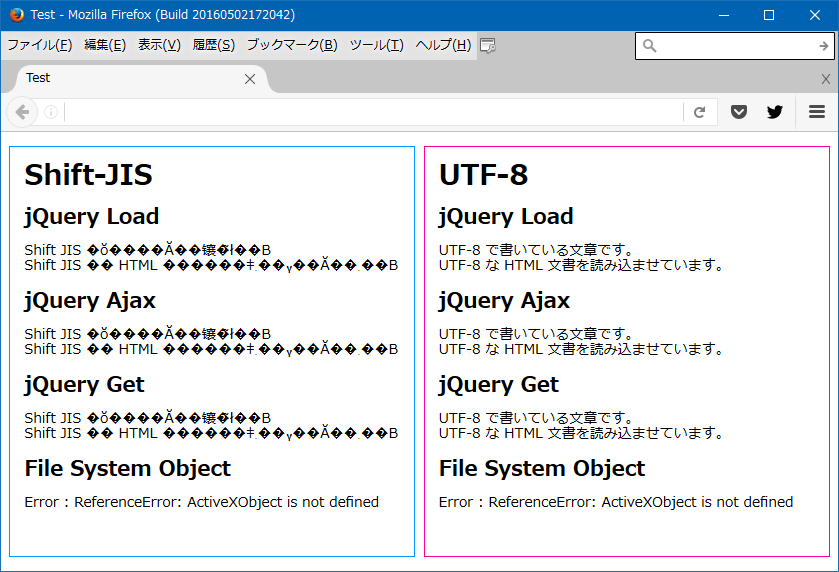
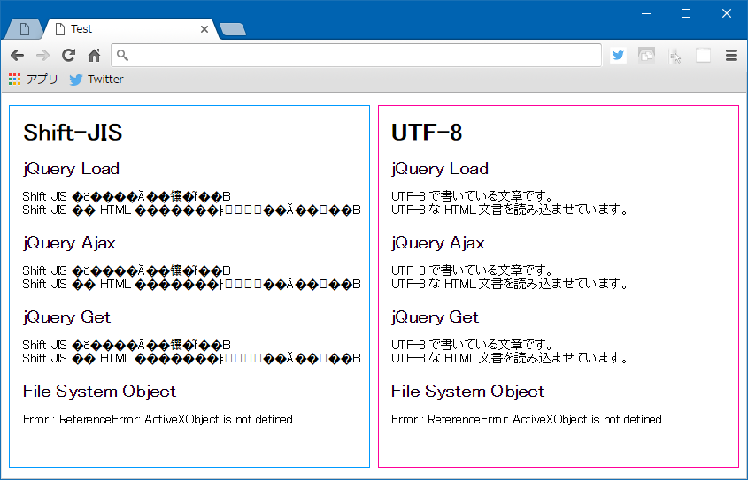
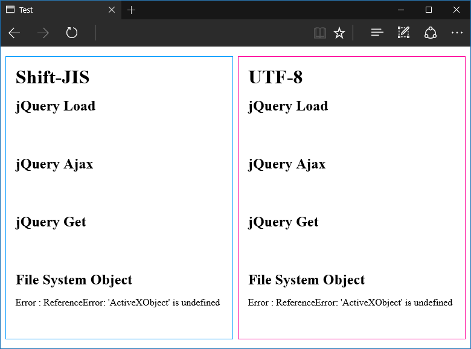

- ローカルに HTML ファイルがある。エンコーディングは UTF-8 を指定している。
- これとは別に、同じフォルダ内に Shift-JIS 形式の別の HTML ファイルがある。

この UTF-8 の HTML ファイルから、Shift-JIS のファイルを読み込んで、インラインに展開させたい。jQuery の `load()` みたいなことをしたい。

しかし、jQuery の `ajax()` やら `get()` やら `load()` やらは、いずれも UTF-8 のファイルを読み込むのがデフォルトになっているので、Shift-JIS のファイルを読もうとすると文字化けしてしまう。

そんなワケで、ローカルの HTML ファイルから他の HTML ファイルを読み込む jQuery のメソッドを試してみつつ、読み込む対象のファイルのエンコード指定と文字化けの関係を調べてみた。

- 調査したブラウザ：
  - IE11
  - Firefox
  - Chrome
  - Edge (※ 2020-12-23 追記 : 当時の Legacy Edge のことです)
- 呼び元の HTML ファイル：
  - ローカルにある UTF-8 のファイル
- 読み込む HTML ファイル：
  - ローカルにある Shift-JIS のファイル (基本は文字化けするが、文字化けさせずに読み込みたいファイル)
  - ローカルにある UTF-8 のファイル (呼び元との組み合わせ的にも、基本的に文字化けしないファイル)
- 読み込み方：
  - jQuery.load()
  - jQuery.ajax()
  - jQuery.get()
  - Scripting.FileSystemObject

## 長くなりそうなので先に結論を

呼び元が UTF-8 の HTML ファイルで、Shift-JIS の別ファイルを読み込みたい時は、__Scripting.FileSystemObject__ を使って Shift-JIS のファイルを読み込み、`ReadAll()` などで拾った値を `jQuery.html()` の引数にでも与えてやれば、両ファイル間で文字コードが違っても文字化けせずに読み込める。

__FileSystemObject が使えるのは ActiveXObject が使える IE11 だけで、かつローカルでしか使えないと思うので、「IE11 限定」「ローカルにある HTML ファイル限定」__というワケ。

では、以下、順に試してみる。

## 呼び元の HTML ファイル

まずはテストするための、呼び元の HTML ファイルを作った。以下のような感じで、Shift-JIS の HTML と、UTF-8 の HTML とを、それぞれ4つの読み込み方で読み込もうとしている。

```html
<!DOCTYPE html>
<html lang="ja">
  <head>
    <meta charset="UTF-8">
    <meta http-equiv="X-UA-Compatible" content="IE=edge">
    <meta name="viewport" content="width=device-width, initial-scale=1">
    <title>Load Local File</title>
    <style>

/* 適当にスタイル付けしとく～ */

* {
  margin:0;
  box-sizing:border-box;
  line-height:1.1;
}

body {
  width:100%;
  margin-top:1rem;
}

body > div {
  width:48.5%;
  padding:1rem;
}

section {
  height:5rem;
}

#sjis {
  float:left;
  margin-left:1%;
  border:1px solid #09f;
}

#utf8 {
  float:right;
  margin-right:1%;
  border:1px solid #f09;
}

h2, section {
  margin:1rem 0;
}

    </style>
    <!-- jQuery は適当に v1 系を読んでおく -->
    <script src="https://code.jquery.com/jquery-1.12.4.js"></script>
    <script>

// ・ShiftJIS.html
// ・UTF-8.html
// 2つの HTML ファイルをこの HTML と同階層に置いておく

// Firefox の「整形式になっていません。」エラー
// → $.ajax() と $.get() で、dataType に "html" を明記しないと発生する (IE・Chrome は dataType を省略しても動作する)

// Chrome の「Cross origin requests are only supported for protocol schemes: http, data, chrome, chrome-extension, https, chrome-extension-resource.」
// → Chrome を起動するときに「--allow-file-access-from-files」オプションを与えて起動すると動くようになる

$(function() {
  
  $("#sjis-load").append($("<div>").load("ShiftJIS.html", function(data) {
    console.log("Shift-JIS Load : " + data);
  }));
  $.ajax({
    type: "GET",
    url: "ShiftJIS.html",
    dataType: "html",
    success: function(data) {
      console.log("Shift-JIS Ajax : " + data);
      $("#sjis-ajax").append($("<div>").html(data));
    },
    error: function() {
      console.log("Shift-JIS Ajax : Error");
    }
  });
  $.get("ShiftJIS.html", function(data) {
    console.log("Shift-JIS Get : " + data);
    $("#sjis-get").append($("<div>").html(data));
  }, "html");
  $("#sjis-fso").append($("<div>").html(loadFso("Shift-JIS", "ShiftJIS.html")));
  
  $("#utf8-load").append($("<div>").load("UTF-8.html", function(data) {
    console.log("UTF-8 Load : " + data);
  }));
  $.ajax({
    type: "GET",
    url: "UTF-8.html",
    dataType: "html",
    success: function(data) {
      console.log("UTF-8 Ajax : " + data);
      $("#utf8-ajax").append($("<div>").html(data));
    },
    error: function() {
      console.log("UTF-8 Ajax : Error");
    }
  });
  $.get("UTF-8.html", function(data) {
    console.log("UTF-8 Get : " + data);
    $("#utf8-get").append($("<div>").html(data));
  }, "html");
  $("#utf8-fso").append($("<div>").html(loadFso("UTF-8", "UTF-8.html")));
});

function loadFso(mode, fileName) {
  try {
    var fso = new ActiveXObject("Scripting.FileSystemObject");
    // FileSystemObject の起点はデスクトップになるようなので、基本的に絶対パスでないと読み込めない
    // (起点は fso.GetFolder("."); で確認)
    var file = fso.OpenTextFile("C:/Test/" + fileName);
    var text = file.ReadAll();
    console.log(mode + " FSO [" + fileName + "] " + text);
    return text;
  }
  catch(e) {
    console.log(mode + " FSO [" + fileName + "] : Error " + e);
    return "Error : " + e;
  }
}

    </script>
  </head>
  <body>
    <div id="sjis">
      <h1>Shift-JIS</h1>
      <section id="sjis-load">
        <h2>jQuery Load</h2>
      </section>
      <section id="sjis-ajax">
        <h2>jQuery Ajax</h2>
      </section>
      <section id="sjis-get">
        <h2>jQuery Get</h2>
      </section>
      <section id="sjis-fso">
        <h2>File System Object</h2>
      </section>
    </div>
    <div id="utf8">
      <h1>UTF-8</h1>
      <section id="utf8-load">
        <h2>jQuery Load</h2>
      </section>
      <section id="utf8-ajax">
        <h2>jQuery Ajax</h2>
      </section>
      <section id="utf8-get">
        <h2>jQuery Get</h2>
      </section>
      <section id="utf8-fso">
        <h2>File System Object</h2>
      </section>
    </div>
  </body>
</html>
```

この HTML ページ自体は `<meta charset="UTF-8">` と書いているとおり、UTF-8 でエンコーディングする前提。そのため、Shift-JIS でエンコーディングされている `ShiftJIS.html` を jQuery で読み込むと文字化けする。

しかし、`FileSystemObject` で `ShiftJIS.html` を読み込み、その内容を

```javascript
$("#sjis-fso").append($("<div>").html(loadFso("Shift-JIS", "ShiftJIS.html")));
```

このようにして HTML 内に展開すると、文字化けせずに表示させられる。

ブラウザごとに色々引っかかったポイントがあった。

- 当然だが、Scripting.FileSystemObject は ActiveXObject が使える IE11 でのみ使える。Firefox や Chrome は勿論だが、Edge も ActiveXObject に対応していない。
- Firefox は jQuery の `ajax()` と `get()` の引数で dataType を指定しないとエラーが出て読み込めない。
- Chrome でローカルの HTML ファイルから `ajax()` などを動作させるには、`--allow-file-access-from-files` という引数を与えて Chrome を起動させる必要がある。  
  - Windows なら「ファイル名を指定して実行」で以下のように起動する。
  - `chrome –allow-file-access-from-files`
  - 参考：[jQuery.load()をChromeで使う時にちょっとハマったこと | バシャログ。](http://bashalog.c-brains.jp/11/02/16-212538.php)

## 結果の画面キャプチャ

順に表示結果を見てみる。

### IE11



画面左下の「Shift-JIS」：「FileSystemObject」部分。_UTF-8 の HTML ファイルであるにも関わらず、Shift-JIS の HTML ファイルを読み込んで文字化けせずに展開できている_。それ以外の jQuery を使った方法では文字化けしてしまっている。

また、_UTF-8 のファイルを FileSystemObject で読み込んでも文字化けしてしまう_ことから、有効なのは「__UTF-8 の HTML ファイルで Shift-JIS の HTML ファイルを読み込む場合__」のみ。また、FileSystemObject の性質上、サーバを介して使用することはないだろうから、_ローカルの HTML ファイルでのみ使える技_、ということになる。

### Firefox



以降は同じソースを他のブラウザで見てみただけ。

Firefox でも Shift-JIS の HTML ファイルは文字化けしているほか、ActiveXObject が使えないので FileSystemObject も当然使えない。

Firefox は別の方法でローカルの HTML ファイルを読み書きできるみたいだけど、Components がもう使えない？らしく、うまくいかなかった。

- 参考：[JavaScriptからローカルファイルを作成する方法まとめ - あらびき日記](http://d.hatena.ne.jp/a_bicky/20110718/1311027391)
- 参考：[Firefoxのjavascriptでローカルファイルにアクセスする方法まとめ - 開発者](http://www.the-workflow.com/home/sino-kai-fa-huan-jing/firefoxnojavascriptderokarufairuniakusesusuru-fang-famatome)
- 参考：[javascript - How to reset netscape.security.PrivilegeManager.enablePrivilege? - Stack Overflow](http://stackoverflow.com/questions/1309243/how-to-reset-netscape-security-privilegemanager-enableprivilege)

### Chrome



Chrome も Firefox と同様の表示。

Chrome でローカルファイルを操作するには File API が使えるらしい。試してない。

### Edge



Windows10 にしたことだし、Edge でも見てみた。Edge は ActiveXObject がサポートされていない他、セキュリティ設定の問題か、ローカルで Ajax ができないみたい。

## 以上

未だに IE しか使わせてもらえないレガシープログラマにとって、JScript・FileSystemObject はまだまだ現役。……泣ける話や……。

それにしても、FileSystemObject で読み込むと文字化けしないのはなんで？
