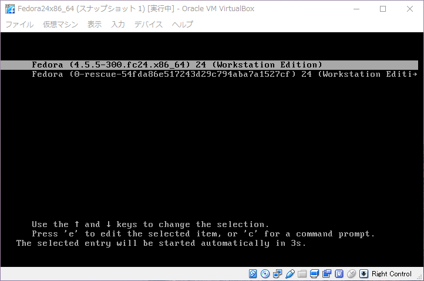
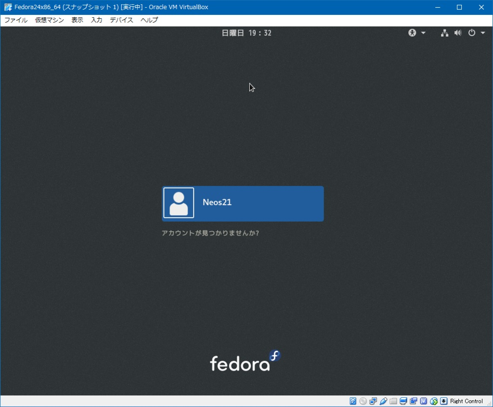
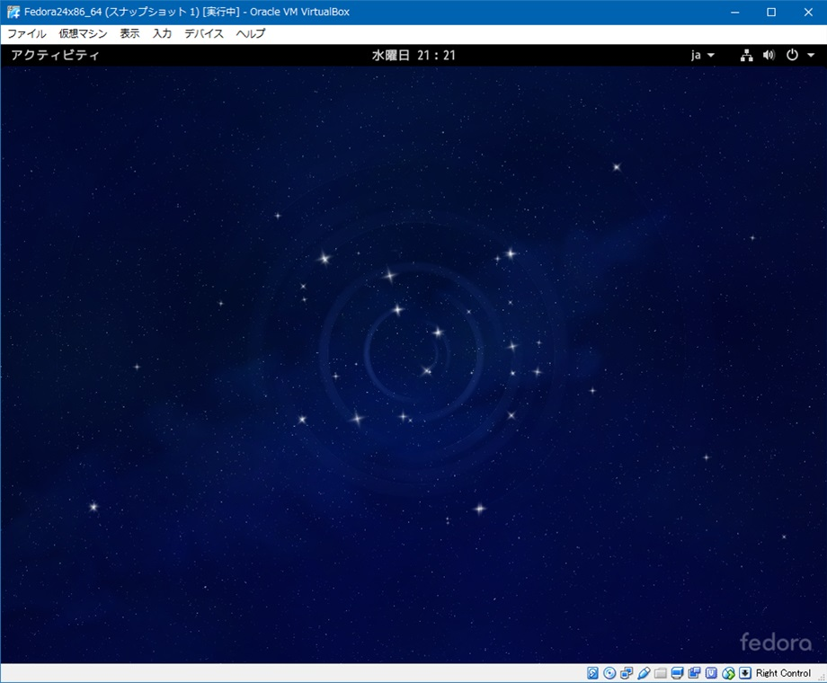
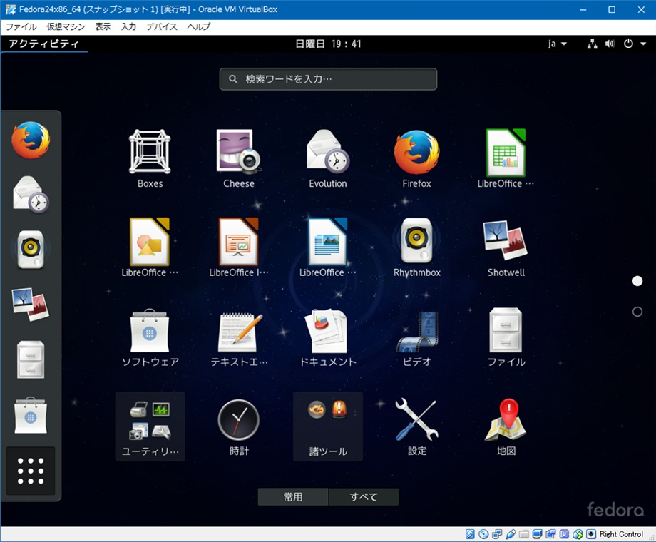
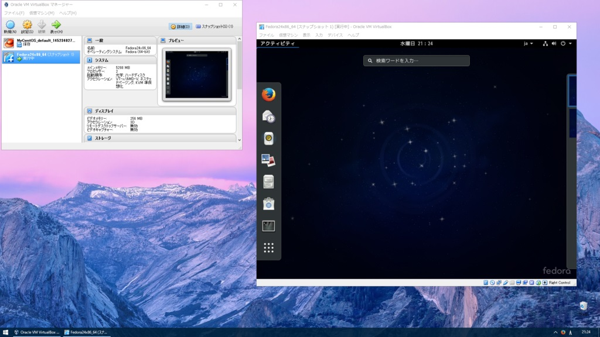

Windows マシン上で VirtualBox を使って、Fedora 24 Workstation を動作させてみる記事。

## 対象読者

- Windows マシンしか持ってないけど Linux を触ってみたい
- でも Linux って GUI ないんでしょ？コマンドしか打たない OS とか分かんないです…
- Linux っていっぱい種類あるじゃん！どれにしたらいいの？

といった人をターゲットにした。自分も割と最近までこうだったけど、ホントに初心者向けに書いてくれてる記事が全然ないので、自分で調べてやってみた結果を簡単にまとめる。

## ゴール

__GUI 環境を持つ Linux OS を、Windows 上に作った仮想環境で動作させる。__

Windows 上で動く仮想環境なので、デュアルブートとかそういう設定はなし。

GUI 環境を持つ Linux もあるんだー、ってところが既に意外な人もいるかもしれない。Windows とも Mac とも違うインターフェースだけど、無料の OS でもこんなのがあるんだ！を実感してもらいたく。

## もう少し詳しく

__VirtualBox 上で Fedora を動かす。__

VirtualBox というのが、Windows 上に他の OS が動く、仮想マシン環境を作るソフト。フリー。

Fedora (フェドラ) というのは、今回チョイスした 、GUI 環境がある Linux OS。Ubuntu とかでも良かったのかもしれないけど、初期設定が気楽そうなのはこれかなーと思ってこれにした。

ではではいよいよ説明スタート。

## VirtualBox のダウンロード・インストール

以下のサイトより VirtualBox をダウンロードする。

- [Downloads – Oracle VM VirtualBox](https://www.virtualbox.org/wiki/Downloads)

「VirtualBox 5.1.2 for Windows hosts」横の「x86/amd64」をクリックして `VirtualBox-5.1.2-108956-Win.exe` をダウンロードする (バージョンは変わっていたら適宜読み替えること)。

ダウンロードができたらファイルを実行してインストールを始める。指示に従ってデフォルト設定のままインストールすれば OK。

## Fedora のダウンロード

- [Fedora](https://getfedora.org/ja/)

上のサイトより、Fedora 24 Workstation を選択して、`Fedora-Workstation-Live-x86_64-24-1.2.iso` をダウンロードする。これが OS の CD イメージ。

## VirtualBox での設定

VirtualBox で、この CD イメージを起動ディスクにして、まずはディスク起動モードで Fedora を起動させるための設定をする。

- VirtualBox を起動する。
- 「新規」をクリックする。
- 「名前とオペレーティングシステム」で名前：「`Fedora24x86_64`」などと入れる。  
  タイプ：Linux、バージョン：Fedora (64-bit) に自動で設定されると思うので「次へ」をクリックする。
- 「メモリーサイズ」は緑ゾーン限界近くまで上げて「次へ」をクリックする。
- 「ハードディスク」は「仮想ハードディスクを作成する」を選択して「作成」ボタンをクリックする。
- 「ハードディスクのファイルタイプ」は「VDI (VirtualBox Disk Image)」を選択して「次へ」をクリックする。
- 「物理ハードディスクにあるストレージ」は「可変サイズ」を選択して「次へ」をクリックする。
- 「ファイルの場所とサイズ」で場所はデフォルト (Users 下の VMs にできる)。  
  サイズは最低でも 10GB は Fedora OS の動作のために必要なので、15〜25GB 程度、用途に応じたサイズを設定して「作成」ボタンをクリックする。

これで、仮想 PC の定義が出来上がった。続いて詳細設定をする。これらを設定しておかないと、マウスを動かしてもガクガクでもっさりしまくる。

- 作成した Fedora を選択して「設定」をクリックする。
- 「ディスプレイ」の「ビデオメモリー」を最大まで拡張する。  
  まず「ディスプレイの数」を最大まで増やす。すると「ビデオメモリー」の上限値が開放されるので、「ビデオメモリー」を緑ゾーンの限界まで拡張して「OK」をクリックする。  
  再度「設定」を開き、最大まで増やした「ディスプレイの数」を「1」に戻す。  
  こうすれば、ビデオメモリーは当初の上限値を突破した最大値に設定できる。
- 同じく「ディスプレイ」の「3D アクセラレーションを有効化」にチェックを入れる。
- 「システム」の「マザーボード・チップセット」を「PIIX3」から「ICH9」に変更し、「アクセラレーション」を「デフォルト「から「KVM」に変更する。
- 「ストレージ」の「コントローラー : IDE」下の CD を選択し、右側の「仮想光学ディスクファイルを選択」で、先ほどダウンロードした Fedora の ISO ファイルを選択する。これが仮想マシンの起動ディスクとして認識される。

ここまでやれば、「起動」ボタンを押して Fedora が起動できるようになる。

## Fedora をハードディスクにインストールする

仮想マシンの HDD は、VDI ファイルの作成時に 15〜25GB 程度で領域を確保したかと思う。この領域に Fedora OS をインストールし、起動ディスク (ISO イメージファイル) なしでも起動できるようにする。

- VirtualBox から「起動」をクリックして Fedora を起動する。
- Test this media & Start Fedora 24 を選択してみる。なにやらコンソールがゴロゴロ動くので待つ。
- しばらくすると、GUI で「Welcome to Fedora」という画面が出る。「Try Fedora」と「Install to Hard Drive」の2つが表示されているので後者を選択する。

ここで OS の初期設定を行う。

- 言語は「日本語」が勝手に選ばれていた。そのまま。
- キーボード設定を見ておく。」日本語」になっていれば OK。
- インストール先のディスクを、仮想マシンのハードディスクを選択する。
- ネットワークは当方環境だと何もせずとも勝手に繋がっていた。

ハードディスクへのインストールを開始する。

その最中に Root パスワードを設定し、ユーザを作成する。  
Root パスワードというのは、OS 全体に関わる操作の時に使用する最強なパスワード、って感じ。だからルート。

インストールが完了したら、その状態で VirtualBox の「仮想マシン」メニューから「設定」を開き、「ストレージ」の「コントローラー : IDE」にマウントした ISO イメージを外す。これをしないと、再起動後も CD ブートしてしまう。CD ドライブ自体はこのあと使うので空で残しておく。

CD イメージがアンマウントできたら Fedora を終了させ、再度「起動」する。

すると、

- Fedora (`4.5.5-300.fc24.x86_64`) 24 (Workstation Edition)
- Fedora (0-rescue-54fda……) 24 (Workstation Edition)

という2つの選択肢が出てくるが、上を選択して Enter。下のは Rescue モードとかいう起動モードらしい。

少し待つと、先ほど作成したログインアカウントが画面上に出てくるので、それを選択してログインする。

デスクトップはこんな感じ。

左上の「アクティビティ」が、Windows でいうスタートメニューみたいなもの。デフォルトでこれぐらいのアプリが入っている。ブラウザは Firefox、オフィススイートに LibreOffice が入ってたりするので、とりあえずいい感じに使えるのでは。

「アクティビティ」内にある「端末」というのが、つまりターミナルだ。Linux コマンドを叩きたい時はここからドウゾ。

Windows デスクトップを含めた画面キャプチャはこんな感じ。

ひとまず、これで Fedora 環境が構築できたということになる。

## GuestAdditions

GuestAdditions というものを入れるとパフォーマンスが向上するので、入れておこう。

「デバイス」から「GuestAdditions CD イメージの挿入」と選択し、先ほどアンマウントした Fedora OS の ISO イメージを選択する。するとターミナルが立ち上がって何やらゴソゴソしていくので、待つ。再起動すれば終わり。

マシンの終了時は画面右上の電源マークから。

## 以上。

以後は VirtualBox を立ち上げて Fedora を選択して「起動」とするだけ。

これであなたも、素敵な Linux ライフの第一歩を！

## 参考

- [Fedora19をVirtualBoxにGUIでインストールしてみた！ | トーハム紀行](http://torhamzedd.blogspot.jp/2013/07/fedora19virtualboxgui.html)
  - 今回の記事のベースはコレ。これを基に自分でもやってみた結果を、再度記事に起こした次第。
- [VirtualBox 最大パフォーマンスでUbuntu環境を構築する - ほりべあぶろぐ](http://holybea.com/2015/07/08/virtualbox-ubuntu/)
  - Mac OSX に Ubuntu 環境を作る解説ページ。ビデオメモリーの増やし方、「システム」設定内容を参考にしました。
- <http://fedorajp.jimdo.com/%E5%B0%8E%E5%85%A5-%E8%A8%AD%E5%AE%9A/>
  - Fedora 初期設定はこちらを参照。
- [VirtualBoxでのスクリーンショットの撮り方 - 揮発性のメモ２](http://d.hatena.ne.jp/iww/20090113/screenshot)
  - > 右コントロールを押して一旦キャプチャを解除すると、撮れる。
- [サービス終了のお知らせ - NAVER まとめ](http://matome.naver.jp/odai/2136783665578247701)
  - パフォーマンス設定を参考に。
