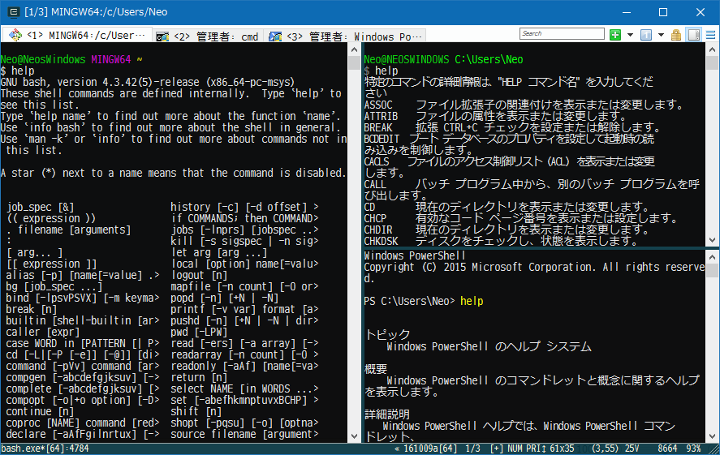
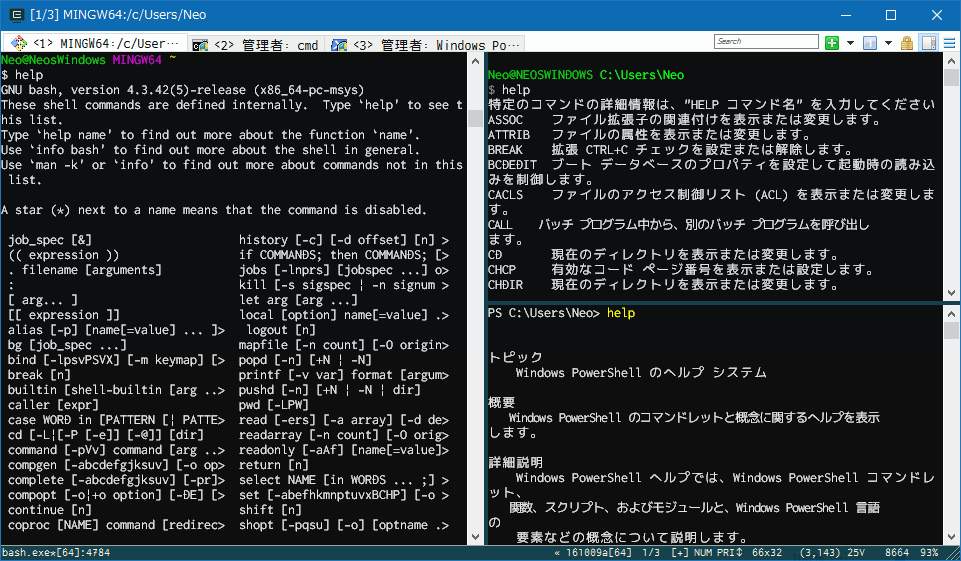

Windows コマンドプロンプト、PowerShell、GitBash。どれも Mac OSX のターミナルみたいにカッコよくない。GitBash のターミナルはフォント指定などがしやすく割と綺麗な方ではあるが、タブ機能がないのがイマイチか。

そこで、これらのシェルの表面 (ターミナル) を担ってくれる、ターミナル・エミュレータの __ConEmu__ を導入してみる。

## ConEmu とは

上述のとおり、ConEmu は、「ターミナル・エミュレータ」と呼ばれるソフト。このソフトが Windows コマンドプロンプトの画面表示部分を代わりに担ったりする。コマンド自体は裏で元々のコマンドプロンプトに渡されているので、あくまで画面表示部分だけを ConEmu に取り替えるようなイメージ。

ConEmu は機能が豊富で、フォント変更、タブ機能、ペイン分割、ウィンドウ透過、タスクトレイへの格納など様々な設定ができる。

## インストール

導入する環境は Windows10。GitBash がインストールしてある環境。

以下のサイトから ConEmu をダウンロードする。

- [Download ConEmu](https://www.fosshub.com/ConEmu.html)

ポータブル版とインストール版があったが、自分はインストール版にした。「Download ConEmu Stable, Installer (32-bit, 64-bit) - 5.23 MB | version: 161009a | MD5/SHA1 signature」のリンクよりダウンロード。

インストーラは特に設定することもなく OK の連打。

インストールが終わったら ConEmu を起動してみる。

## 設定

どうも ConEmu が、このマシンの中で使えるシェルを自動的に検出してくれるようで、cmd.exe、PowerShell、GitBash が最初から選択できる状態だった。GitBash をデフォルトのシェルにしておく。

設定項目は大変多いが、詳細説明は省く。スキーム (テーマカラー) を X Term にし、軽く透過設定をしたりして、フォントに `MeiryoKe_Gothic` (メイリオを等幅に改造したフォント) を選んだ。

後述するペイン分割を使って、左に GitBash、右上にコマンドプロンプト、右下に PowerShell を置いてみたのが以下のスクリーンショット。

フォントにアンチエイリアスがかかっていて、標準のコマンドプロンプトも GitBash っぽい。スキームが X Term 風でカッコイイ。タブ機能、ペイン分割が面白く、この時点でもなかなか良い感じ。

## Ricty Diminished フォントのインストール

が、やはりどうもフォントがイマイチだ。と思っていたら、__Ricty Diminished__ というフォントがオススメらしいので入れてみることにした。

以下のサイトより、「4.0.1 (2016 年 1 月 28 日)」部分のリンクを押下して `ricty_diminished-4.0.1.tar.gz` をダウンロード。

- [プログラミング用フォント Ricty Diminished](http://www.rs.tus.ac.jp/yyusa/ricty_diminished.html)

Lhaplus などで適当に解凍すると、TTF ファイルがいくつか見える。エクスプローラで全部選択して右クリックから「インストール」でインストールする。

ConEmu の Settings → Main → Main console font で、「Ricty Diminished Discord」を選択する。タブバーのフォントなどは別の項目で同様に設定できる。

「Ricty Diminished」と「Ricty Diminished Discord」は、`0` や `z` など、一部の文字・記号の形が違う程度。お好みで選択するとよろし。

前述のターミナルの状態から、フォントを Ricty Diminished Discord に変更したのが以下のスクリーンショット。

スゲー！なんかイカしてるハッカーみたい！(笑) 満足である。

## タブ機能・ペイン分割

ちょいと操作にクセがあるが、ペイン分割ができる。アクティブなペインから見て右か下かに、新規コンソールを作成できる。既存のコンソールを複製することも可能。

- 参考：[【メモ】ConEmuの新規タスクウインドウについてまとめ：shirokichi's hobby life：So-netブログ](http://shirokichi2.blog.so-net.ne.jp/2015-11-17)

## 以上

これスゲー気持ち良い。カッコイイ。

常に前面表示とか、タスクトレイに収納して常駐とか、とっても便利。まだまだ色々な機能があって、`Ctrl + Win + Enter` でフルスクリーンモードになったりして素敵。

## その他参考

- [ConEmu 突っ込んだら Git for Windows の Git Bash がカッコよくなった - てっく煮ブログ](http://tech.nitoyon.com/ja/blog/2014/03/07/fancy-git-bash/)
- [ConEmuのダウンロード＆インストール＆分割・設定まとめ | NormalBlog.net](http://system.normalblog.net/conemu/download_install_settings/)
- [Git bash用のComEmu設定 - sechsの開発日記](http://sechs.hatenablog.com/entry/2014/06/11/102521)
- [Ricty Diminished フォントが超絶いい！！ - Qiita](http://qiita.com/murachi1208/items/513ffa243a879ee250f2)
- [見やすいプログラミング用フォント「Ricty Diminished」をWindowsにインストールしてSublime Textで利用する方法](http://nelog.jp/how-to-use-ricty-diminished-font)
- [のびーの食っちゃね〜だらだらな日々。食っちゃ寝生活してても意外と平気だったりする。 : MacBook Air に Ricty Discord を入れて気分一新！(ﾟ∀ﾟ)](http://blog.livedoor.jp/okashi1/archives/51836566.html)
