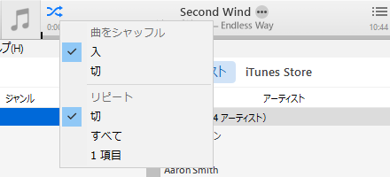
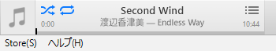

iTunes 12 から、リピート再生するための設定アイコンが生成バーに表示されなくなった。だがこれは、機能がなくなったワケではなく、非表示にされただけ。

**再生バーの「シャッフル再生」を切り替えるアイコンを右クリック**すると、このようなメニューが出てくる。

「リピート」から「すべて」などを選ぶと、以下のようにリピート再生が可能になり、アイコンが表示されるようになる。

……なんでこの機能隠したの？

- 参考：[【iTunes12】音楽をリピート再生する方法 ！消えたリピートボタンはどこへ？ | 楽しくiPhoneライフ！SBAPP](http://sbapp.net/appnews/itunes12-2-19211)
