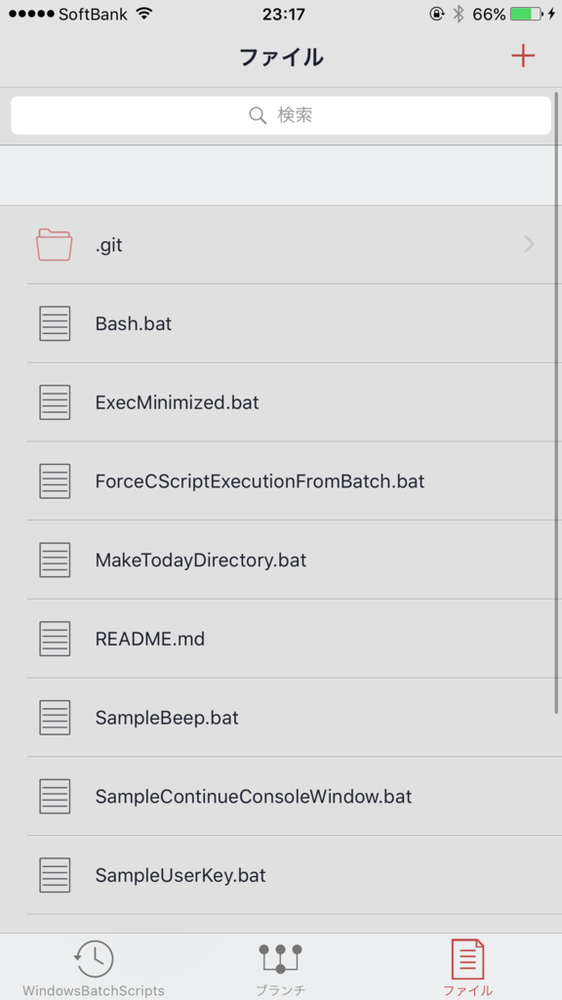
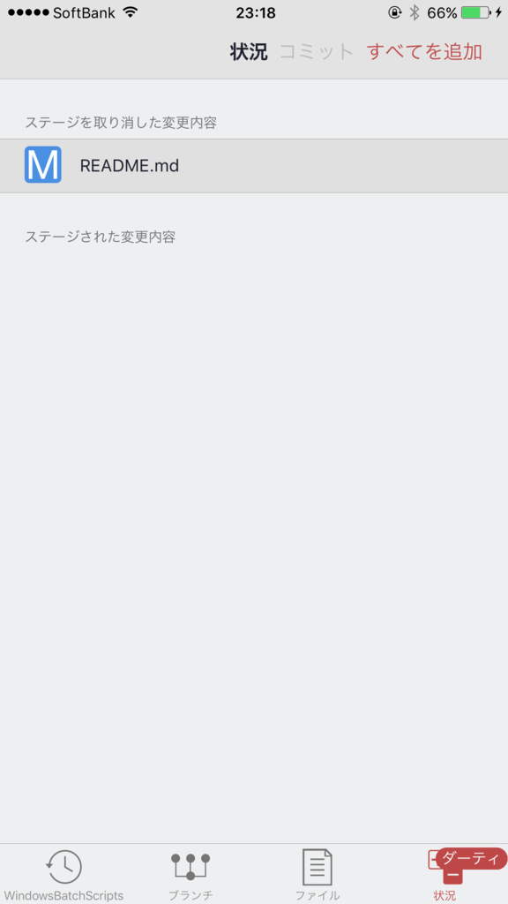
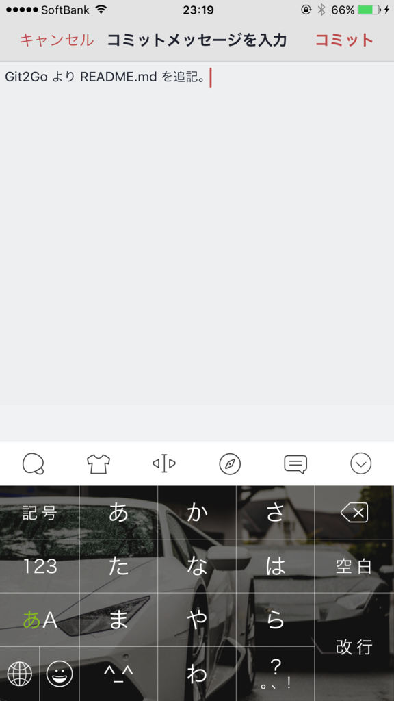
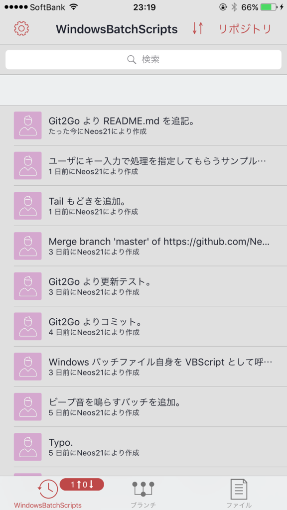

iPhone 上で GitHub との連携ができる「**Git2Go**」というアプリが凄かったので紹介。

## インストールと初期設定

使用端末は iPhone6Plus。AppStore より Git2Go を検索してインストールする。

初期起動時に何か入れたかもしれないけど、必要な設定は後からでも、画面下部の一番左、「リポジトリ」タブの左上「設定」から行えるのでご安心を。

「リモートログイン」で GitHub アカウントにログインすれば、自分のリポジトリをローカルにコピーしてファイルを閲覧することができる。

しかし、Git2Go が凄いのはここから。なんと**ファイルの編集やプレビュー、さらにはコミットと Push までできる**のである。*ケータイから GitHub に草が生やせるぞ！*

ということで次は草を生やすための手順を紹介。一連の操作で、右下の灰色の部分が緑になることをご確認いただきたい。

## SSH Key の設定

まず、設定の「Git ID」で、Git 用に使っているアカウント名とメールアドレスを設定しておく。多分これが普段と違うと Contributions に色が付かないと思う (未検証)。

次に設定の「SSH キー」を選択し、「再作成」をタップする (初回でも「再作成」)。

すると SSH キーができるので、「公開鍵を共有」をタップしてキー文字列をコピーする。

あとは GitHub にアクセスして SSH キーを貼り付けて登録すれば OK。登録の仕方はパソコン版の環境構築と同様なので割愛。

## Add・Commit・Push をしてみる

ここからは実際に GitHub に Push までやってみる。

Git2Go 内にローカルリポジトリをクローンした状態とする。リポジトリの切り替えや、別のリポジトリのクローンなどは「リポジトリ」タブの右上、「リポジトリ」ボタンより行える。

「ブランチ」タブでブランチの確認・切り替えができる。今回は個人的なリポジトリだし、Contributions を増やしたいから、master ブランチを直接触ることにする。

「ファイル」タブで、既存ファイルを選ぶとエディタが開き、内容を編集できる。HTML ファイルなんかであればプレビューもできたりする。新しいファイルを作る時は右上の「+」マークから。

エディタの機能はまぁまぁで、UTF-8 でないファイルは文字化けしてしまったり、`.bat` ファイルなどはテキストとして開けない。重めのファイルは開くのに時間がかかったりして、本当にフロントエンドの簡単なコード変更にとどまる感じだ。iPhone でゴリゴリ打ち込むこともないだろうし、こんなもんだろうか。

ファイルを更新すると、「ファイル」タブに「ダーティ」というバルーンが付き、その右に「状況」タブが追加される。これを選ぶと `git add` ができる。右上の「すべてを追加」が楽チン。

`git add` ができると、上部に「コミット」ボタンが出てくる。これをタップするとコミットメッセージの入力ができ、`git commit` ができる。

コミットができたら、「リポジトリ」タブに移る。ココに今コミットしたログが追加されているので、画面を上から下へスワイプして `git push` する。この下スワイプ操作は `git pull` と `git push` を兼ねている。

これで完了。GitHub を見てみれば、先ほどのコミットが確認でき、Contributions に色が付いたことだろう。

電車内で iPhone 片手にコーディングしてそのまま GitHub に上げられる、なんて素敵なんだろう！
