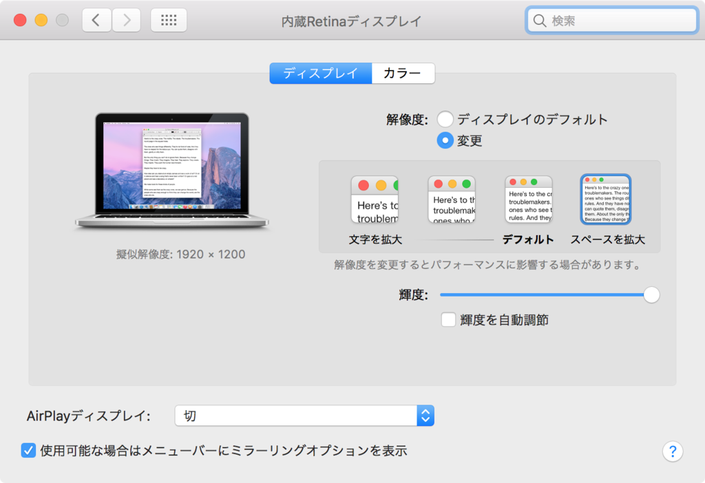

Early 2015 の MacBook Pro 13インチ Retina (MacOS Sierra) を使っている。何やら解像度を 1680x1050 よりも大きい 1920x1200 にする方法があるようなので試してみた。

以下の記事がそのままなので、特筆する内容はなし。

- [Macbook Pro 13インチでも疑似解像度1920x1200を使えるようにする(Sierra版) - Qiita](http://qiita.com/marron-akanishi/items/4e11d147dc69006818e4)

SIP の無効化は、

```bash
csrutil disable
```

もやっておいた。

あとは自環境が上の記事と同一だったので、

```bash
cd /System/Library/Displays/Contents/Resources/Overrides/DisplayVendorID-610/
sudo vim DisplayProductID-a02a
```

で対象の設定定義ファイルを開き、

```xml
    <data>AAAPAAAACWAAAAAB</data>
</array> ←既存行
```

となるように行を追加するだけ。

確かに広い。良い感じ。
