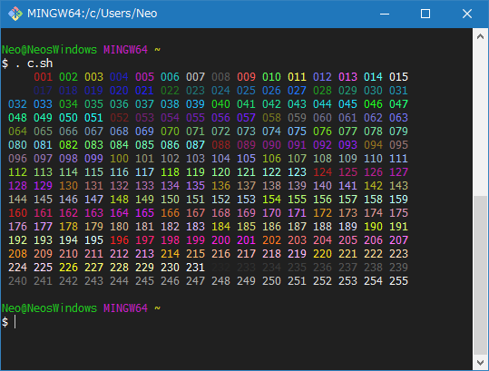
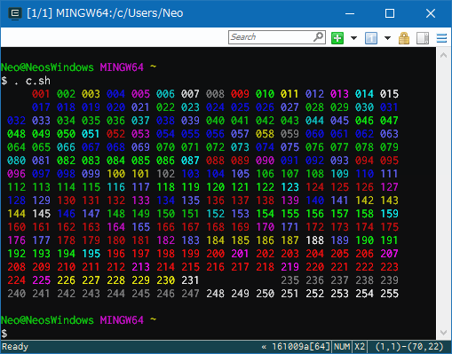
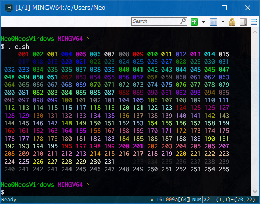
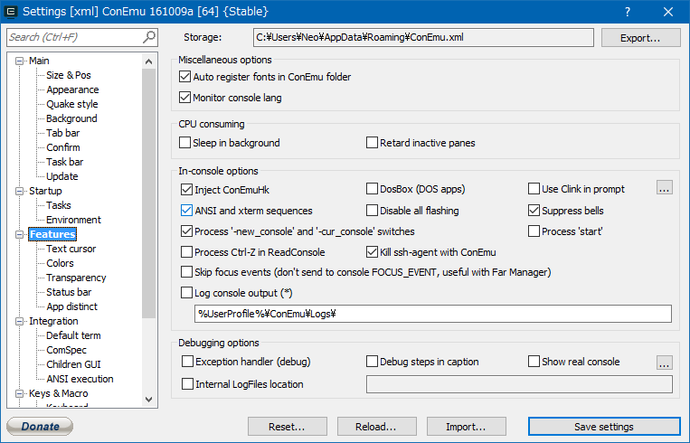
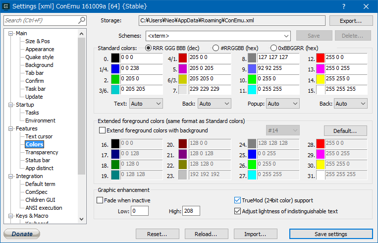
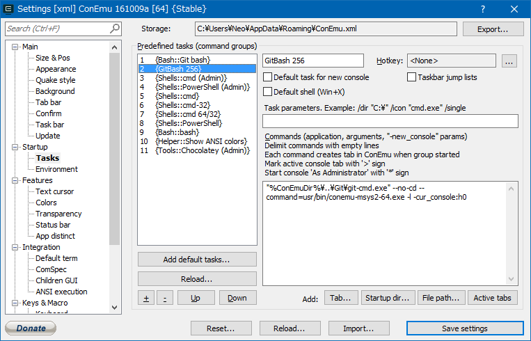

ConEmu 上で GitBash を使い始めて、何やら256色表示できるらしいと聞いて色々知らべてみたら思わぬ地雷だった。

## 発端

GitBash を直接起動した場合、以下のように256色表示できる。これは、以下のシェルスクリプトで256色表示をテストしたところ。

- 参考：[colcheck.sh · GitHub](https://gist.github.com/rcmdnk/6457780#file-colcheck-sh)



_純正 GitBash であれば、256色表示できるし、コンソールバッファも有効である。_

だが、同じシェルスクリプトを ConEmu 上で動作させている GitBash で実行すると、256色が正しく表示できない。



はてはて、何でだろうと思って調べて試行錯誤していたが、大変だったし、実現するには残念なトレードオフがある。

## 先に結論

_設定次第で ConEmu 上の GitBash でも256色表示はできる_。しかし、__コンソールのバッファを切らないといけない__。要するに画面上に見えている範囲しか残らないので、スクロール表示ができない。これは不便だ。

また、_ホームディレクトリにコネクタが出力するログが残る_。`connector-23944.log` といったファイルがボコボコできて、コンソールの全てを記録しているみたい。ログローテーションもなくどんどん増えていくので鬱陶しいのだが、切り方がわからなかった。

## 具体的な設定方法

環境は Windows10 64bit。

1. 以下のサイトから __Cygwin-Connector__ をダウンロードする (最新版は `terminals.v0.7.4.7z`)。
    - [Releases · Maximus5/cygwin-connector · GitHub](https://github.com/Maximus5/cygwin-connector/releases)
2. ダウンロードした `.7z` ファイルを解凍し、`conemu-msys2-64.exe` を取り出す。
    - 32bit 版の OS の人は `conemu-msys2-32.exe` を使えばできると思う (未検証)。
3. `conemu-msys2-64.exe` を `C:\Program Files\Git\usr\bin\` 配下にコピーする。
4. ConEmu で以下のように設定する。
    - Features：「Inject ConEmuHk」「ASNSI and xterm sequences」にチェックを付ける。
    - Features - Colors：「TrueMod (24bit color) support」にチェックを付ける。
5. 同じく ConEmu の Startup - Tasks で以下のようなタスクを追加する。

```bash
"%ConEmuDir%\..\Git\git-cmd.exe" --no-cd --command=usr/bin/conemu-msys2-64.exe -l -cur_console:h0
```

これで完成。

先程の256色表示をテストするシェルスクリプトを実行してみる。



う～む綺麗。だがバッファを切らないといけないのがな…。

設定箇所のキャプチャ置いときます。

- 
- 
- 

カラーチェックのスクリプト？は、ConEmu 内にもあるみたい。以下のように実行する。

```bash
cat "C:\Program Files\ConEmu\ConEmu\Addons\AnsiColors256.ans"
```

純正 GitBash では何もしなくとも256色綺麗に出るし、バッファも有効。でも ConEmu 上から起動した GitBash では殆どの色が灰色に抜け落ちる。

先程設定した Cygwin-Connector 経由であれば、ConEmu 上の GitBash からも256色表示できる。しかし、バッファを切らないといけない。イマイチ…。

## 参考文献

- [Cygwin+screenで256 colorを有効にする](http://rcmdnk.github.io/blog/2013/09/05/computer-cygwin-putty-vim/)
  - 256色表示をテストするシェルスクリプトを公開していた記事。
- [ConEmuからMSYS2のシェルを起動したときに256色対応させる - 水を見ると釣りがしたくなる](http://e8l.hatenablog.com/entry/2016/03/24/161206)
  - 以下の公式記事を紹介していた日本語記事。
- [ConEmu | cygwin/msys terminal connector](http://conemu.github.io/en/CygwinMsysConnector.html)
  - 公式の記事。
- [cmd.exe と awsome print - oogatta のブログ](http://oogatta.hatenadiary.jp/entry/2014/04/05/111408)
- [Enable 256 colour support over SSH · Issue #379 · cmderdev/cmder · GitHub](https://github.com/cmderdev/cmder/issues/379)
- [ConEmu | ANSI X3.64 and Xterm-256 Support](http://conemu.github.io/en/AnsiEscapeCodes.html#Xterm_256_color_map)
- [windows 10 - ConEmu + ls -- 256 colors not working - Super User](http://superuser.com/questions/1030047/conemu-ls-256-colors-not-working)
- [MSYS2で快適なターミナル生活 - Qiita](http://qiita.com/Ted-HM/items/4f2feb9fdacb6c72083c)
- [Connector for git-cmd.exe? · Issue #628 · Maximus5/ConEmu · GitHub](https://github.com/Maximus5/ConEmu/issues/628)
- [terminal - Can't enable 256 colors in ConEmu - Stack Overflow](http://stackoverflow.com/questions/12913392/cant-enable-256-colors-in-conemu)

この文字色を変えているのは、ANSI エスケープシーケンスと呼ばれる特殊な文字を渡して実現しているみたい。よー分かってないので勉強します。

…

…あれ、そういやそもそも何で256色表示したかったんだっけ…？

> You have no need in 256-colors In fact.
