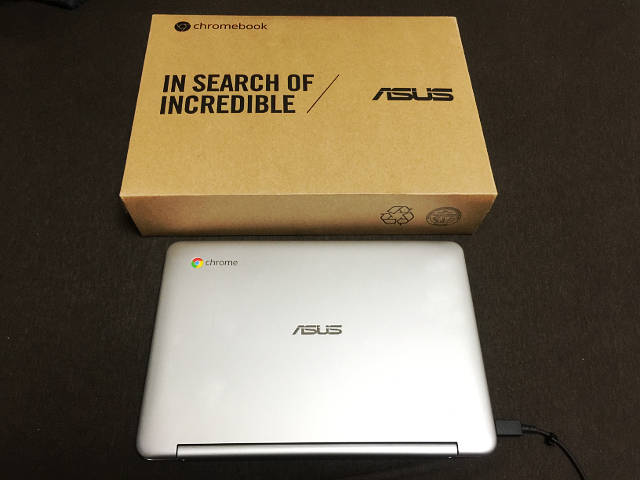
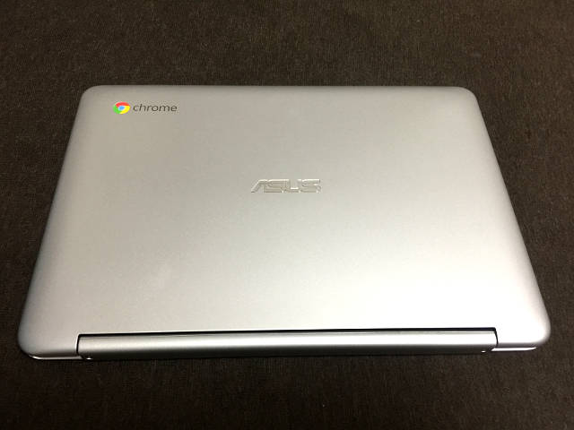
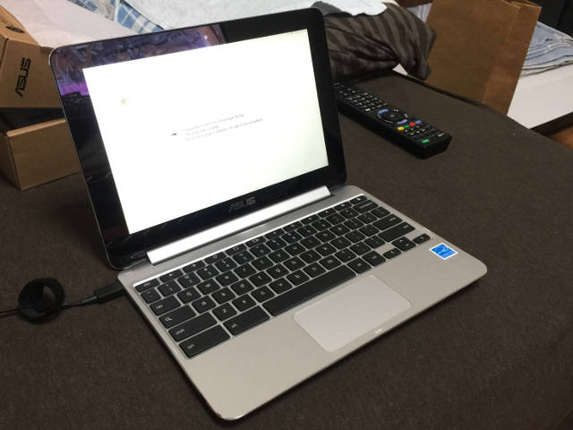
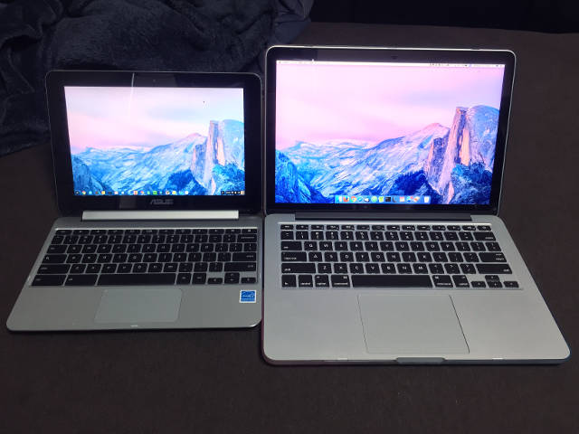

新型 MacBookPro が発表されたのを見て、「軽い MacBook イイなぁ～、Early 2015 の MacBookPro 13インチは大変優秀だけど 1.58kg もあると、持ち運び大変なんだよなぁ…」と思い、一旦は「iPad Pro + キーボードでノート PC チックに使う」案を検討したが、やはり iOS だと開発環境としては厳しいかなぁと思い断念。

色々考えていたら、ChromeBook という激安ノートパソコンが選択肢に挙がる。

これは面白い…。

…

そう思っていた_次の瞬間_、**手元には Asus ChromeBook Flip C100PA-DB02 が!!!!!**



箱から出しました…



御開帳…



なるほど…

## スペック

- **Asus ChromeBook Flip C100PA-DB02**
- CPU：Rockchip RK3288 1.8GHz Processor
- RAM：_4GB_ DDR3
- SSD：16GB
- Screen：10.1 Inches / 1280x800 Pixels / _Touch Screen_
- Keyboard：_US key_
- Weight：890g
- OS：_Chrome OS_

日本でも売っている ChromeBook Flip の海外版。日本ではメモリ 2GB、日本語キーボードなのだけど、MacBookPro 同様、英語配列のキーボードにしたかったのと、4GB メモリがあった方が良いかと思い、海外版を購入。

実際の商品はコレ。

- Amazon.com：<https://www.amazon.com/Chromebook-10-1-Inch-Convertible-Touchscreen-C100PA-DB02/dp/B00ZS4HK0Q>

日本語版の紹介サイトはコチラ。

- [ASUS Chromebook Flip C100PA | ノートパソコン | ASUS 日本](https://www.asus.com/jp/Notebooks/ASUS_Chromebook_Flip_C100PA/)

ChromeBook **Flip** という名前のとおり、液晶を裏側に折りたたんで、タッチパネルでタブレットのように扱える。890g と MacBookPro (1.58kg) のほぼ半分の重さで、10.1インチは手軽に扱えるサイズだ。

今回の海外モデル、海外の Amazon.com で買うと、速達オプションを入れても3万3千円程度でかなり安い。日本の Amazon で同じ型番の並行輸入品を買うと、約4万5千円になる。ということで、Amazon.com に登録して3万3千円で買ってやろうと思ったら、カード会社が使用を不審に思って止めに入ったらしく、注文がキャンセルされてしまい、オマケに Amazon.com のアカウントにログインできなくなってしまった。アカウント解除とかのあれこれを考えるのがもう面倒臭いので、日本の Amazon で4万5千円出して買ってしまった。2016年11月3日注文、2016年11月5日到着。

## ChromeBook って？

ChromeBook は、ChromeOS を搭載したノートパソコンの総称。この Asus 以外にも、Google と提携するメーカー各社が「ChromeBook」の名を冠した製品を販売している。Windows OS にお金を取られないので安く済んでいる。スペックを落としてあり、作りも若干安っぽいモノが多いが、「安かろう悪かろう」ではなく、少なくともサブ機として必要十分なスペックだ。

ChromeOS は基本的に Chrome ブラウザだけで構成されており、アドインのようにインストールできる拡張機能およびアプリしか使えないので、Windows や Mac のように、Office やら Firefox やらといった外部ソフトを入れたりすることはできない。Android に通じるような気がするが、「限られた中でカスタマイズして使う精神」がないと凝ったことはできない。逆に、「ネット見るだけだし、ブラウザとかよく分かんない」って人は、ネットとメールだけに限ったノートパソコンとして十分に使える。

## 並べてみる

左に ChromeBook Flip 10.1インチ、右に MacBook Pro 13インチ。外観はシルバーで、キーボードの配色やベゼルの色も MacBook Pro によく似ている。ChromeBook の方はバックライトキーボードではない。また、液晶の明るさも、MacBook Pro と比べるとだいぶ暗いように感じた。明るさの問題は比べるからであって、使っていれば慣れる。



そうそう、多分このブログではまだ記事にしていなかったと思うのだけど、MacBook Pro にはカラフルなケースを被せてある。普段は以下のようなカラフルなキーボードカバーを付けていて、これだとさらに印象が変わる。


Windows マシンのモニタの前に置いてみた。10.1インチ液晶で、解像度は _1440x900 px_ が最大。3つとも同じ壁紙にしてあるだけで、特に同期とかはさせていない。

## ChromeOS の実力は？

普段は Firefox メインで、Chrome ブラウザはボチボチだったのだが、ChromeOS 導入を機にカスタマイズを本格化した。Gmail アカウントに設定内容が同期されるので、Windows・Mac の Chrome ブラウザからインストールしておいた拡張機能やアプリなどは、ChromeOS の Chrome ブラウザにもサッと同期させられる。ブックマークなども Gmail アカウントとして同期するのでかなり便利だ。

メインで使っている Firefox のブックマークと連動させることができていないが、今のところ不便していない。というのも、Firefox を使用するメインの作業を ChromeBook で完璧にできないといけないこともないので、必要なブックマークだけ Chrome にも入れておくぐらいでなんとかなっている。サブ機としての使用に限定している感じだ。

メーラーも普段は Thunderbird を使っているが、管理しているアカウントは Gmail だったので、普通に Gmail で見れたら十分。

その他、Google Keep、スプレッドシートなどは普段から使っているので、Gmail アカウントの同期でなんとかなっている。

Evernote、Dropbox、Wunderlist など、普段 Windows・Mac・iPhone で使っているアプリとの連携も、Chrome アプリ・拡張機能を入れれば普通に使えて、動画も VLC プレイヤーが入るので特に問題なし。

エクスプローラ的な「ファイル」アプリがあるが、ローカルの SSD を使うルートディレクトリは「ダウンロード」フォルダ配下になる。ローカルの SSD は 16GB しかないので、基本的には Gmail アカウントに紐付く Google ドライブを使うことになる。「ヘルプ」画面あたりに案内があったと思うが、本体を購入した特典で Google ドライブに 100GB 分の容量をもらえるので、サブ機で操作する内容として不便はないだろう。前述のとおり Dropbox 連携もできるので、不便は全くない。

「ダウンロード」フォルダがルート扱いなのが気持ち悪い人には、以下のアプリで任意のフォルダを「ダウンロード」フォルダと同じ階層に作ることができる。

- [Add MY Documents - Chrome ウェブストア](https://chrome.google.com/webstore/detail/add-my-documents/plmanjiaoflhcilcfdnjeffklbgejmje?hl=ja)

## 開発環境としてはどうか？

Chrome Dev Editor というアプリがあり、GitHub と連携してのフロントエンド開発ができる。その他、標準では Ruby や Python をインストールできるわけではなく、Cloud9 などのウェブサービスで開発する手法が一般的。

このあと話すが、開発者モードにすることでシェル (Bash) をいじれるので、ターミナルのカスタマイズが可能。

## 開発者モードにする

ChromeOS には「開発者モード」というものがあり、これを有効にするとターミナル環境をいじることができる。開発者モードに移行するとそれまでのローカルデータは全て消えるので、購入したら最初に開発者モードにしてから始めると良い。

手順は以下のとおり。解説しているサイトは沢山あるので、色々調べてみるべし。

1. 一度パソコンの電源を落とし、Esc + F3 (Refresh キー) + 電源ボタンで起動する。
2. `Ctrl + D` で開発者モードにする。
3. スペースキーは押さずに、初期化が始まるまで待つ。
4. 初期化が終わったら、次回以降、**起動時は毎回 `Ctrl + D` を押す。**

これで開発者モードになる。

- 参考：[Chromebook Flip C100PA を買いました - みねこあ](http://d.hatena.ne.jp/minekoa/20151005/1444061337)
- 参考：[chromebook flip C100PA でlinux環境づくり - Stellar](http://squeuei.hatenablog.com/entry/2016/05/26/194028)

起動したら、`Ctrl + Alt + T` でターミナルを起動する。ここで起動するシェルは _crosh_ と呼ばれる ChromeOS のシェルで、ココで

```bash
$ shell
```

と入力することで、Bash が起動する。

ここからあれやこれやすると、Linux OS を導入してデュアルブートできるようになる。この話は次回。

- [Crouton を使って ChromeBook に Xubuntu 環境を構築する](/blog/2017/01/08-02.html)

## まとめ

まだ2日しか使っていないが、スペック的には申し分なし。

複数タブを一気に開くと若干もたつくが、MacBook Pro での同様の操作と処理時間がそんなに変わらないので、無線 LAN の速度で待たされているのかな？と思う。動画・音声も問題なく再生できており、音質はそこそこ良い。自分はサブ機と割り切っているが、用途が合えばメイン機としても十分申し分ない。キーボードは個人的には MacBook Pro より打ちやすく感じていて好きだ。

初の ChromeOS なので、これからゴリゴリカスタマイズしていこうと思う。
