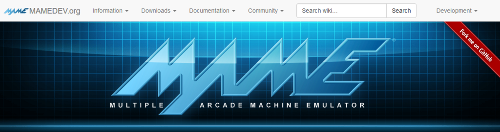
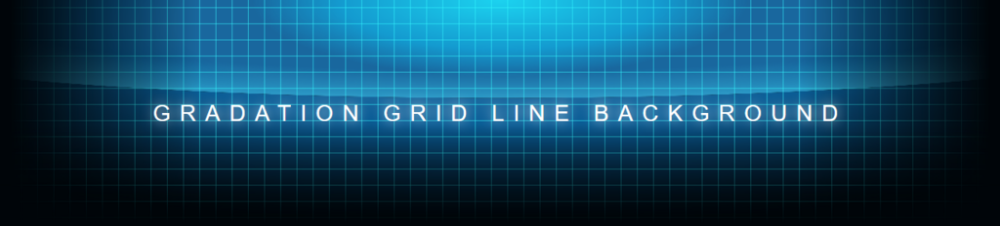

アーケードゲーム用エミュレータとして知られる「MAME」のサイトのヘッダ部分の画像がカッコよかったので、CSS だけでどこまで再現できるか試してみた。

- [MAMEDEV.org | Home of The MAME Project](http://www.mame.net/)

結果は以下。

CodePen で公開しているので、CodePen 上で広げて見てみてください。

- [Gradation Grid Line Background](http://codepen.io/Neos21/pen/QGdrLB/)

## 背景を作るまで

幅 1200px くらいで見た時にそれっぽくなるように作った。1要素で済ませてみたかったので `background` を複数指定して頑張った。

_`background` (`background-image`) は先に指定したものほど上に重なる_ので、初めに左右下にビネット効果を与えるグラデーションを指定し、一番最後に全体の背景となる黒を載せるようにした。`background-size`・`background-position`・`background-repeat` などは、`background` で指定した順に合わせて指定する。

さて、グリッド状の背景を作る方法だが、これは _`linear-gradient()` と `background-size` を組み合わせ_、20px 四方の右端もしくは下端に 1px 程度の色を付けるようにした。それ以外の部分は透過させておき、「横線の繰り返し」のレイヤーと「縦線の繰り返し」のレイヤーを重ねることで方眼を作った。

ここで問題なのは、MAME のサイトの方をよく見ると、このマス目の罫線自体がグラデーションしているのだ。20px 四方の背景を作り出して繰り返させている以上、この_罫線をさらにグラデーションさせることができず_、今回は断念した。うまいやり方知ってる人がいたら教えてください。

それ以外は円形グラデーションの組み合わせでそれっぽく表現した。グラデーションというと `linear-gradient()` しかないんだろうと思っていたのだけど、__`radial-gradient()`__ という関数もあった。これは円形のグラデーションが指定できるもの。位置指定とサイズ指定の関係を理解するのに時間がかかったので、MDN でプロパティを見ながら実際に使って見てみると良い。円の大きさや色合いをもっと凝れば近付けられると思うが、大変なのでそれっぽいところで切り上げた。

## 文字に関する指定

テキストが複数行になっても上下左右で中央寄せになるようにするため、__`display:flex;`__ を利用した。`align-items:center;` で垂直方向に中央寄せにし、`justify-content:center;` で水平方向に中央寄せにするのだが、折り返しが発生するほど幅が狭められた時は `text-align:center;` がないと水平方向の中央寄せが効かない。

あとは `text-shadow` で若干 Glow エフェクト (ネオン効果) みたいなのを付けてみたりした程度。

## 以上

CSS オンリーでもそれなりに凝ったことができるのはやはり面白い。Photoshop いらずの CSS 芸人になれたらいいな。
