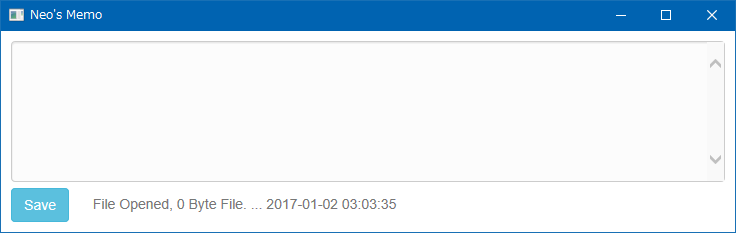
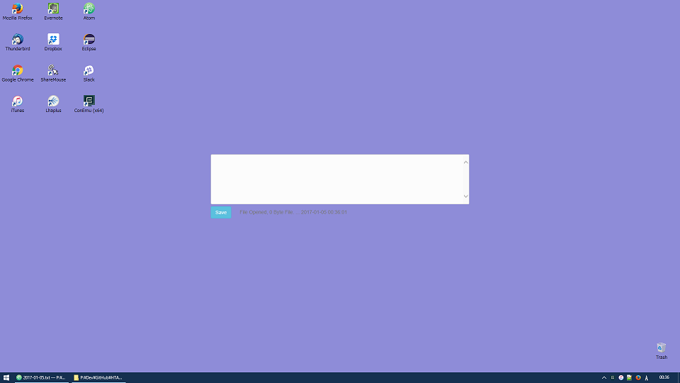

前回の記事で、HTA で IE11 のページを開きつつ、枠線がないウィンドウを開く方法を学んだ。

- [IE11 (Edge) モードで枠なしの HTA Application ページを開きたい](/blog/2017/01/04-02.html)

そこでこのテクニックを応用して、HTA を使ったメモアプリ「**HTA Memo**」を作ってみた。

ファイルは以下の GitHub リポジトリに置いてある。

- [GitHub - Neos21/hta-memo: HTA で Memo アプリを作ります。](https://github.com/Neos21/hta-memo)

## 必要な環境

- Windows 環境 … Windows10 にて動作確認。Windows7 でも動作するはず。WSH を使うので Windows 以外では動作しない。
- Internet Explorer 11 … Edge モードで動作するようにしたため IE11 推奨。
- Excel … 後述する「常に最前面表示」機能のために使用。なくても動作はする。Excel 2007 で動作確認。

その他、jQuery・Bootstrap の CDN を読み込ませているので、ネット環境が欲しい。jQuery 部分は Vanilla JS に書き換え可能なレベルだし、Bootstrap も大して使っていないので、自力でカスタマイズしてオフライン利用できるアプリにしてもらっても結構。

## インストール

ローカルで動作させる前提なので、`Execute.hta` と `Main.hta` をローカルの任意のフォルダに配置して使用すること。

後述するが `Main.hta` と同階層に `Memo_YYYY-MM-DD.md` という名前のテキストファイルが日付ごとに生成されていくので、メモアプリ用のフォルダを作っておくと良い。

## ファイルと外観

**`Main.hta`** が本体。直接開くと以下のようにウィンドウアプリとして開く。

**`Execute.hta`** は `Main.hta` を枠線なしのウィンドウで開くための起動用ファイル。これを介して開くとウィンドウ枠がないアプリになる。デスクトップの背景色に合わせて背景色を指定したりすれば、以下のキャプチャのように、デスクトップに馴染ませて「アクティブデスクトップ」のように見せかけることができる。

## `Execute.hta` の機能

`Execute.hta` は、`Main.hta` を枠線のないウィンドウとして開くための起動用ファイルだが、その他にも以下のような機能を持たせてある。

### 常に最前面表示

Excel の API を利用して、常に最前面表示されるようにしてある。動作させるには Excel がインストールされている必要があるが、Excel がなくても最前面表示にならないだけでメモアプリとしての動作には影響なし。

- 参考：[htaの質問です - htaのウィンドウを常に最前面に表示し続けるようにするには... - Yahoo!知恵袋](http://detail.chiebukuro.yahoo.co.jp/qa/question_detail/q12151482357)

### ウィンドウをドラッグして移動できる

「Save」ボタン右にある余白部分をマウスでドラッグすれば、ウィンドウを移動できる。

- 参考：[タイトルバーのないウインドウを移動](http://write-off.cside.com/scripts/hta/movewin.htm)

## `Main.hta` の機能

メインの機能の紹介。

### メモファイルの日付ローテート

その日最初に起動させると、`Main.hta` と同階層に `Memo_YYYY-MM-DD.md` という形式で当日日付のファイルを生成する。翌日起動すると、翌日の日付でまたファイルを生成する。つまり_日付ローテートする_メモアプリになっている。

拡張子は `.md`、Markdown ファイルとしたが、`.txt` と考えてもらって良い。内部的には `FileSystemObject` を使用しているため、エンコードは UTF-8 ではなく ASCII (Shift JIS) 形式。

なお、その日のファイルができている状態で一度アプリを閉じ、再起動しても、その日のファイルを読み込み直すので、いつでも続きからメモが書ける。

### `Ctrl + S` で保存可能

「Save」ボタンを押下すれば変更内容が保存できるが、`Ctrl + S` でも保存できるようにした。

- 参考：[javascript - Best cross-browser method to capture CTRL+S with JQuery? - Stack Overflow](http://stackoverflow.com/questions/93695/best-cross-browser-method-to-capture-ctrls-with-jquery)

### `Tab` キーでインデントが挿入可能

`Tab` キーでスペース2つのインデントが挿入可能。カーソル位置を取得するのに `selectionStart` と `selectionEnd` という API があることを知ったので、これを基にテキストを範囲選択した状態でも普通のテキストエディタのようにインデントが挿入できるように工夫した。

## 作成した背景

オフラインの Windows 環境で、タスクバーを占領せず、メモを書きたかったので作ってみた次第。

日付ごとにファイルを自動生成することで、あとでメモを探したり移動したりしやすくしたつもり。

## 今後の課題

- テキストエリアの内容が変更された時点で、未保存である旨のメッセージを出したりしたい。
- 一定時間ごとに自動保存できると良いだろうか。自動保存時は Temp ファイルに保存することでレジュームできると良いだろうか。

…とはいっても、今後オフライン環境で仕事することもないと思うので、もう更新しないかも。
