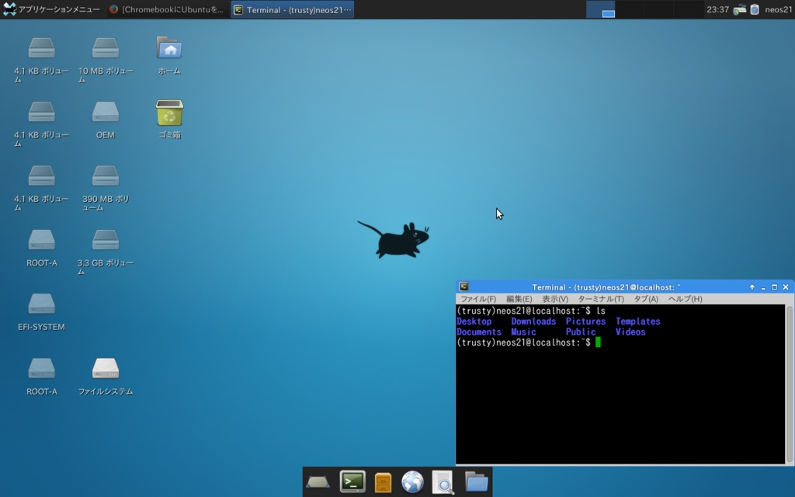

去年、2016年11月に Asus ChromeBook Flip C100PA-DB02 を購入した。

- [Asus ChromeBook Flip C100PA-DB02 を買いました](/blog/2016/11/07-01.html)

このあと、この ChromeBook に Xubuntu を導入したので、その記録を今更ながら記事にする。

## 目次

## ChromeBook に Linux 環境を構築するには

ChromeBook に Linux 環境を構築するためのツールとして有名なのが、**Crouton** というツール。これは `chroot` によって ChromeOS と Linux OS を同居させるようなことが可能になるツール。chroot とは CHange ROOT の略。指定の子プロセスに対してルートディレクトリを変更するコマンドで、Linux OS が動作する環境を Chrome OS 環境とは別にルートと見せかけることで OS を共存させるようなイメージか。

- 参考 : [chroot - Wikipedia](https://ja.wikipedia.org/wiki/Chroot)

ちなみに、Chromebrew というツールがあって、これを使うと ChromeOS のターミナルに各種 Linux コマンドを導入できるのだが、Asus ChromeBook Flip の場合は CPU がコレに対応していないとのことで、インストールできなかった。そこで、Linux 環境を別に作り、開発環境として利用しようというワケ。

今回は導入する Linux OS として Xubuntu を選んだ。特に理由はない。Ubuntu を入れることもできる。今回の一連の作業は以下の記事を参考に試行錯誤した結果なので、Ubuntu を入れてみたいという人は以下の記事やその他ググってみると良いだろう。ChromeBook に Linux OS を導入する記事は山程ある。

## 全体の流れ

1. ChromeOS を開発者モードで起動する
2. Crouton をダウンロードする
3. Crosh から Bash を起動し、Crouton を使って Xubuntu をインストールする
4. Xubuntu を起動し、日本語入力できるように設定する

こんな流れで説明しようかと。

## 1. ChromeOS を開発者モードで起動する

ChromeBook を開発環境として使おうとしているギークの皆さんなら購入時点から開発者モードにしていると思うが、今一度説明。といっても以前の記事の抜粋。

> ChromeOS には「開発者モード」というものがあり、これを有効にするとターミナル環境をいじることができる。開発者モードに移行するとそれまでのローカルデータは全て消えるので、購入したら最初に開発者モードにしてから始めると良い。
> 
> 手順は以下のとおり。解説しているサイトは沢山あるので、色々調べてみるべし。
> 
> 1. 一度パソコンの電源を落とし、Esc + F3 (Refresh キー) + 電源ボタンで起動する。
> 2. `Ctrl + D` で開発者モードにする。
> 3. スペースキーは押さずに、初期化が始まるまで待つ。
> 4. 初期化が終わったら、次回以降、**起動時は毎回 `Ctrl + D` を押す。**
> 
> これで開発者モードになる。
> 
> - 参考 : [Chromebook Flip C100PA を買いました - みねこあ](http://d.hatena.ne.jp/minekoa/20151005/1444061337)
> - 参考 : [chromebook flip C100PA でlinux環境づくり - Stellar](http://squeuei.hatenablog.com/entry/2016/05/26/194028)

## 2. Crouton をダウンロードする

次に Crouton をダウンロードする。以下の URL にアクセスするといきなりファイルの保存先を選択するダイアログが表示されるので、「ダウンロード」フォルダの直下に「crouton」というファイルをダウンロードして置いておく。

- <https://goo.gl/fd3zc>

「これ何の URL？平気？」と気になった方、ご安心を。以下の Crouton 公式 GitHub リポジトリでもこの URL で最新版の Crouton がダウンロードできると記載されている。

- 参考 : [GitHub - dnschneid/crouton: Chromium OS Universal Chroot Environment](https://github.com/dnschneid/crouton)

以下は「ダウンロード」フォルダ直下に、拡張子なしの「crouton」ファイルが存在する前提で話をすすめる。パスでいうと「/Downloads/crouton」がある状態にしておくということだ。

## 3. Crosh から Bash を起動し、Crouton を使って Xubuntu をインストールする

Crosh と Bash の起動については前回の記事より抜粋。

> `Ctrl + Alt + T` でターミナルを起動する。ここで起動するシェルは *crosh* と呼ばれる ChromeOS のシェルで、ココで
> 
> `sh $ shell`
> 
> と入力することで、Bash が起動する。

Bash が起動したら、以下のコマンドで Crouton を叩き、Xubuntu をインストールする。*インストールには1時間近くかかるので気長に待とう。*

```bash
$ sudo sh ~/Downloads/crouton -r trusty -t xfce-desktop,keyboard,audio,extension,touch,chrome
```

インストール作業を待つ間に、オプションの詳細や、ハマったポイントを紹介する。

## Crouton のオプション詳細

- 上のコマンドは、chroot 配下のデータを暗号化しない設定になっている。chroot 配下を暗号化するには、コマンドに `-e` オプションを付ければ良い。
- `-r` オプションでディストリビューションを選択している。何が選べるは以下のコマンドで確認できる。

```bash
chronos@localhost / $ sudo sh ~/Downloads/crouton -r list

Downloading latest crouton installer...
######################################################################## 100.0%
Recognized debian releases:
    potato* woody* sarge* etch* lenny* squeeze* wheezy jessie stretch sid
Recognized kali releases:
    kali* sana* kali-rolling
Recognized ubuntu releases:
    warty* hoary* breezy* dapper* edgy* feisty* gutsy* hardy* intrepid* jaunty*
    karmic* lucid* maverick* natty* oneiric* precise quantal* raring* saucy*
    trusty utopic* vivid* wily* xenial* yakkety* zesty*
Releases marked with * are unsupported, but may work with some effort.
```

- 上の出力を見て分かるとおり、`-r trusty` は Ubuntu ディストリビューションを選択している。Trusty とはバージョン 14.04 (LTS : 長期サポート) のコードネームなので、Ubuntu 14.04 をインストールするよ、ということになる。
- `-t` オプションは、ウィンドウマネージャやパッケージを選択する。こちらも有効なパラメータを以下のコマンドで調べられる。

```bash
chronos@localhost / $ sudo sh ~/Downloads/crouton -t list

Available targets:
audio
        Support audio playback via Chromium OS's audio system.
        Requires: core
chrome
        Google Chrome browser, stable channel.
        Requires: x11
chrome-beta
        Google Chrome browser, beta channel.
        Requires: x11
chrome-dev
        Google Chrome browser, dev channel.
        Requires: x11
chromium
        Chromium browser. Uses the distro's version, which may be old.
        Requires: x11
cli-extra
        Basic CLI tools such as ssh.
        Requires: core
core
        Performs core system configuration. Most users would want this.
e17
        Installs the enlightenment desktop environment. (Approx. 50MB)
        Requires: gtk-extra
extension
        Clipboard synchronization and URL handling with Chromium OS.
        Requires: x11
gnome
        Installs the GNOME desktop environment. (Approx. 400MB)
        Requires: gtk-extra
gnome-desktop
        Installs GNOME along with common applications. (Approx. 1100MB)
        Requires: gnome
gtk-extra
        GTK-based tools including gdebi, gksu, and a simple browser.
        Requires: x11
kde
        Installs a minimal KDE desktop environment. (Approx. 600MB)
        Requires: x11
kde-desktop
        Installs KDE along with common applications. (Approx. 1000MB)
        Requires: kde
keyboard
        Adds support for Chromebook keyboard special keys.
        Requires: x11
lxde
        Installs the LXDE desktop environment. (Approx. 200MB)
        Requires: gtk-extra
lxde-desktop
        Installs LXDE along with common applications. (Approx. 800MB)
        Requires: lxde
touch
        Touchscreen and limited generic gesture support.
        Requires: x11
unity
        Installs the Unity desktop environment. (Approx. 700MB)
        Requires: gtk-extra
unity-desktop
        Installs Unity along with common applications. (Approx. 1100MB)
        Requires: unity
x11
        X11 via autodetected backend. Does not install any desktop environment.
xbmc
        Installs the XBMC media player. (Approx. 140MB)
        Requires: x11
xfce
        Installs the Xfce desktop environment. (Approx. 250MB)
        Requires: gtk-extra
xfce-desktop
        Installs Xfce along with common applications. (Approx. 1200MB)
        Requires: xfce
xiwi
        X.org X11 backend running unaccelerated in a Chromium OS window.
        Requires: audio extension
xorg
        X.Org X11 backend. Enables GPU acceleration on supported platforms.
        Requires: audio
```

- 上のコマンドは `-t xfce-desktop,keyboard,audio,extension,touch,chrome` と指定したので、以下のような環境が導入できる。
  - `xfce-desktop` … ウィンドウマネージャに Xfce デスクトップを採用し、主要なパッケージが導入済の状態にする。  
    (`xfce` という方を選んでしまうと主要パッケージがないせいで日本語化が面倒臭いので注意)
  - `keyboard` … Linux 環境下で ChromeBook のファンクションキーを解釈可能にする。
  - `audio` … 音声再生を有効にする。
  - `extension` … ChromeOS とのクリップボードを共用にする。ChromeOS から Xubuntu にテキストをコピーしたりできるようにする。
  - `touch` … タッチスクリーンを有効にする。ChromeBook Flip ならではのタッチ操作を可能にするため。
  - `chrome` … Linux に Chrome ブラウザをインストールする。
- ここまでで、「あれ、Ubuntu 14.04 を選択していて、なんで Xubuntu が入るワケ？」と思うかもしれないが、`-r trusty -t xfce-desktop` と指定し、ウィンドウマネージャに Xfce を選択することで、Ubuntu の派生ディストリビューションである Xubuntu がインストールされるようになるというワケ。このあたりの組み合わせは以下が詳しい。
  - 参考 : [ChromebookにXubuntuをインストールする方法 | Chrome速報](http://chromesoku.com/xubuntu-on-chromebook/)
- 一部必要な容量が記載されているが、普通に Xubuntu を導入するだけで 1・2GB ぐらいは容量を食うので、16GB そこらしかない ChromeBook では容量に注意すること。なお、SD カードに Linux 環境をインストールしている人もいたりするので、本体の容量が足りない人は試してみると良いかも。
  - 参考 : [ChromebookのSDカードにLinuxをインストールする方法 | Chrome速報](http://chromesoku.com/linux-on-chromebook-sdcard/)

### `sudo` ができない？

`sudo` コマンドを打つとなぜかパスワードを聞かれてしまい、これまで何のパスワードも入れていなかったので何を入れたらいいのか分からない、という状態に陥った。

結局原因はよく分からないが、*Powerwash して最初からやり直した*らうまく行った。Powerwash はタスクバーから選択する「設定」ウィンドウから実行可能。一度完全に初期化するのでデータのバックアップは別途とっておくこと。自分はほぼ全てのデータを Google Drive に置いていたので影響ほぼなし。

なお、開発者モードにしないと Crosh で `shell` と打っても Bash に入れないので、開発者モードは必要。Powerwash 後、*デバッグ機能*を有効にして初期化処理すると `sudo` 時にパスワードを求められるようになるので、デバッグ機能は有効にしないで進める。うまくいくと `sudo -s` でパスワード設定とかなしにいきなり `sudo` できるようになるはずだ。

- 参考 : [Google グループ](https://productforums.google.com/forum/#!topic/chromebook-central/83CBFpaQc9I)
- 参考 : [Chroot asking for password that I did NOT set Solved · Issue #2050 · dnschneid/crouton · GitHub](https://github.com/dnschneid/crouton/issues/2050#issuecomment-136217253)

### Linux 環境を捨てるには？

再度インストールを実行したいとか、Linux 環境やっぱイラネとなったときは、`/usr/local/chroots/trusty/` ディレクトリを丸ごと削除すれば良い。

```bash
# これで Trusty の場合のインストール内容が削除できる。
$ cd /usr/local/chroots/
$ rm -rf trusty
```

## 4. Xubuntu を起動し、日本語入力できるように設定する

Xubuntu を起動するには、Crosh → Bash から以下のコマンドを打つ。

```bash
$ sudo startxfce4
```

これで Xubuntu が開いた。

次に、*日本語表示を可能にするための設定*を続けていく。Xubuntu 内のターミナルを開き、以下を入力。

```bash
$$ sudo apt-get install language-pack-ja
$$ sudo apt-get install ibus-mozc
$$ sudo update-locale LANG=ja_JP.UTF-8
```

> 1行目は日本語パックのインストール、2行目はMozcのインストール、3行目はlocaleに日本語を追加するコマンドになります。各コマンドの実行時にパスワードを求められたときは、インストール時に設定したパスワードを入力します。

- 参考 : [ChromebookにXubuntuをインストールする方法 | Chrome速報](http://chromesoku.com/xubuntu-on-chromebook/)

コマンドでのインストールが終わったら、左上のスタートメニューから設定を選び、「Language Support」を選んで「Install」を押す。

インストールができたら一旦ログアウトして再度 `sudo startxfce4` で再起動する。これで Xubuntu が日本語表示になる。

次に*キーボードから日本語入力できるようにする*。

日本語入力のための `ibus-daemon` が起動時に立ち上がるようにする必要がある。「設定」→「セッションと起動」→「自動開始アプリケーション」で「追加」ボタンを押下し、以下のコマンドを入力する。

```bash
ibus-daemon -rdx
```

次に、ルート権限で `/etc/profile` に以下の環境変数を追加する。

```bash
$$ sudo mousepad /etc/profile

# Mousepad というのはテキストエディタ。
# これで /etc/profile が開くので、一番最後に次の4行を追加して保存する。

export GDM_LANG=ja
export GTK_IM_MODULE=ibus
export XMODIFIERS=@im=ibus
export QT_IM_MODULE=ibus
```

で、一度ログアウトして再起動すると、日本語入力できるようになる。

*英数字に直すには F10・音量上げるキー*を押す。

- 参考 : [taijuのブログ: hp chromebook 11にcroutonでUbuntu導入&日本語入力環境構築](http://mp884.blogspot.jp/2014/02/hp-chromebook-11.html)
- 参考 : [croutonでのxubuntu日本語等の環境設定](https://jands-innovation.com/memorandum/linux-memorandum/cloudready/3540/)

**これで環境設定は完了。**

## ChromeOS と Xubuntu の行き来の仕方

`Ctrl + Alt + F1 (戻る)` などと紹介している記事もあるのだけど、どうも ChromeBook Flip の場合は Shift キーも要るみたい。

- `Ctrl + Alt + Shift + F1 (戻る)` … Xubuntu から ChromeOS に戻る
- `Ctrl + Alt + Shift + F2 (進む)` … ChromeOS から Xubuntu に戻る

全てのキーを押して、離すときに画面が切り替わる感じ。

- 参考 : [Chromebook & crouton の操作。 | サイゴンのうさぎ シーズン1](http://usagisaigon.blogspot.jp/2013/08/chromebook-crouton_14.html)
- 参考 : [Chromebookを買ったら、そうだUbuntuでも入れよう - @nagasの路地裏](http://atnagas.com/install-ubuntu-on-chromebook)
- 参考 : [chromebookにcroutonでubuntuをいれる - Qiita](http://qiita.com/yasuki/items/f6a8a350087517b0069b)

ついでに Xubuntu のスクリーンショットを撮ってみた。

> ファイルの保存場所として、Chrome OSのDownloadsフォルダが両環境で共有できます。
> 
> - スクリーンショット : 「Applications Menu」→「Accesary」→「screen shot」



ひとまずこんな感じで良いでしょう！

## 参考

以下の3つの記事がベースになっとります。

- [ChromebookにUbuntuをインストールする方法 | Chrome速報](http://chromesoku.com/ubuntu-on-chromebook/)
- [ChromebookにXubuntuをインストールする方法 | Chrome速報](http://chromesoku.com/xubuntu-on-chromebook/)
- [Dell Chromebook 11 にcroutonを使いubuntuをインストールし動かすまでの道のり(2) | 2480GADGET](http://2480design.com/gadget/20150128/archives/8319)

日本語化の試行錯誤中に以下のようなコマンドを Xubuntu 上で打ったりしたけど、多分効果なかったものと思慮。一応備忘として残しておく。

```bash
$$ sudo apt-get install fcitx fcitx-mozc fcitx-libs-qt5 fcitx-frontend-qt5
```

- 参考 : ["Xubuntu 14.04 LTS"の日本語入力](http://home.catv.ne.jp/dd/kanak/Zlinux/lx035.htm)

あ、あと全然関係ないけど、ChromeBook Flip における「Delete キー」の動作は、**`Alt + Backspace`** でできまする。意外と便利。
