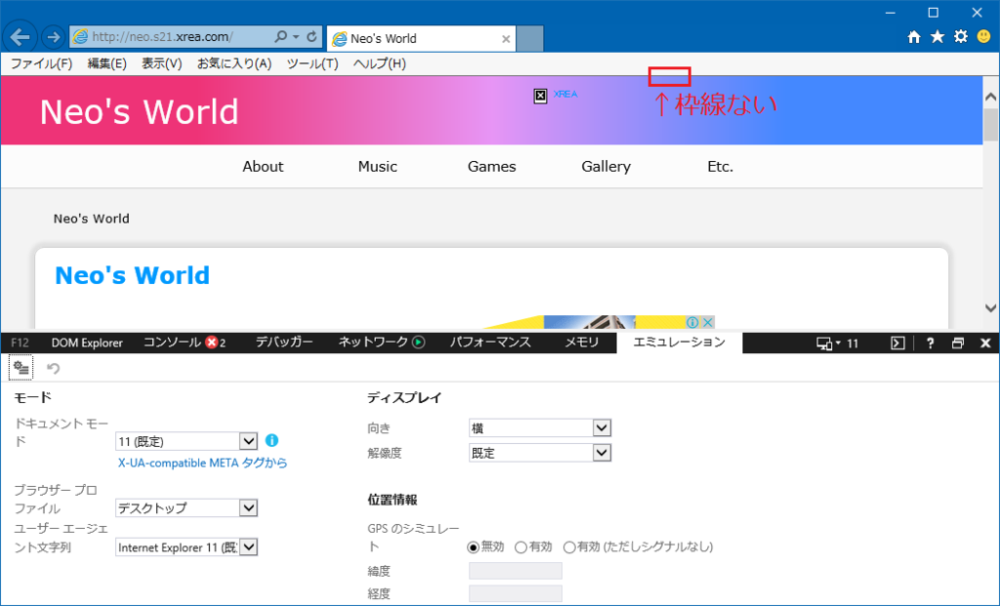
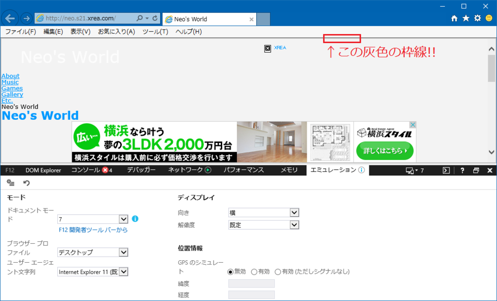

IE11 で IE7 エミュレートにしたりすると、ページを表示する領域全体を灰色の枠線が囲んでいる。

これが通常の Edge モード表示。

次に、IE7 エミュレートを選択した状態。

ページのフチに、2px か 3px 程度の灰色の border が出ているのが分かるだろうか。

…いや、だから何というワケではないのだが、これって何で出てるんだろうか、と。

調べてみたら、この事象自体は認知されているものの、みんな気にしていないみたい。

- 参考：[ブラウザの上と左右の枠について - マイクロソフト コミュニティ](https://answers.microsoft.com/ja-jp/ie/forum/ie9-windows_7/%e3%83%96%e3%83%a9%e3%82%a6%e3%82%b6%e3%81%ae/ec27e6c0-a3d2-4966-a06d-0af9f2a59a9f?msgId=d55366cd-b14f-4816-a46b-5ee9ff82f015)  
  「互換表示にすると出ますね」という回答だけ。
- 参考：[css - IE strange border - Stack Overflow](http://stackoverflow.com/questions/11642262/ie-strange-border)  
  「meta 要素で Edge モードにすると出なくなるよ」程度の回答。
- 参考：[Gray border (2 or 3 pixel) around html page (inside browser window) in IE7 only. - Weaver Themes Support Forum](https://forum.weavertheme.com/discussion/3426/gray-border-2-or-3-pixel-around-html-page-inside-browser-window-in-ie7-only)  
  「`<html>` 要素より外側にあるっぽい？」的な回答のみ。

以下のサイトがもう少し詳しく触れていた。

- 参考：[What happens in Quirks Mode in web browsers?](https://www.cs.tut.fi/~jkorpela/quirks-mode.html)

> A gray 2px page border appears by default on some versions of IE. It can in some cases be changed or removed by setting the `border` property of the html element (e.g., `html { border: 0; }`).

`html { border: 0; }` で削除できると書いてあったが、試した限りだとできなかった。

…別に何も困ってないし、「いつまで互換表示モードに頼ってるの」と言われそうだけど (~~ギョーミーな SIer はこんなもんだよ!!~~)、気になったので記事にしておく。
