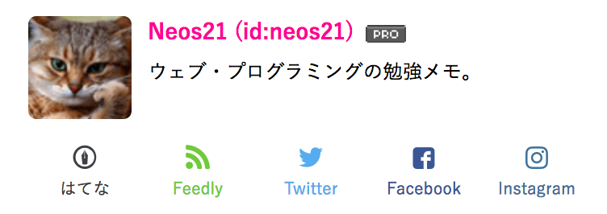
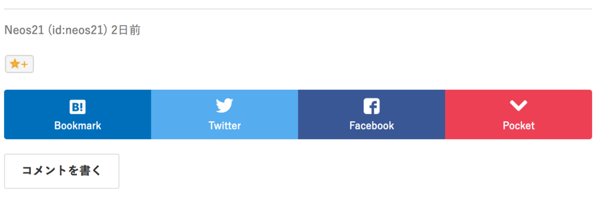

自分が運営する3つのはてなブログをまたカスタマイズした。今度は記事をシェアするリンクやブログをフォローするボタンを独自のモノにカスタマイズすることで、表示速度を高速化させた。

## 何を変えたか

まず、ページ右側に表示されているプロフィール欄にあった「読者になる」ボタンや「Twitter をフォローする」ボタンを、以下のような独自のリンクに変更した。Feedly への RSS 登録や Facebook・Instagram へのリンクも追加してみた。

次に、記事の下に置く各種 SNS へのシェアをお願いするリンクも、デフォルトのモノから以下のように変更した。

「はてなスター」だけは代替手段がなさそうだったので、少々重たいのだがデフォルトのまま使うことにした。

今回はこれらのリンクの作り方については触れない。別途記事を作るつもり。今回は「この辺削るとはてなブログは速くなるよ」について触れておく。

## はてなブログ公式のプラグインは表示速度が遅い

はてなブログ公式 (デフォルト) の各プラグインは、基本的に _`iframe` 要素で別ページのデータを読み込むようなことをしている_モノが多く、必然的に表示速度が遅くなる。

つまり、これら公式のプラグインをそのまま使う以上、表示高速化は見込めない。

では、表示高速化に寄与する要素とは具体的にどれなのか、細かく見ていきたい。

## 「設定」画面で設定できる内容

Pro になると変更できるようになる以下の設定項目について。

### 記事にキーワードリンクを付与しない

記事ページとして生成される HTML ソースにキーワードリンクが入らなくなるため、記事のサイズは必然的に軽くなり、高速化に多少影響すると思われる。

Pro に移行する前に書いた過去記事に関しては、記事を編集して更新してあげないとキーワードリンクが消えないため注意。

- [はてなブログ Pro に移行しても過去記事の「はてなキーワード」へのリンクは消えないので記事を更新しよう](/blog/2017/01/28-02.html)

### はてなによる広告を表示しない

広告分軽くなる。代わりに自前の AdSense などを貼るのであれば、プラマイゼロ、むしろマーイになるか。

### ブログにヘッダとフッタを表示しない（PC版のみ）

ヘッダは `iframe` で読み込んでいるようだ。このチェックを入れると `display:none;` でヘッダ・フッタ部分が非表示になるだけで、`iframe` 要素はそのまま中に残っているので、大して変わらないと思う。

…

ということで、「設定」画面で変更できるものに関しては大きく表示速度が変わる要素は少ないと思われる。

## 「デザイン」画面で設定できる内容

「デザイン」画面から設定できるもので変化があるのは、「ソーシャルパーツ」がメイン。

## 各ソーシャルパーツ

これらも `iframe` 要素で実現されるものがほとんどで、シェアされた数などを取得しに行って表示するため、すごく重たい。不要な SNS のリンクは置かないに限る。

ブログのジャンルにもよるとは思うが、個人的には「はてなブックマーク」と「Twitter」のシェアリンクがあれば十分だと思う。

## はてなスター

まぁまぁ重たいようだが、自前でリンクを置けるような代替手段がないため、これだけはそのまま残した。スターが付くと嬉しいので…。

## はてなブックマークコメント

これも `iframe` 要素で読み込まれる。これがかなり重たいらしく、_これを外すだけでもかなり違うと思う_。コメントは直接コメント欄で頂くことにしたい…。

## Zenback

最初から未使用。

## サイドバーの「プロフィール」モジュール

「読者になるボタン」や「Twitter フォローボタン」などは、置けばおくだけ重くなる。

## 実際どのくらい速くなるの？

ウェブページの表示速度を計測してくれるサービスは色々あるが、今回は体感速度でだけカスタマイズをした (単に計測が面倒くさかった)。

このブログに関しては、トップページの読み込みが終わるのに_10数秒〜20秒近くかかっていた_のが、上のカスタマイズをしたら、__3〜4秒で読み込みが終わるようになった__。早くやればよかった…！
