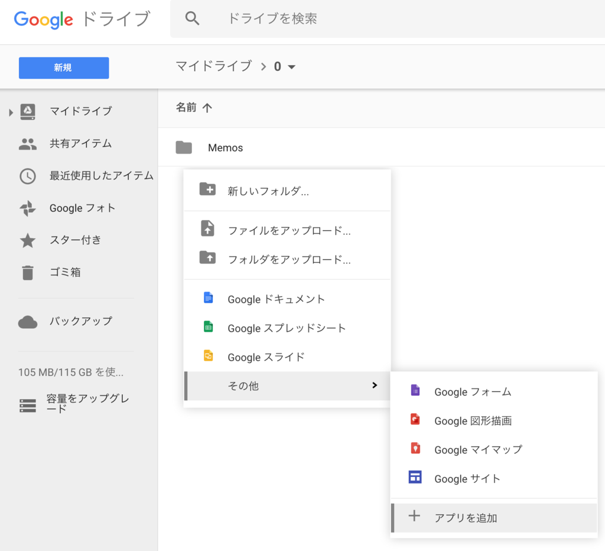
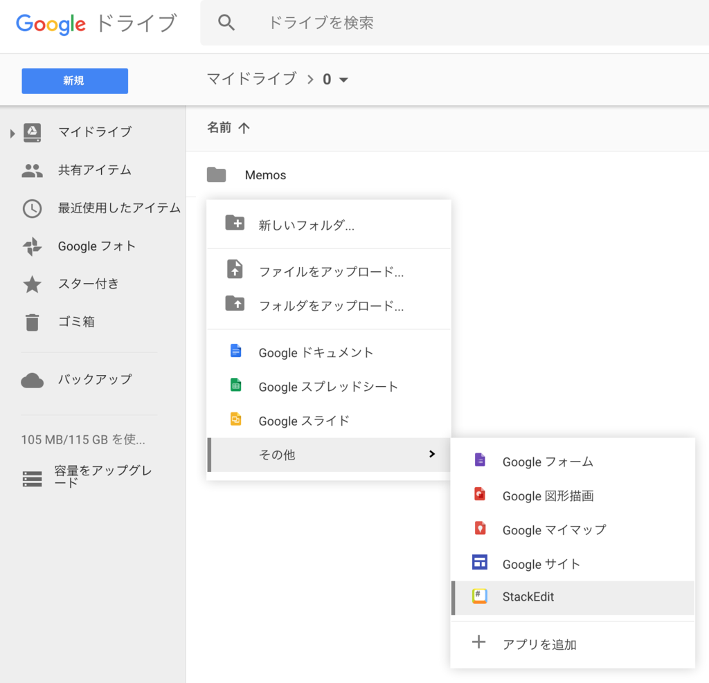

Google ドライブを使うことが増えてきたので、Google ドライブ上で Markdown ファイルを書きたいなーと思って調べたら良いアプリがあった。「__StackEdit__」というアプリだ。

Google ドライブで使用するには、Google ドライブ上で右クリックし、「アプリを追加」を選ぶ。

出てきた画面で「StackEdit」を検索し、「接続」ボタンでアプリを追加する。

すると右クリックしたところに「StackEdit」が追加されるようになるので、これを選ぶとそのディレクトリに Markdown ファイルを作ってくれる。

エディタ画面は一般的なマークダウンエディタと同様。GitHub Flavored Markdown にも対応していたり、プレビューのスタイルを変更したりできる。

Google ドライブに保存連携する他、HTML ファイルとしてエクスポートしたりもできてかなり便利。

設定画面には有料ライセンス買ってクレメンスなお知らせが出ているが、ほとんどの機能は無料で使える。これで十分である。

## 参考

- [超高機能マークダウンエディタ「StackEdit」の Welcome Document を和訳してみた - Qiita](http://qiita.com/ka215/items/9a7768609b88c5df8ef6)
- [Chrome拡張機能「StackEdit」が文書作成用にすばらしい件 | Chrome速報](http://chromesoku.com/markdown-stackedit/)
