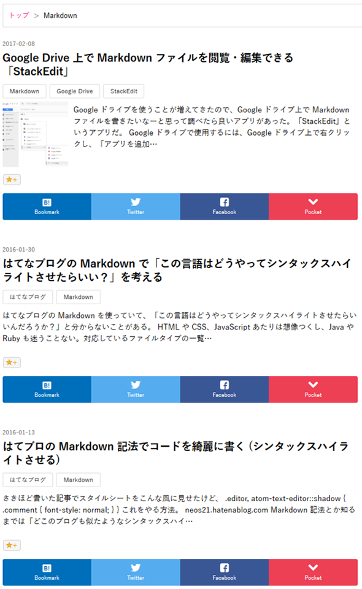

はてなブログ標準のシェアリンク (ソーシャルパーツとも) は、*通常だと各記事のページにしか表示されない*。これを、**トップページや、月別・カテゴリ別・検索結果などのアーカイブページにおいて、各記事の下にシェアリンクを追加する**方法を紹介する。

完成形としては、以下の画像のように、各記事の下部に独自シェアリンクが配置された状態になる。



## 通常のソーシャルパーツや独自シェアリンク

通常のシェアリンクは、「デザイン」→「カスタマイズ」→「記事」より、「ソーシャルパーツ」を選択して任意のシェアリンクを追加できる。

これを独自のシェアリンクにして高速化を図る方法は、以下の記事で紹介したように、*「デザイン」→「カスタマイズ」→「記事」→「記事下」* に HTML を追加することで作成できる。付随する CSS も以下で紹介しているので、シェアリンクのデザインは以下の記事をドウゾ。

- [はてなブログで独自のシェアリンク・フォローボタンを作る HTML・CSS](/blog/2017/01/30-02.html)

このブログの場合、「記事下」に以下のような HTML を追加している。`{Permalink}` や `{Title}` 部分は、はてなブログが各記事の URL やタイトルに自動的に置換してくれる。

```html
<ul class="neos21-share">
  <li class="neos21-share-hatebu"><a href="http://b.hatena.ne.jp/entry/{Permalink}"><i class="blogicon-bookmark"></i><span>Bookmark</span></a></li>
  <li class="neos21-share-twitter"><a href="https://twitter.com/share?url={Permalink}&amp;text={Title}"><i class="blogicon-twitter"></i><span>Twitter</span></a></li>
  <li class="neos21-share-facebook"><a href="http://www.facebook.com/share.php?u={Permalink}"><i class="blogicon-facebook"></i><span>Facebook</span></a></li>
  <li class="neos21-share-pocket"><a href="http://getpocket.com/edit?url={Permalink}&amp;title={Title}"><i class="blogicon-chevron-down"></i><span>Pocket</span></a></li>
</ul>
```

## 独自シェアリンクを記事ごとに置く方法

さて、このような独自のシェアリンクを、トップページやアーカイブページにおいて記事ごとに配置するには、JavaScript を組み合わせるしかない。つまり、以下のような方法を取る。

1. 「フッタ」部分に、シェアリンクのテンプレートとなる HTML を置いておく
2. ページ読み込み時に、`1.` で用意したテンプレート HTML を複製し、記事ごとに URL やタイトル部分を書き換えて DOM 挿入する

ということで、この方法を紹介する。

## テンプレート HTML

シェアリンクのテンプレートとなる HTML は、以下のようなものになる。**これを「デザイン」→「カスタマイズ」→「フッタ」に仕込んでおく**。

```html
<!-- シェアリンクのテンプレート -->
<div id="neos21-template" style="display:none;">
  <ul class="neos21-share" id="neos21-share-template">
    <li class="neos21-share-hatebu"><a class="neos21-share-hatebu-link"><i class="blogicon-bookmark"></i><span>Bookmark</span></a></li>
    <li class="neos21-share-twitter"><a class="neos21-share-twitter-link"><i class="blogicon-twitter"></i><span>Twitter</span></a></li>
    <li class="neos21-share-facebook"><a class="neos21-share-facebook-link"><i class="blogicon-facebook"></i><span>Facebook</span></a></li>
    <li class="neos21-share-pocket"><a class="neos21-share-pocket-link"><i class="blogicon-chevron-down"></i><span>Pocket</span></a></li>
  </ul>
</div>
```

記事ごとに設置しているシェアリンクと同様のスタイルを適用させるため、基本的には「記事下」に配置した HTML と同様。一部異なるのは、いずれもスクリプトで処理するための部分。

- テンプレートとして複製するときに扱いやすくするため、`ul.neos21-share` に対し `#neos21-share-template` という ID を付与している。
- `a` 要素には `href` 属性を書いていない。記事ごとに URL を作る必要があるため、ココでは書いておかない。
- その代わり、この `a` 要素を特定しやすくするため、記事ごとのシェアリンクには付けていなかった `.neos21-share-【SNS 名】-link` というクラス名を付与している。
- このテンプレート全体は表示させる必要がないので、これを囲んだ `div#neos21-template` には `display:none` を書いておくと安全。

というワケで、このようなテンプレート HTML が完成する。

## 記事ごとにテンプレートを複製するスクリプト

このテンプレート HTML を複製し、記事ごとに仕込んでいくための処理は、以下のような JavaScript で行う。*これも「デザイン」→「カスタマイズ」→「フッタ」に仕込んでおく*。先程のテンプレート HTML の直後にでも置いておけば良いだろう。

```javascript
<script>
  // 記事ごとにシェアリンクを追加する
  (function() {
    // Body 要素に任意のクラス名が存在するか確認する関数
    var hasClass = function(className) {
      return (" " + document.body.className + " ").replace(/[\n\t]/g, " ").indexOf(" " + className + " ") !== -1;
    }
    
    // Body 要素のクラス名に応じて記事一覧を取得し、シェアリンクの挿入先を決定する
    var articles;
    var destClassName;
    if(hasClass("page-index")) {
      // トップページの場合
      articles = document.getElementsByClassName("hentry");
      destClassName = "customized-footer";
    }
    else if(hasClass("page-archive")) {
      // アーカイブページ (月別・カテゴリ別・検索結果) の場合
      articles = document.getElementsByClassName("archive-entry");
      destClassName = "archive-entry-body";
    }
    else {
      // 該当しないページでは処理しない (シェアリンクは作らない)
      return;
    }
    
    // ページが読み込まれたら実行する
    document.addEventListener("DOMContentLoaded", function() {
      // テンプレートを取得する
      var template = document.getElementById("neos21-share-template");
      template.removeAttribute("id");
      
      // 記事ごとにシェアリンクを複製して作っていく
      Array.prototype.forEach.call(articles, function(article) {
        // 記事情報を取得する。記事タイトルのみ URL 用にエンコードしておく
        var entryTitleLink = article.getElementsByClassName("entry-title-link")[0];
        var title = encodeURIComponent(entryTitleLink.innerText);
        var permalink = entryTitleLink.getAttribute("href");
        
        // テンプレートを複製する
        var clone = template.cloneNode(true);
        
        // はてブ用リンク：http://b.hatena.ne.jp/entry/{Permalink}
        var hatebuLink = clone.getElementsByClassName("neos21-share-hatebu-link")[0];
        hatebuLink.setAttribute("href", "http://b.hatena.ne.jp/entry/" + permalink);
        
        // Twitter 用リンク：https://twitter.com/share?url={Permalink}&amp;text={Title}
        var twitterLink = clone.getElementsByClassName("neos21-share-twitter-link")[0];
        twitterLink.setAttribute("href", "https://twitter.com/share?url=" + permalink + "&amp;text=" + title);
        
        // Facebook 用リンク：http://www.facebook.com/share.php?u={Permalink}
        var facebookLink = clone.getElementsByClassName("neos21-share-facebook-link")[0];
        facebookLink.setAttribute("href", "http://www.facebook.com/share.php?u=" + permalink);
        
        // Pocket 用リンク：http://getpocket.com/edit?url={Permalink}&amp;title={Title}
        var pocketLink = clone.getElementsByClassName("neos21-share-pocket-link")[0];
        pocketLink.setAttribute("href", "http://getpocket.com/edit?url=" + permalink + "&amp;title=" + title);
        
        // 記事下部に挿入する
        article.getElementsByClassName(destClassName)[0].appendChild(clone);
      });
      
      // テンプレートを削除する
      document.getElementById("neos21-template").removeChild(template);
    }, false);
  })();
</script>
```

少々長いが、コメントも付けているので、やろうとしていることは分かっていただけるかと思う。

- まずは Body 要素のクラス名から、このページが「トップページ」か「アーカイブページ」かを判別する。
  - それ以外のページ (プロフィールページや各記事のページ) はシェアリンクが不要なので、`return;` で処理しないようにしている。
  - 「トップページ」の場合と「アーカイブページ」の場合とで、記事ごとの HTML が若干異なる。
      - トップページ (`body.page-index`) の場合 ： `article.hentry` の数だけ記事が存在する。各記事のフッタには空の `div.customized-footer` が存在するので、この内にシェアリンクを追加していく。
      - アーカイブページ (`body.page-archive`) の場合 ： `section.archive-entry` の数だけ記事が存在する。各記事にフッタを示す要素はないので、本文とはてなスターが含まれている、`div.archive-entry-body` の最後に追加していく。
- ココからの処理は、トップページかアーカイブページのいずれかの場合のみ行われる。`document.addEventListener("DOMContentLoaded")` を利用して、ページ読み込み時に使用する。
- 最初に置いたテンプレート HTML のうち、`ul#neos21-share-template` を変数 `template` として取得しておく。これを記事ごとに複製して加工していく。複製時に邪魔しないよう ID は消しておく。
- 記事ごとのループ処理は `Array.prototype.forEach.call()` を利用する。第一引数に Array ライクな関数、つまりココでは `var articles` が記事の要素の配列になっているので、コレを指定する。第二引数が配列の各要素に行わせる処理を関数で書いておく。この関数の引数 (ココでは `article` 部分) が、各要素を示す変数になる。ということで、`Array.prototype.forEach.call(articles, function(article) {});` という枠組みができる。

ループ処理の中では、テンプレート HTML を複製して加工していく。

- シェアリンクを作るため、「記事ごとの URL」と「記事のタイトル」を取得する。これは、記事タイトルとそのリンクが `h1`.entry-title > a.entry-title-link`でマークアップされているので、この`a.entry-title-link\` を拾ってやればいい。
- `a.entry-title-link` の `href` 属性値はどうもエスケープされた URL が入っているようなので、変数 `permalink` には `#encodeURIComponent()` は噛ませない。
- 記事のタイトルは `a.entry-title-link` の `.innerText` で取得する。リンク URL に組み込むため、`#encodeURIComponent()` でエスケープしておく。
- 変数 `template` を、`#cloneNode(true)` で子要素含めて丸ごと複製する。この複製した変数 `clone` の HTML をアレコレいじくって、記事の下部に挿入していく。
- 各 SNS に合わせたリンク URL を生成していく。変数 `clone` の中から、各 `a` 要素を取得する。これを楽に書くため、`a` 要素に `.neos21-share-【SNS 名】-link` というクラス名を付与していた。
- この `a` 要素に `href` 属性を設定する。ココは各記事用のシェアリンクと同様なのだが、はてなブログが用意していた `{Permalink}` や `{Title}` といった変数ではなく、先ほどこねこね作った `permalink` や `title` という変数を使うことになる。
- こうして、変数 `clone` の中は各記事のシェアリンクに書き換えられた。あとはこれを各記事の最下部に挿入する。ページを判別したときに控えておいた `destClassName` が挿入先のノードになるので、このノードに対して `#appendChild()` してやる。

最後に仕上げ。

- テンプレート全体を囲んでいる `div#neos21-template` には `display:none` を指定しているので、必ずしもやる必要はないが、元の `ul#neos21-share-template` は `#removeChild()` で消しておくと気持ち良いかも。

これでやりたいことはできた。

## アーカイブページのためにスタイルを少し直す

アーカイブページにおいて、サムネイル付きの記事の場合にシェアリンクが崩れるのを確認したので、Float を解除するための Clearfix を仕込んでおくと良いだろう。アーカイブページであることを判別するには、JavaScript でやっているのと同様、Body 要素に `.page-archive` クラスが付与されていれば良いので、これを親セレクタとして指定してやる。

JavaScript で挿入する `ul.neos21-share` は、この `span.social-buttons` の後ろに入るので、`span.social-buttons` 内の `span.star-container` をブロック要素化してマージンを与えておく。

```css
/* はてなスターが入っている span 要素の手前で Clearfix */
body.page-archive span.social-buttons:before {
  display:block;
  visibility:hidden;
  clear:both;
  height:0;
  font-size:0;
  content:".";
}

/* サムネイルとの余白を適度に開けるための指定 */
body.page-archive span.social-buttons span.star-container {
  display:block;
  margin-top:10px;
  margin-bottom:10px;
}
```

上の CSS は HTML 構造を分かりやすくするために要素名も書いておいたが、余計なセレクタをかませると速度が遅くなるので、クラス名だけで良いだろう。

## スクリプトを圧縮する

CSS の圧縮は以下の記事で説明したように、npm-scripts を利用した Minify の手法を用意してあるので、コチラをドウゾ。

- [CSS を Minify (圧縮) する npm パッケージの Clean-CSS をコマンドラインで利用する「Clean-CSS-CLI」](/blog/2017/01/31-03.html)

JavaScript の方は、独自のクラス名部分が使い回せそうだったので、今回は人力で「オレオレ Uglify」をしてみた。

```javascript
!function(){var d=document,i="getElementById",c="getElementsByClassName",q="setAttribute",f="href",s=" ",h=function(C){return ~(s+d.body.className+s).replace(/[\n\t]/g,s).indexOf(s+"page-"+C+s)},a,e,n="neos21-",r="share-",w=n+r,l="-link",t="template";if(h("index"))a=d[c]("hentry"),e="customized-footer";else{if(!h("archive"))return;a=d[c]("archive-entry"),e="archive-entry-body"}d.addEventListener("DOMContentLoaded",function(){var T=d[i](w+t);T.removeAttribute("id");Array.prototype.forEach.call(a,function(A){var L=A[c]("entry-title"+l)[0],E=encodeURIComponent(L.innerText),P=L.getAttribute(f),o=T.cloneNode(1),x=function(N,U){o[c](w+N+l)[0][q](f,U)};x("hatebu","http://b.hatena.ne.jp/entry/"+P);x("twitter","https://twitter.com/share?url="+P+"&amp;text="+E);x("facebook","http://www.facebook.com/share.php?u="+P);x("pocket","http://getpocket.com/edit?url="+P+"&amp;title="+E);A[c](e)[0].appendChild(o)});d[i](n+t).removeChild(T)},0)}()
```

このコードは先ほどのスクリプトと完全に同じ動きをする。

少しだけ改行を入れ、コメントを追加してみよう。

```javascript
// !function(){}(); で即時関数になる
!function(){
  var d=document,
      i="getElementById",
      c="getElementsByClassName",
      q="setAttribute",
      f="href",
      // Body 要素のクラスを判別する関数
      s=" ",
      h=function(C){
        // ~ 演算子を使うと「indexOf() !== -1」(>= も同義) を代用できる
        return ~(s+d.body.className+s).replace(/[\n\t]/g,s).indexOf(s+"page-"+C+s)
      },
      // a : 元のコードの変数 articles に相当
      a,
      // e : 元のコードの変数 destClassName に相当
      e,
      // 使い回せそうなクラス名の文字列を分解して保持しておく
      n="neos21-",
      r="share-",
      // "neos21-share-"
      w=n+r,
      l="-link",
      t="template";
  
  // 頻繁に使う document.getElementsByClassName() などはブラケット記法 (配列記法) でアクセスする
  // カンマ演算子を利用して処理
  if(h("index")) a=d[c]("hentry"), e="customized-footer";
  else{
    // return を先に行わせれば if 文を1行で済ませられる
    if(!h("archive"))return;
    a=d[c]("archive-entry"),e="archive-entry-body"
  }
  
  d.addEventListener("DOMContentLoaded",function(){
    // テンプレート取得
    var T=d[i](w+t);
    T.removeAttribute("id");
    
    Array.prototype.forEach.call(a,function(A){
      // 変数 A が各記事の要素、変数 L が記事タイトルのリンク要素を取得
      var L=A[c]("entry-title"+l)[0],
          // E : title
          E=encodeURIComponent(L.innerText),
          // P : permalink
          P=L.getAttribute(f),
          // o : 複製した要素 (clone)。「1」は暗黙型変換で「true」。
          o=T.cloneNode(1),
          // x : 指定クラスの href 属性に指定の URL 文字列を設定する、という処理を関数化
          x=function(N,U){
            o[c](w+N+l)[0][q](f,U)
          };
      // リンクの加工
      x("hatebu","http://b.hatena.ne.jp/entry/"+P);
      x("twitter","https://twitter.com/share?url="+P+"&amp;text="+E);
      x("facebook","http://www.facebook.com/share.php?u="+P);
      x("pocket","http://getpocket.com/edit?url="+P+"&amp;title="+E);
      // 記事下部に追加
      A[c](e)[0].appendChild(o)
    });
    
    // テンプレート削除
    d[i](n+t).removeChild(T)
  },0)
  // false は暗黙型変換を利用して 0 と表記
}()
```

こんな感じ。`"entry"` という文字列も4回出てきているのだが、1文字変数を作って文字列連結しても1文字多くなってしまうので止めた。

というか、はてブロテンプレートのクラス名を1文字変数で作るのは乱暴過ぎる気がするので、"page-" を関数内に埋め込んだり、`.entry-title-link` に変数を使ったりするのは止めた方が良いとは思う。可読性も兼ねて人力圧縮するなら、文字列結合で別の動きをさせるのは避けた方が良いだろう。

そういうワケで、このブログの最終的な「フッタ」HTML には、以下のように HTML と JavaScript を圧縮して挿入している。

```html
<div id="neos21-template"><ul class="neos21-share" id="neos21-share-template"><li class="neos21-share-hatebu"><a class="neos21-share-hatebu-link"><i class="blogicon-bookmark"></i><span>Bookmark</span></a></li><li class="neos21-share-twitter"><a class="neos21-share-twitter-link"><i class="blogicon-twitter"></i><span>Twitter</span></a></li><li class="neos21-share-facebook"><a class="neos21-share-facebook-link"><i class="blogicon-facebook"></i><span>Facebook</span></a></li><li class="neos21-share-pocket"><a class="neos21-share-pocket-link"><i class="blogicon-chevron-down"></i><span>Pocket</span></a></li></ul></div>
<script>!function(){var d=document,i="getElementById",c="getElementsByClassName",q="setAttribute",f="href",s=" ",h=function(C){return ~(s+d.body.className+s).replace(/[\n\t]/g,s).indexOf(s+"page-"+C+s)},a,e,n="neos21-",r="share-",w=n+r,l="-link",t="template";if(h("index"))a=d[c]("hentry"),e="customized-footer";else{if(!h("archive"))return;a=d[c]("archive-entry"),e="archive-entry-body"}d.addEventListener("DOMContentLoaded",function(){var T=d[i](w+t);T.removeAttribute("id");Array.prototype.forEach.call(a,function(A){var L=A[c]("entry-title"+l)[0],E=encodeURIComponent(L.innerText),P=L.getAttribute(f),o=T.cloneNode(1),x=function(N,U){o[c](w+N+l)[0][q](f,U)};x("hatebu","http://b.hatena.ne.jp/entry/"+P);x("twitter","https://twitter.com/share?url="+P+"&amp;text="+E);x("facebook","http://www.facebook.com/share.php?u="+P);x("pocket","http://getpocket.com/edit?url="+P+"&amp;title="+E);A[c](e)[0].appendChild(o)});d[i](n+t).removeChild(T)},0)}()</script>
```

*これでトップページからも記事をシェアしてもらいやすくなった*と思うので、皆様どうかシェアのほど宜しくお願い致します。ｗ
