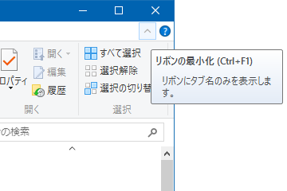

Windows8 あたりから、エクスプローラーも Office と同じようなリボン UI になっている。このリボンメニューが毎回自動的に閉じられてしまうのでなんとかしたかったのだが、「表示」→「メニューバー」的なメニューがなく、どうしたらいいか分からなかった。

調べてみると、__エクスプローラーの右上にある「▲」「▼」マーク__が「リボンを常に表示する」ためのアイコンだった。

↑コレ。

Windows10 で確認したが、多分それ以前の OS でも同じであろう。
