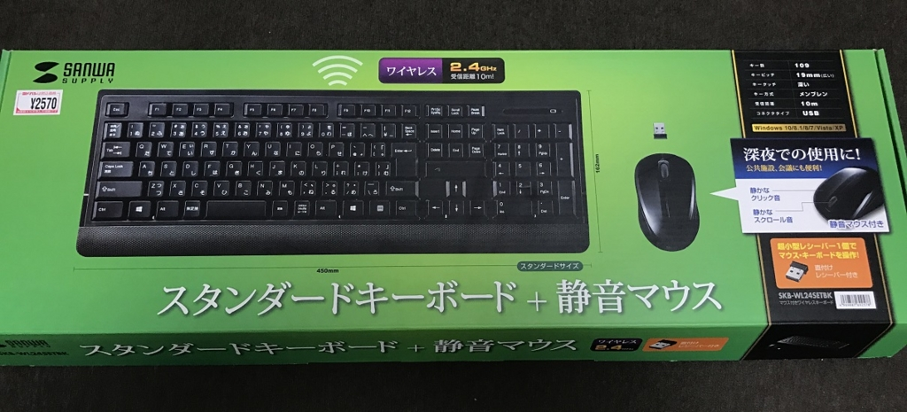
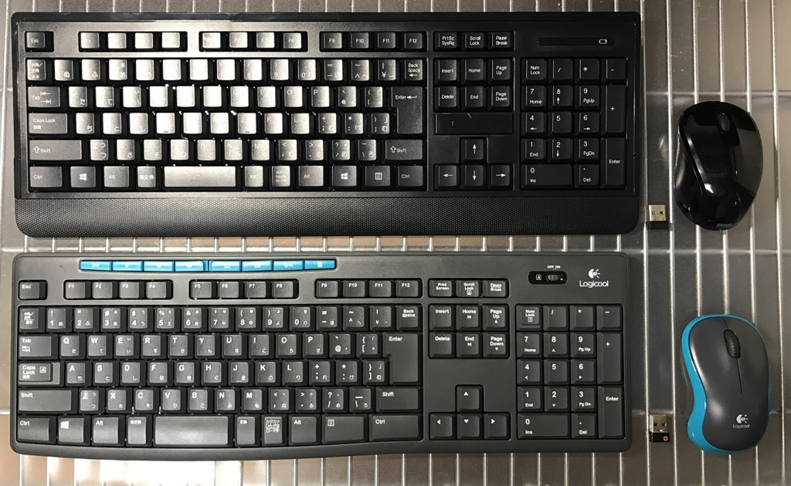
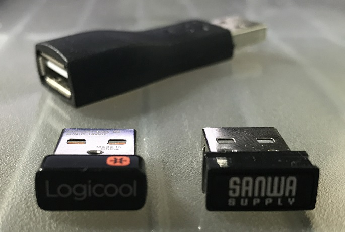
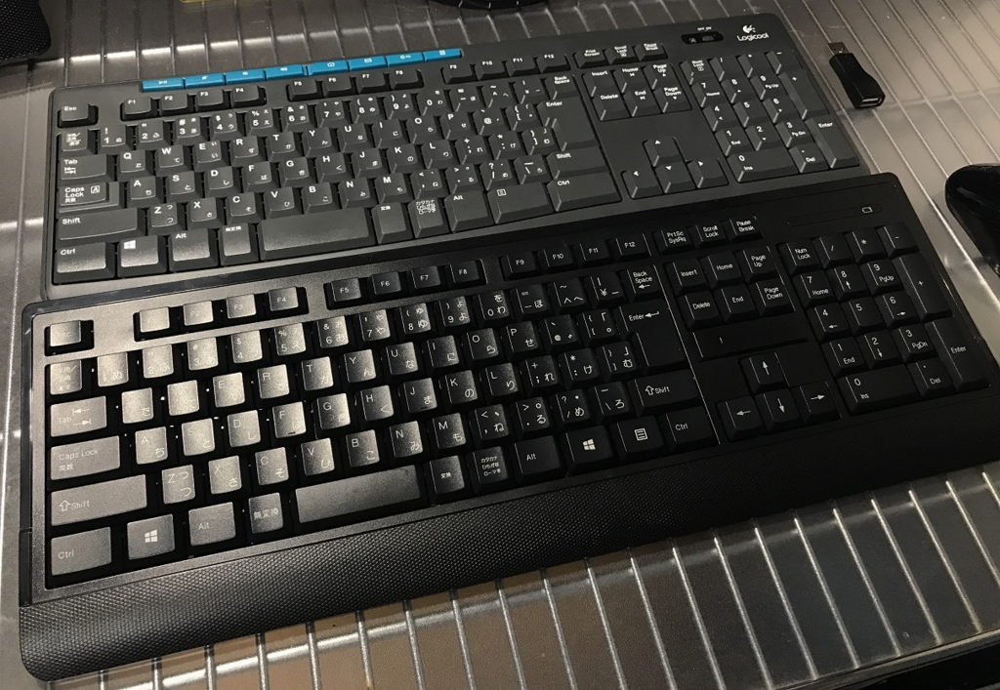

新しいキーボードを買ったので紹介する。

## これまで使っていたキーボード

これまで、**Logicool MK275** という、無線のキーボードとマウスのセットを使っていた。

↑この画像の下が MK275。上がこれから紹介する今回の主役。

これがぼくにとって初の無線キーボードと無線マウスだった。ワケあって2台同じモノを買うぐらい使っていて、今は会社に持っていって会社用として使っている。

Unifying という USB レシーバー1つで、キーボードとマウスの両方を受信してくれるので、USB ポートを1つしか使わなくて良い。マウスもクリック感があって良いし、キーピッチも広めで、メンブレン方式のいわゆる「普通のキーボード」な感じがとても好きである。

ただ、一ついただけない部分がある。

それは、キー配列が**日本語108配列**なところである。

108キー配列は、Windows キーが左側に1つしかない。右側のアプリケーションキーの隣に Windows キーがないのだ。これによって、`Win + E` とか `Win + R` とかのショートカットキーが入力しづらく、個人的にはこれだけでそこそこストレスなのである。

## ぼくのキーボードの好み

ココまでで少し読み取っていただけたかもしれないが、ぼくはそれなりにキーボードに好みがある。基本的に、デスクトップパソコンに付属の安っぽいキーボードな作りが好きなのである。というか、変形キーボードや変形マウスに慣れたくないので、ド標準なモノを使いたいのである。

- 日本語109キー配列。Windows キーは2つ要る。
  - ちなみに MacBook と ChromeBook は英語配列で慣れた。Windows では昔から日本語配列を使っているので日本語配列のままがいい。
- 全体的な形は、角ばっていて直線的な長方形である方が嬉しい。変にパームレストとか付けないで欲しい。
- スペースキーは太くない方が良い。キーは四角く直線的である方が良い。
- メンブレン方式で、カタカタと音が鳴って打てている方が好き。平たいのとか嫌い。
- キーピッチは 19mm 程度の広めが良い。何かキーが独立してるようなのは嫌い。
- 音楽再生キーとか余計なキーは要らない。MK275 に付いてるこれらのキーは1回も使ったことがない。

以上のスペックであれば、本当に安いキーボードを探せばいくらでもある。しかし、一度無線キーボードに慣れてしまうと、有線に戻るのがキツい。そして、無線キーボードでこの条件を満たすキーボードというのがほとんどないのだ。

## かなり近い！サンワサプライのキーボード

色々と探していて見付かったのが、今回紹介する **Sanwa Supply SKB-WL24SETBK** というマウスとキーボードのセットだ。*値段も2500円程度と安い*。

Logicool の Unifying レシーバーのような感じで、1つの USB 受信機がマウスとキーボードの両方を拾ってくれる。しかも Unifying レシーバーと違ってデバイスドライバのインストール等が不要だった。

↑レシーバーの比較。

SKB-WL24SETBK には、奥に写っているような延長用の USB コネクタが付属していない (このコネクタは MK275 に付属していたもの)。自分のデスクトップパソコンの裏側にある USB ポートには上手く挿せなかったので、MK275 に付いていたこのコネクタを利用してレシーバーを接続した。

問題のキーボードだが、Logicool MK275 が日本語108キー配列だったのに対して、コチラの Sanwa Supply SKB-WL24SETBK は日本語109キー配列。Windows キーが右側にもあるのである。最高！

キーピッチ広め、メンブレン方式で良い。MK275 と比べると、SKB-WL24SETBK の方がほんの少しキータッチが浅いだろうか。タイピング音もサンワサプライの方が静かである。これは MK275 ぐらいうるさくても個人的には良いが、周りの人に配慮するならサンワサプライだろう。

キーボードは乾電池駆動なのだが、乾電池を入れる場所が表面にある。Delete・End キーなどと矢印キーとの間に乾電池を入れるフタがある。下手すると Delete キーのつもりでフタの出っ張りを叩いている時があるが、そこまで気にならない。

↑手前が Sanwa Supply SKB-WL24SETBK。奥が Logicool MK275。右側にある Windows キー最高だろ！？ｗ

## 静音設計のマウスは個人的にちょっと惜しい…

同梱の無線マウスは、標準的な2ボタンにホイールのマウス。サイズもちょうどよく、左右対称な形も好み。MK275 のマウスからすんなりと移行できる。

クリック音がうるさくならないよう、静音設計になっている。いわゆる「カチッ」と音がする押し込み方ではなく、なんというか、「グニッ」と静かに押し込む感じ。

これが個人的にはマイナスポイント。というのは、押し込んだ音がせず、指に伝わってくる感覚でもクリックしたのかどうかが分からりづらいので、何かドラッグしたりしている時に、うっかりドラッグが外れていても気付きにくいのだ。

もう少し、「ハイ今クリックイベントが作動しましたよ！」「ここから緩めるとクリック解除ですよ！」というハッキリしたクリック感が欲しいところ。

そうはいっても、そこまで致命的に使いづらいワケではないし、別の無線マウスを買ってきて USB ポートを2つ使うのは嫌なので、このマウスで騙し騙しやっていこうと思う。

## 総合的には大満足！

マウスのクリック感だけが少し好みと外れるが、*あとはほぼ希望どおりの製品が存在していた*、という感じ。

コレ以外で好みに合いそうなモノというと、8000円以上する無線キーボードオンリーの製品が見つかるぐらいなので、2500円程度でキーボードとマウスが揃うならかなり買いだと思う。

全体的に Logicool MK275 よりは、この *Sanwa Supply SKB-WL24SETBK の方が、キーボードもマウスも静音設計*になっていると感じたので、会社で使うとか、回りに配慮するなら SKB-WL24SETBK だろう。と言いながら、ぼくは MK275 を会社に持って行き、SKB-WL24SET は家で使うことにしたのだが。ｗ

青色 LED なのもカッコイイ感じ？ｗ 良い意味で「フツー」、それでいて無線のキーボードとマウスを探している方はぜひ。
