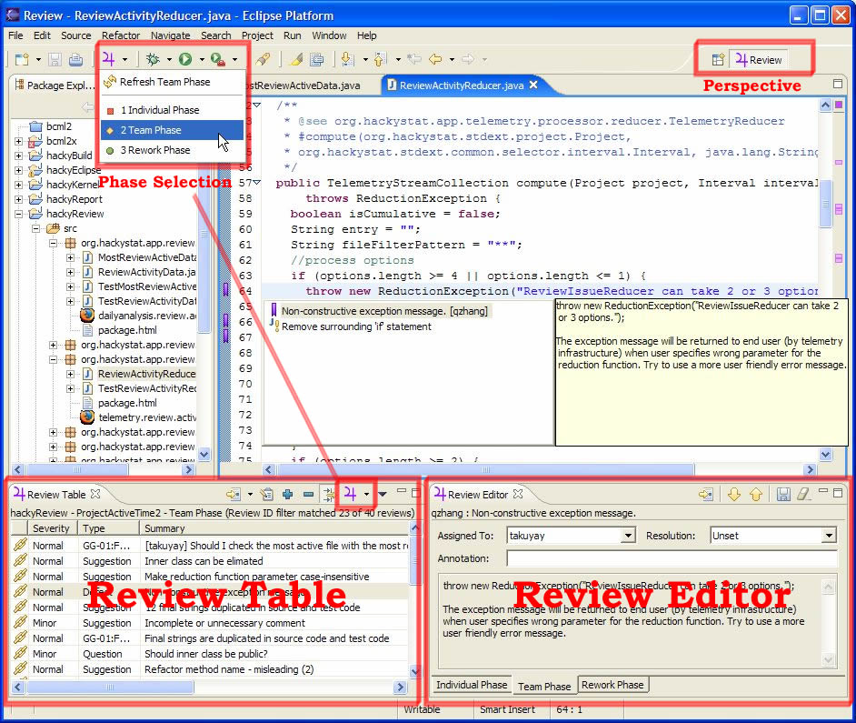
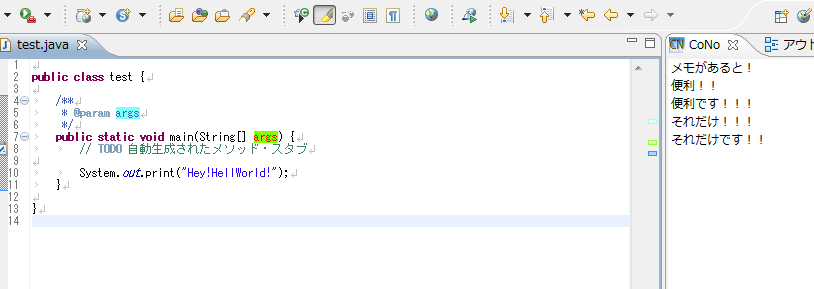

コードの中にコメントを書くと、その性質上どうしても縦に長くなる。簡潔にコメントを書けていればコードの文脈の中でコメントがスラスラ入ってきて分かりやすいのだが、コメント (日本語) の質は人によりけり。

IDE によっては、コメントブロックを折りたたんだりできるのだが、そうではなく、__コードはコードだけで閲覧し、コメントはコメントでその行なりオブジェクトなりに紐づいていて、並べて読めたらいいんじゃないか__と思っている。

UI 的には、GUI でコードの diff を表示した時のように、__左ペインにコード__があって、それに対応する_コメントが右ペイン_にあって、__両者が線で結ばれていて__、スクロールはコードとコメントの文量を見て上手いこと同期してくれる、みたいな。

もっと平たく言えば、Word 文書にフキダシコメントを付ける感じで、コードにフキダシ的にコメントが付けられるような感じ、というか。これがありそうなのになかなか見当たらない。

## それっぽいツールは…

それっぽいことができるツールとしては、Eclipse プラグインの __Jupiter__ というツール。

- 参考：[jupiter-eclipse-plugin - aqubi+shin1](https://sites.google.com/site/shin1ogawa/eclipse/jupiter)
- 参考：[Eclipse Plug-Ins](http://www.h7.dion.ne.jp/~s_wat/eclipse/plugin.html)
- 参考：[Code Review Tools and Techniques - DZone Java](https://dzone.com/articles/code-review-tools-and)

ただ、これはコードレビュー時のコメントを入れて、チケット管理と連動させたりするようなツールで、コードに対してずっと残しておくような使い方は想定されていない模様。本当に Word のフキダシコメントと同じ用途で、校閲が終わったらなくなっているモノ、的な使い方なのだ。

あと、__CoNo__ という Eclipse プラグインも、同様の機能を提供している。が、いかんせん古い。

- 参考：[JavaTips 〜Eclipse活用編：Eclipseでコードに紐付いたメモを残す - ＠IT](http://www.atmarkit.co.jp/ait/articles/0402/03/news098.html)
- 参考：[CoNo - Eclipse plugin](http://cono.sourceforge.net/)
- 参考：[［日記］ Eclipseのいいプラグイン見つけました | Skycat's Lair](http://blog.skycat.me/2013/05/09/58%E3%81%AE%E6%97%A5%E8%A8%98/)

こちらはあまり共有を考慮していない、個人的なメモに終止している様子。

そうではなく、もう少しコメントを共有できるドキュメントライクに扱いつつ、それでいてコードに紐づいていてくれないかな、と思うのである。

## ニホンノエスイーにも用途があると思う

ニホンノエスイーの会社は、プログラム仕様書だとかなんとか言って、コードの日本語訳みたいなドキュメントを書かされて、これに対応づいたコーディングがなされていればそれで OK、というような杜撰なコードレビューが行われていたりする。

日本語もプログラミング言語もできねえ連中がこんなことして SE 名乗ってるような風潮が消えてなくなればいい、というのが究極的な願いだが、多分ぼくが生きている間には叶わないだろう。

だが、こうしたやり方をするにしても、コードとドキュメントを行単位で紐付けられるようなツールがあれば、より分かりやすく、扱いやすくなるのではないだろうか。

つまり、先程まで「コメント」と表現していた「右ペイン」に置く文章を、その「プログラム仕様書」とやらに差し替えてやればいいのではないかということだ。

これなら、「右ペイン」の文章を見ながらコーディングして、対応づくコードの範囲を指定したりできると思う。

## あったらやりたい使い方

こんなツールがあれば、_コード中に大量にコメントを書きたくなるような機会_に、コードを汚さずにコメントが書けるんじゃないかと思う。例えば、

- 使用するライブラリの注意点を丁寧にコメントに書いてみたり、
- フレームワークの制約上致し方なくやっている奇怪なコーディングの説明や参考 URL を載せてみたり、
- 条件分岐が多くなってしまっているところに表でパターン一覧を書いてみたり、

とか。

コメントが長いと、コードの流れを分断してしまい、コメントを読んでいる間にコードを忘れちゃったりして、逆に読みづらいコードになってしまったりすると思う。

だからそういうものは「横にズラして置いておきたい」と思うのだ。

## そもそもコメント要らねえだろ的な反論について

ぼくもコメントをやたらめったら書くことには反対だが、それでも人よりコメントの量は多いんじゃないかと思う。それにはいくつか理由があって、

- ぼく自身が忘れっぽいから、「なんでこう書いたんだっけ？」という理由や意図を思い出しやすくするために書いておきたい
- 参考文献とした URL とかをメモしておきたい
- 誰かに「どうしてこういう実装してるの？」「こういう所は抜け漏れないの？」と聞かれた時に証拠として説明文とか実装に至った経緯とかを書き留めておきたい
- フレームワークの制約や少し細かな言語仕様を理解しないで書こうとするチームメンバに対して意識してもらいたくて、丁寧な実装方法を共有したい

とか、そういう理由で、コメントを多めに書くことがある。

実際は長文コメントはウケが悪いので、URL を貼ったり長文を書いたりするのは避けてるのだけど、そうした説明文を別のドキュメントに起こしたところでなかなか浸透しないし、「ドキュメントは共有したけどみんなが読まなかった」ことが原因で起こしたバグもあったりする。

その人にスキルがなくて、どんなにコードが理解できなかろうが、プログラマ、エンジニアである以上、対象システムのコードは必ず読むものだ。

事実、みんなコードは読むがドキュメントは読まないから、既存のウンコードをコピペして新たなウンコードを生成したりしているのだ。そして「そのウンコードを真似するとこういう問題がありますよ、その既存コードは後続のこの処理でなんとかバグが回避できてるだけだから、そこ単体でコピペしたらバグるよ」と丁寧に日本語で書いたドキュメントは読まれないから、ぼくだけが分かっていたバグでみんなが苦労しているのである。

バグがあってもコードを直せない現場とか、残念ながらあるのです。でも、だったらコードを直さずに他にできることをやろうよ、と思い、それを実現できそうなモノが、_「コードの隣に対応づくコメントやドキュメントが書ける仕組み」_だと思う。

既にそういうツールがあれば教えて欲しい。もしくは誰か一緒に作ってほしい。
