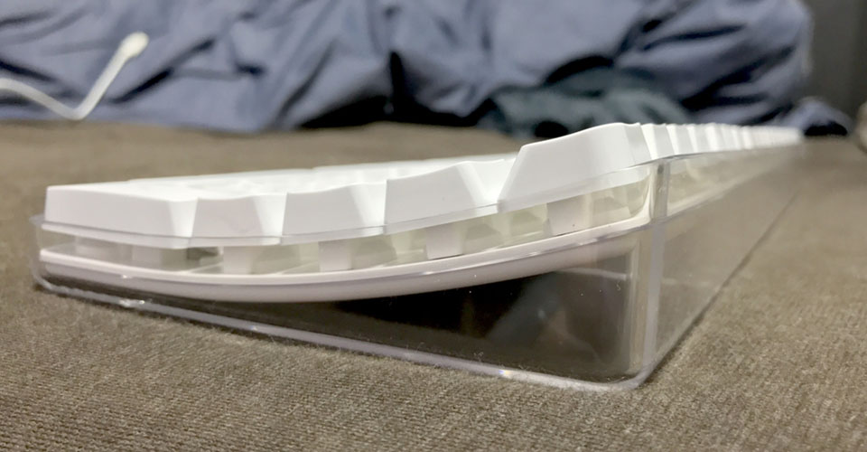

MacBookPro (Early 2015・13 Inch) 用に、**Apple Wireless Keyboard (Model No. A1016) M9270LL/A** を買った。

↑コレ。

Amazon で買った。楽天だと中古品くらいしか見当たらない。ちょいレア。

## A1016 M9270LL/A のスペック

少し前に「Sanwa Supply SKB-WL24SETBK」という Windows 用の無線マウス・キーボードのセットを買ったが、今度は MacBookPro 用に、無線キーボードを買った次第。

- [日本語109配列の無線キーボード & マウス！「Sanwa Supply SKB-WL24SETBK」を買った](/blog/2017/02/23-02.html)

主な特徴はこんなところ。

- 英字配列 (US 配列)
- Home・End などのファンクション部分とテンキー付きの**フルキーボード**
- Bluetooth 接続する*ワイヤレス*方式

このあとお話するが、2003年製の少し古い製品なので、製品に関する情報はネット上でも少なめ。

- 参考：[Apple Wireless Keyboard - Wikipedia](https://en.wikipedia.org/wiki/Apple_Wireless_Keyboard)
- 参考：[Apple Keyboard - Wikipedia](https://en.wikipedia.org/wiki/Apple_Keyboard#Apple_Keyboard_.28109_keys.29)
- 参考：[アップル - サポート - 製品名一覧](http://www.apple.com/jp/support/list.html#keyboard)

このモデルは、モデル No. A1016 で、英字配列だと **M9270LL/A** という型番が付く。

同じ A1016 モデルの日本語配列は、以下の *M9270J/A* というモノがある。これも無線である。

## 所感

この A1016 モデルというのは、**2003年**に発表された Apple 初の Bluetooth 搭載キーボード。最近はせいぜい単3乾電池1・2本で動作するキーボードが主流だが、この Wireless Keyboard は*単3乾電池を4本*も入れる。そのせいで若干重たさはある。

↑裏面の様子。乾電池を入れるフタの部分はコインを使ってネジを回して外す。

↑キーは白いプラスチック製、側面は透明なプラスチックで構成されている。

14年前のキーボードではあるが、箱なし新品というものを買ったので、キーボードはビニールで覆われ、プラスチックの黄ばみもない美品であった。側面・底面の透明なプラスチック部分もキレイ。

なんというか、「これぞ Mac」っていう感じの、自分が一番好きな時代の Mac のデザインだと思う。

↑Windows で使っているサンワサプライの無線フルキーボードとの比較。Apple Wireless Keyboard の方がテンキーとの間隔が開いているが、フチギリギリまでキーが配置されているので、全体のサイズ・キーピッチはほぼ同じくらい。

テンキー付きのフルキーボードというと、現在の Apple 純正品では USB キーボードしかなく、無線となるとテンキーがない Magic Keyboard になってしまう。個人的にはテンキーはそれほど使わないものの、矢印キーを満足に使いたいので、フルキーボードが欲しいのである。無線であることの優先度は低いのだが、この A1016 モデルのデザインが良かったので買うことにした。

## MacBookPro との接続方法

MacBookPro との相性は14年前のキーボードでも抜群。MacBookPro 本体が Bluetooth を認識できるので、余計な USB レシーバーを繋いだりしなくても認識してくれる。

先に Wireless Keyboard の電源を入れておいてから、「システム環境設定」→「Bluetooth」と進むと、キーボードを認識しやすい。コンテキストメニューから「接続」を選んで接続できる。初回だけ認識のために特定のキーを入力しろと言われるが、それ以降は「接続」を選ぶだけ。

もしかすると接続するまでが手こずるかもしれない。以下のページあたりを参考に。

- 参考：[OS X El Capitan: Apple のワイヤレスキーボード、マウス、またはトラックパッドを Mac とペアリングする](https://support.apple.com/kb/PH21519?locale=ja_JP&viewlocale=ja_JP)
- 参考：[Mac で Bluetooth 対応のマウス、キーボード、トラックパッドを使う - Apple サポート](https://support.apple.com/ja-jp/HT201171)
- 参考：<https://discussionsjapan.apple.com/thread/10007621?tstart=0>

## キー入力について

キーの打ち心地は、割とストロークが深めで気持ち良い。

Delete キーが、Windows でいうところの BackSpace と Delete のように、カーソルの左側と右側がそれぞれ消せるキーが別れてくれたので、文章が打ちやすい。MacBookPro オンリーだといちいち `fn + Delete` と打っていたので、それよりは楽である。

矢印キーも、フルキーボードのサイズが有るとやはり使いやすい。ただしその代わりに、MacBookPro のキーボードと比べると、右下の Command・Option あたりのキーの位置が変わっているので、半角・全角を切り替えるために使用している左右の Command キーのうち、右側の Command キーの位置に慣れない。MacBookPro のキーボードだとカンマキー `,` の下に Command キーがあるワケだが、Wireless Keyboard は右に1キー分ズレてドット `.` キーの右下あたりにあるので、MacBookPro の時よりも右手親指を曲げて食い込ませるようにしないといけない。

F13 〜 F16 キーと、テンキー上にもファンクションキーがある。そのまま MacBookPro に繋いだだけだと、F13・F16 は特にバインドがないみたい。F14・F15 で液晶の明るさを変えられる。テンキー上は音量変更とミュート。ディスクのイジェクトキーと思われるキーが右端にあるが、これも CD ドライブがない MacBookPro だと無効か。

あと Home キーの左、右 Delete キーの上にある「Help」キーは何だろう。`fn` キーっぽいモノかと思うが、特に使っても分からなかった。

## Home・End キーの動きについて

このフルキーボードを買ってから初めて知ったのだが、どうも文章入力中の Home・End キーの動きは、Windows マシンにおける Home・End キーとは異なるみたい。

Windows での Home・End キーというと、*その行の最初と最後に移動できる*ものであるが、Mac における Home・End キーは**ウィンドウや入力欄の一番上・一番下に移動する**のである。

**Mac で Windows における Home・End と同じ動作をするには、`Command + ←`・`Command + →` というショートカットしかないようである。**

もしかしたらキーバインドで設定変更とかできるかもしれないが、MacBookPro オンリーで使うときも大いにあるので、あんまり Windows 環境に寄せず、Mac は Mac で慣れるようにしようと思う。Option + 矢印キーでの単語移動とかもまだ慣れないんだよなぁ…。ついつい Ctrl + 矢印キーの間隔で触ってしまう…。

- 参考：[macのendキーとhomeキー -imacでbluetoothキーボードを使用しているの- Mac OS | 教えて!goo](https://oshiete.goo.ne.jp/qa/1441947.html)

## 個人の慣れはあるけれど、キーボードは最高

ストロークが深めで、とにかく打ち心地が好きである。

メタルラックのデスクに Windows 環境と Mac 環境が併存していてなかなかゴチャついているけど、ひとまずおけおけ。

一つ分からないのは、この製品、使っていない時に電源オンの状態だと、乾電池の消費はどうなんだろうな？というところ。乾電池4本入れてるし、もしかしたら電源オンにしていたら常時接続しようとしてスリープモードとか省電力モードとかないのかもしれない。情報がなくて分からなかったので、使いながら感覚で見てみる。

## Mac 向け・無線・US 配列・フルキーボードは少ない

今回、Apple 純正の14年前のキーボードを買ったわけだが、こういうことになったのは、*Mac 向けの無線フルキーボードで US 配列のモノが極端に少ない*ことにある。

Windows 用のキーボードが Mac でも使えたりするが、やはり Mac には Mac 用のキーボードが欲しいところ。しかし、ざっと探した感じだと、この古い Apple 純正の Wireless Keyboard 以外だと、*以下の2製品ぐらい*しかないようである。

### Logitech K750

Logitech のソーラーパネル搭載キーボード。Unifying USB レシーバーでの接続となる。

デザインは最近の Magic Keyboard に近い感じだろうか。

### Matias Wireless Aluminium Keyboard Bluetooth 3.0 Mac 配列

Matias は Mac 向けのキーボードの種類が多い。どれも高級系で値は張るが、実質的にこのブランドぐらいしか Mac 用キーボードってない印象。

カラーバリエーションもあり、白・シルバーで構成されている Magic Keyboard っぽい感じもあるが、キーが黒くなっていて、MacBook っぽい感じのもある。

ゴールド・ピンクカラーもある。iPad とかでも使えるみたい？他にも、同様のデザインで日本語配列のモノもある。

英語配列だと本当にこのぐらいしか見当たらなかった。

## 有線だと…

有線なら、Apple 純正の現行製品でもフルキーボードが存在する。

この A1016 モデルの有線バージョンというべきモデルがあり、**A1048** というモノ。こちらも2003年頃に発表されたモノだが、透明プラスチックがキレイなので紹介しておく。A1048 モデルの **M9034J/A** は JIS 配列。

サードパーティだと以下の **iBuffalo BSKBM01WH** がフルサイズでお手頃だろうか。

Mac 向けのキーボードは全体的に少なめなので、もっと色んな種類が出てほしいものである。
