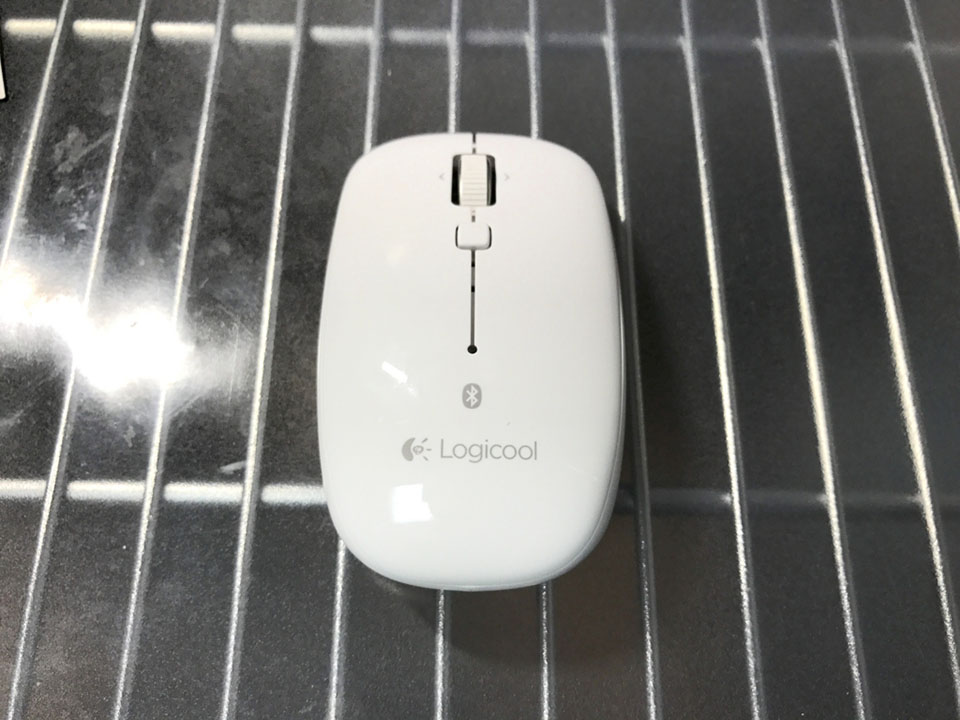

この前 MacBookPro 向けに Apple Wireless Keyboard を購入し、こうなったら Mac 用に無線マウスも欲しいなぁ〜と思い、色々調べて **Logicool M558** という Bluetooth マウスを買った。

- [Apple Wireless Keyboard (A1016) M9270LL/A を買った](/blog/2017/03/05-02.html)

これが M558。

開けてみた。

左右対称のデザインで、サイズは普通。クリック感は標準的かやや強め、カチッとハッキリ音がする。ホイールはクリック感が少なく、割りとヌルッと回る。ホイール下にボタンがあり、デフォルトだとミッションコントロールが開いた。どうもカスタマイズできるみたい。

単3電池2本が付属していて、普段は2本入れるのだが、1本でも動作するので、電池が切れ掛かったときも助かる。

Mac との接続方法は特に迷わなかったので省略。以下に説明アリ。

- 参考：[M558 Bluetooth マウスを Mac に接続します](http://support.logicool.co.jp/ja_jp/article/48485?product=a0qi00000069vAbAAI)

あとはシステム環境設定からマウスの動きの設定を少し機敏にしてあげたくらい。少しテキパキ動きすぎるくらいが好み。

Windows 用として M557 という同型のマウスもある。違いは Windows マークの有無ぐらいに見えるが、一応この M558 は Mac 専用と謳っていて、Apple のサイトでも推奨されているみたいなので、マカーは割高でもコチラを買っておこう。w

- 参考：[mac用bluetoothマウス ロジクールM558 M557との違いは？ - YouTube](https://www.youtube.com/watch?v=i3GFvXputbU)

自分のデスクは、メタルラックの台に透明なデスクマットを敷いて構築している。そのためか若干マウスの反応が悪かったので、1・2年くらい前に買ったまま開けていなかったサンワサプライのマウスパッドを置くことにした。

コレ。

Windows 環境と並んでいてデスクが激狭になってきたw

でもよきよき。

ちなみに、だいぶ前に ShareMouse というアプリを導入しているので、本当はマウスもキーボードも1つあれば、両環境を行き来できるのだが…w。

- [Windows マシンと MacBook のマウスとキーボードを共有する Share Mouse が超絶便利](/blog/2016/05/13-01.html)

でも意味がないワケではなく、Bluetooth 製品を LAN を通して別環境に対して使おうとすると、やはりほんの少しだがタイムラグがあり、文字入力やカーソル操作で若干もっさり感を覚える。だから Windows 用と Mac 用とでそれぞれマウス・キーボードがあるのはちょうど良いのだ。

何より、Mac の周辺機器を白で揃えられていて満足している。w
