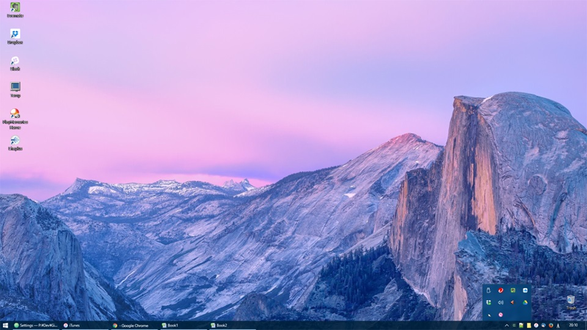
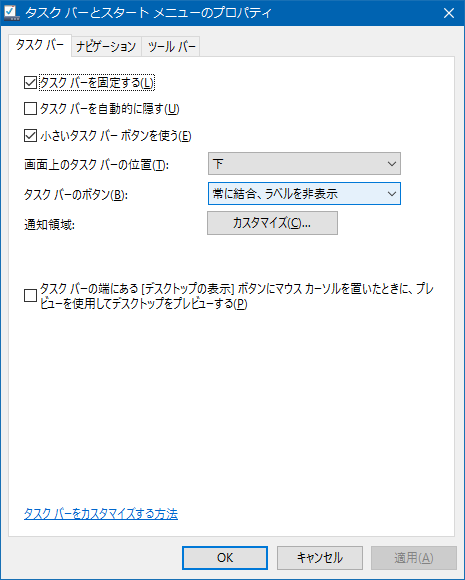
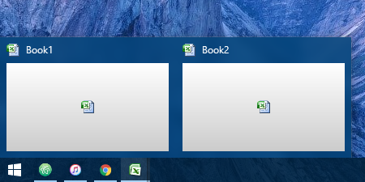
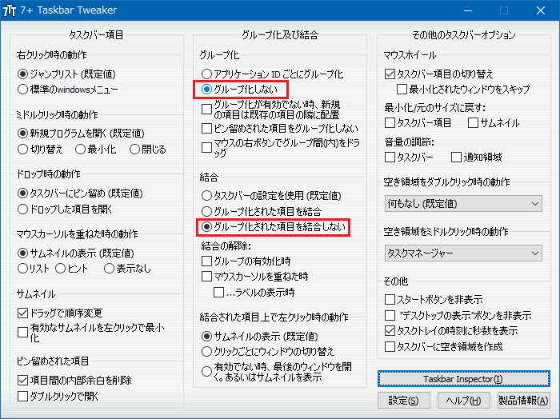
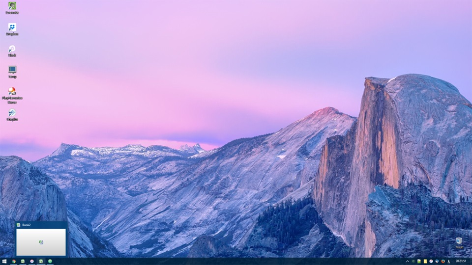

Windows でも、Mac の Dock のように、タスクバーにはアイコンが並んでいてほしいな、と思い、便利にアイコン化するための方法を調べた。

## 変更前の現状

これまでの Windows デスクトップはこんな感じ。

ぼくは元々、なんでも右下のタスクトレイアイコンにアプリをブチ込みたい性で、左端から並ぶタスクバーは開いているウィンドウしか置きたくないと思っている。

だから普段は2・3のアプリをアクティブに使っていて (= タスクバーに並んでいて)、それ以外の最小化したアプリ、常駐アプリはタスクトレイに入っている、という状態だ。

共有ストレージなどの常駐アプリ以外で、大抵タスクトレイに収納しているアプリは以下のとおり。

- Firefox : アドイン「[MinimizeToTray revived – Get this Extension for 🦊 Firefox (ja)](https://addons.mozilla.org/ja/firefox/addon/minimizetotray-revived/)」でタスクトレイに格納している
- Thunderbird : アドイン「[MinimizeToTray revived :: Thunderbird 向けアドオン](https://addons.mozilla.org/ja/thunderbird/addon/minimizetotray-revived/)」を使用
- エクスプローラ : QTTabBar というエクスプローラの拡張アプリの機能を使用 [QTTabBar でエクスプローラをタブ化 +α](/blog/2017/02/24-01.html)
- iTunes : 標準機能でタスクトレイに格納できる
- Notepad++ : 標準機能
- ConEmu : 標準機能

Chrome や Atom エディタがタスクトレイにしまえないので、RBTray というどんなアプリでもタスクトレイに収納できるアプリを使っていたりする。

- [Chrome の最小化ボタンを押しても閉じるボタンを押してもタスクトレイに最小化されるようにしたい](/blog/2016/01/16-03.html)

## タスクバーのアイコン化自体は標準設定でできる

タスクバーをアイコン化すること自体は、Windows の標準的な設定でできる。

それは、「タスクバーのボタン」で「**常に結合、ラベルを非表示**」を選択すれば良いのだ。

自分の環境の場合は「タスクバーとスタートメニューのプロパティ」という、タスクバーを右クリックして選択できるメニュー画面から設定できたが、Windows10 のグレードなどによっては「PC 設定」内の「タスクバー」という項目で同項目が設定できる。

## 「常に結合」を止めて欲しい

「ラベルを非表示」によって開いているアプリがアイコン表示されるのは嬉しいのだが、「常に結合」が個人的には迷惑なのだ。

Windows7 あたりから「ウィンドウの結合」という機能ができたようだが、これは Excel などのように1つのアプリが複数のウィンドウを持つようなときに、「でも1つのアプリだから1アイコン」というようなタスクバーのまとめ方をする機能なのだ。これをされると、例えば Excel で複数のブックを開いているときに目的のブックをアクティブにするのに手間取るのだ。WindowsXP 以前はこの機能がなくて、ずっと慣れないのだ。

↑こんな風に、2つの Excel ブックを開いていても、タスクバーのアイコンは1つ。この動きが嫌。

これが嫌なのだが、*「結合はせずにラベルを非表示」という設定方法はなく、困っている。*

## Windows7 まではタスクバーの幅をレジストリで狭められた

Windows7 までは、タスクバーの表示幅をレジストリで狭めることができた。こうすると、ラベル部分が短くなるので、実質的にアイコン表示風に使えたのだ。結合もされないし、これが割りと便利だったのだが、Windows10 になってこのレジストリが効かなくなったようである。

ちなみに当時はどうやっていたかというと、`regedit` で `HKEY_CURRENT_USER\Control Panel\Desktop\WindowMetrics\` キーまで降り、ココに `MinWidth` という名前の「文字列値」を作る。値は `-285` 以上で適宜調整し、再起動すれば反映される。

- 参考 : [タスク・バーのボタンの幅を調整する − ＠IT](http://www.atmarkit.co.jp/fwin2k/win2ktips/974taskbaricon/taskbaricon.html)
- 参考 : [タスクバーのボタンの幅を短くする - 日経トレンディネット](http://trendy.nikkeibp.co.jp/article/tec/winxp/20050202/110887/)

## そうして見付けた「7+ Taskbar Tweaker」

ようやくタイトルに出てきた **「7+ Taskbar Tweaker」** の話である。これはタスクバー周りの設定を変更できるアプリだ。

なお、予め先ほど紹介した「*常に結合、ラベルを非表示*」という Windows の標準設定をしておく。「7+ Taskbar Tweaker」はアイコン表示してくれるアプリではなく、**「常に結合」を解除してくれる**アプリとして使うのだ。

- [7+ Taskbar Tweaker - RaMMicHaeL's Blog](http://rammichael.com/7-taskbar-tweaker)

上のサイトにアクセスし、「`7tt_setup.exe`」をダウンロードしインストールする。設定項目は日本語表示できる。

設定項目のうち、「*グループ化しない*」と「**グループ化された項目を結合しない**」を選択しておくことで、ウィンドウを結合させずに表示できる。

嬉しい副作用として、同じアプリが複数個タスクバーにあるときに、それらの表示位置を個別に変更することができるようになった。これまでは、例えば複数の Excel が立ち上がっていて、その表示位置を移動させようとすると、全ての Excel のタスクバーがつられてくっついて動く動きをしていたのだが、以下のキャプチャのように、それぞれの Excel ブックを全く別の位置に入れ替え並べることができる。

## これがカスタマイズ後のデスクトップだ！

このようにアイコン表示でき、アプリが結合しなくなっている。大変使いやすく、思っていた動きをしてくれている。

他にも「タスクバーでマウスホイールを動かすと前後のアプリに移動できる」とか、「右下の時刻表示を秒数まで表示させる」など、ちょっとした便利機能が実現できるので、「7+ Taskbar Tweaker」、オススメ。

- [7+ Taskbar Tweaker - RaMMicHaeL's Blog](http://rammichael.com/7-taskbar-tweaker)
