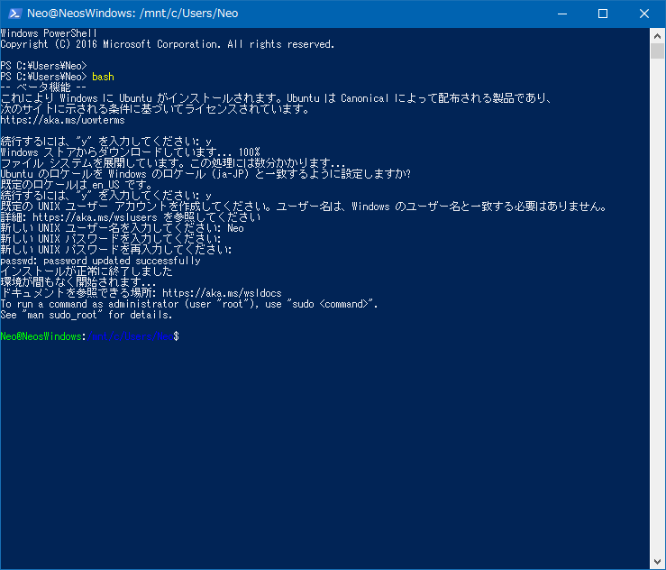

Windows 10 Creators Update がリリースされた今日に合わせて、というつもりでは全くなかったのだが、Bash on Ubuntu on Windows をいじってみたくて、ようやく導入してみた、という流れ。実施環境は Windows10 64bit。

Windows Insider Program に参加しないと導入できないのかと思って、Windows Insider Program に登録したりしてしまったのだが、どうやら __Windows10 Anniversary Update 以降は Windows Insider Program に登録しなくても Bash on Ubuntu on Windows をサクッと入れられるみたい__。導入してから気付いた…。

## Bash on Ubuntu on Windows って？

「Bash on Ubuntu on Windows」と呼んでいるのは、Windows10 上で Ubuntu をネイティブに動かせるようになった機能のこと。Windows 上に Ubuntu 環境が乗っかる形で利用できる。

## Windows Insider Program について

Windows10 Anniversary Update というアップデート以前は、Bash on Ubuntu on Windows は開発者向けのベータ版として公開されていたため、Microsoft アカウントを登録し、Windows Insider Program というプログラムに参加する必要があった。

Windows Insider Program に参加する手順については以下の記事が詳しい。

- 参考：[Windowsに採用されたBash (Ubuntu)を試してみる](https://rcmdnk.com/blog/2016/06/05/computer-windows-ubuntu-bash/)

が、Windows10 Anniversary Update の登場によって、もう不要になっていたようだ。

- 参考：[Windows 10でBash on Ubuntu on Windowsも含まれるAnniversary Updateの提供開始](https://rcmdnk.com/blog/2016/08/04/computer-windows-ubuntu-bash/)

Windows Insider Preview も鬱陶しいので、もはや無効にしておきたい。

- 参考：[Windows Insider previewを止めた](https://rcmdnk.com/blog/2016/06/27/computer-windows/)

### 何やらブランチがあった

自分がコレを導入しようとした時は、何やらブランチ選択ができるようになっていて、「`rs1_release`」「`rs2_release`」など4項目ほどあったのだが、とりあえず古めで情報が出揃っていそうな「`rs1_release`」を選択しておいた。

### Microsoft アカウントとローカルアカウント

Windows Insider Program に参加するために Microsoft アカウントに登録し、元々 PC にログインしているローカルアカウントを Microsoft アカウントに切り替える必要があった。これが鬱陶しかったのだが、後で以下の手順でローカルアカウントに戻せる。

- _スタートメニューから PC 設定 → アカウント → 「ローカルアカウントでのサインインに切り替える」を選択し、ウィザードに沿ってローカルアカウントの再設定_

ローカルアカウントの情報等は消えていないし、Microsoft アカウントとは情報を引き継げるので特に問題なし。

### アップデートすると「7+ Taskbar Tweaker」が使えなくなった

「_7+ Taskbar Tweaker_」というアプリを使っていたのだが、Anniversary Update 以降はアプリ側の対応が十分ではないようで、起動時に「7+ Taskbar Tweaker: ライブラリをロードできませんでした (104)」というエラーが表示されてしまう。

- [7+ Taskbar Tweaker を使うと Windows10 のタスクバーを便利にアイコン化できる](/blog/2017/03/20-02.html)

公式サイトから Anniversary Update にも対応しているベータ版を落として入れてみたが、コチラもダメだった。残念。

- 参考：[7+ Taskbar Tweaker for Windows 10 Anniversary Update: early alpha version - RaMMicHaeL's Blog](https://rammichael.com/7-taskbar-tweaker-for-windows-10-anniversary-update-early-alpha-version)

## Bash on Ubuntu on Windows の導入

さて、それでは Ubuntu の導入に移る。自分は Windows Insider Program から Update をかけたワケだが、今は違うっぽい。詳しく知らないので、とりあえず Windows Update などを行っておく。

`Win + R` で「ファイル名を指定して実行」を開き、`winver` と入力する。「Windows のバージョン情報」の中でビルド番号を確認する。

> ビルドが `14316` より大きければ Bash の機能が使える様になっています。

ということみたい。

_以降は、以下のように操作していく。_

- PC 設定 → 更新とセキュリティ → 開発者向け → 「開発者モード」を選択する。
- コントロールパネル → プログラムと機能 → Windows の機能の有効化または無効化 → 「Windows Subsystem for Linux (Beta)」という項目があるはずなのでこれにチェックを入れて、再起動する。
- 再起動後、PowerShell を起動し、`bash` と入力する。Bash のインストールをするか聞かれるので、`y` と入力する。
- インストール中、言語切替やユーザ名・パスワードの設定を求められるので、入力していく。
- インストールが終わると、PowerShell 上で Bash が起動する。



これでインストール完了。以降は__スタートメニューに「Bash on Ubuntu on Windows」__というメニューが追加されているので、ココから起動できる。

## Bash on Ubuntu on Windows に関する仕様

- ホームディレクトリは `C:\Users\(ユーザ名)\AppData\Local\lxss\home\(Bash 用のユーザ名)\` になっている。隠しフォルダ扱いなので、隠しフォルダを表示するようにしておく。
- Windows 環境のドライブには `$ cd /mnt/c/` といった形でアクセスできる。

その他は前述の参考記事が詳しい。基本的には普通に Linux として違和感なく触れる。

何も入力していない時にバックスペースを打ったりするとビープ音がしてうるさいのは、`/etc/inputrc` というファイルを書き換えると解消できる。

```bash
# 設定ファイルを Vi (Vim) で開く。編集するためには sudo で開く必要あり。
$ sudo vi /etc/inputrc
```

以下のようなコメントアウトされている行を見つける。

```
# set bell-style none
```

このコメントアウトを外し、`:wq` で保存終了する。

```
# こうする。
set bell-style none
```

これで Bash を再起動すれば、ビープ音が鳴らなくなっている。

- 参考：[Disable beep of Linux Bash on Windows 10 - Stack Overflow](http://stackoverflow.com/questions/36724209/disable-beep-of-linux-bash-on-windows-10)

## 所感

今まで自分が触ったことがある Linux ディストリビューションとしては、CentOS (Vagrant にて)、Red Hat Enterprise Linux (サーバとして)、Fedora (VirtualBox にて)、Xubuntu (ChromeBook の Crouton にて) ぐらいで、Ubuntu 自体は初めて触った。

- [Windows 上から VirtualBox でLinux 入門！Fedora 24 Workstation を動かしてみる](/blog/2016/07/24-01.html)
- [Crouton を使って ChromeBook に Xubuntu 環境を構築する](/blog/2017/01/08-02.html)

最初は楽しかったが、次第に_「コレ別に Windows 上にガッチャンコした Ubuntu を無理に触らなくてもいいのでは…」_と感じ始めた。すなわち、Vagrant や Docker みたいな仮想環境として扱ったほうが色々と気楽で、中途半端に Windows に依存している Linux には違和感があるのだ。

多分仮想環境で動かすよりは、Windows 標準の Linux として扱えている方が動作も軽いのだろうけど、そこまでスペックが必要になるような使い方はしていないし、そこまで Bash on Ubuntu on Windows に手を出さなくとも、__Vagrant でいいんじゃない？__というのが僕の感想…。

- 参考：[Windows Subsystem for Linuxをインストールしてみよう！ - Qiita](http://qiita.com/Aruneko/items/c79810b0b015bebf30bb)
- 参考：[Bash on Ubuntu on Windowsが楽しい! - Qiita](http://qiita.com/ushibondi/items/936284131af2344bf12d)
- 参考：[【西川和久の不定期コラム】Windows 10 Creators Updateで「Bash」がバージョンアップ【前編】 ～Ubuntu 14.04.5 LTSから16.04.2 LTSへ。WindowsのEXEも実行可能 - PC Watch](http://pc.watch.impress.co.jp/docs/column/nishikawa/1054154.html)
