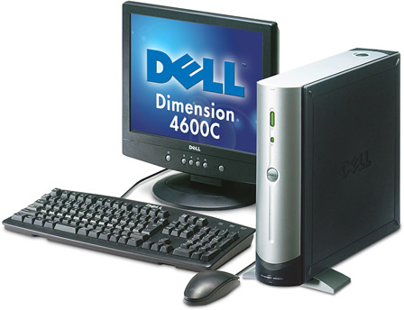
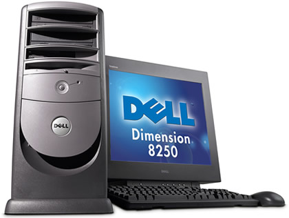

…

> **「ハリウッドはクソだ」**

…

…というセリフから始まる、2001年公開の「**Swordfish ソードフィッシュ**」という映画が、僕の人生を決定付けた、という話をする。

  

    
  

  

    

      <a href="https://www.amazon.co.jp/dp/B003EVW5A0?tag=neos21-22&amp;linkCode=osi&amp;th=1&amp;psc=1">ソードフィッシュ 特別版 [DVD]</a>
    

  

- [Swordfish (1/10) Movie CLIP - The Problem With Hollywood (2001) HD](https://youtube.com/watch?v=WjDLin6Egyw)

この映画に出会ったのは恐らく2002年頃、父が何の気なしにこの映画の DVD を買ってきたときだった。1500円だか2500円だかという廉価 DVD シリーズの仲間入りをしていた映画で、僕も親父も何の気なしに見始めた。ジョン・トラボルタは「フェイス・オフ」とかを観て知っていたが、他の出演者、ヒュー・ジャックマンやハル・ベリーは「X-メン」を観ていなかったので知らなかった。

この映画は、凄腕ハッカーのスタンリー・ジョブソン (ヒュー・ジャックマン) がテログループのボスであるガブリエル・シアー (ジョン・トラボルタ) に目をつけられ、政府が隠し持っていた95億ドルを強奪する計画に参加することになる…というモノ。ガブリエルの手下であるジンジャー (ハル・ベリー) は実はおとり捜査官で、スタンリーはガブリエルが仕掛ける罠にハマっていく…という。

600台のカメラを並べて「_バレット・タイム_」と呼ばれる手法で撮った、冒頭の爆発シーンが見もの。バレット・タイムの元祖といえば、マトリックスの銃弾を避けるあのシーンだが、本当にカメラを大量に並べてバレット・タイムを撮影した映画って、マトリックスとこのソードフィッシュぐらいしか知らない。「マトリックス・リローデッド」の頃にはフル CG でやるようになってたし。

- [Swordfish (2/10) Movie CLIP - Street Explosion (2001) HD](https://youtube.com/watch?v=hiHZWeeoEUg)

↑これがそのバレット・タイムのシーン。特撮・CG 大好きだったのでコマ送りして何度も観てた。

ソードフィッシュは世間的には B 級と評されていたりして、可もなく不可もなく、みたいな評価なのだが、僕はこの映画に衝撃を受けたし、今でも大好きな映画だ。

この映画は本当に大好きなので、映画に関する話はまた何度かに分けてしようと思っているのだが、今回はこの映画に出会った僕がどう影響を受けたのかを話そうと思う。

  

    
  

  

    

      <a href="https://www.amazon.co.jp/dp/B003GQSY3A?tag=neos21-22&amp;linkCode=osi&amp;th=1&amp;psc=1">ソードフィッシュ [Blu-ray]</a>
    

  

この映画の DVD を観た2002年頃というと、既に個人のウェブサイトを作っており、家族で共用のパソコンを普段から使っていた。だがこの映画の中で、Dell のパソコンを華麗に操るスタンリーの姿を見て、「自分のパソコンが欲しい」と思うようになったのである。

買うんだったら映画と同じ Dell がいい、ということで、親に駄々をこねまくって、中学入学祝いとして、2003年4月に _Dell Dimension 4500C_ というスリムタワーのデスクトップ PC を買ってもらった。スペックは以下のとおり。

- CPU：Intel Pentium 4 2.4GHz
- メモリ：512MB (後に 1GB に増設)
- HDD：40GB (後に外付け HDD で 160GB・250GB を追加)
- グラフィックカード：NVIDIA GeForce4 MX 420
- OS：Microsoft Windows XP Home Edition
- モニタ：15インチ (後に壊れて Toshiba 製の17インチに移行)
- 光学ドライブ：DVD コンボドライブ

- [デル DIMENSION 4600C 外観、拡大写真](http://www.ari-web.com/shop/pc/dell/dimension-4600c-2.htm) より写真を拝借。
- この画像は Dimensino 4600C というマイナーチェンジ版だが、外観はこれと同じ。4500C というモデルは自分が買った直後にすぐ消滅してしまった。

ペンティアム4というのが今となっては意味分からんと思うけど、当時は「3.6GHz スッゲー！」みたいなことを言ってて、値段を下げるために妥協に妥協して 2.4GHz にしたと記憶する。HDD もかなり渋った。モニタは、劇中の銀行のシーンとかで出てくる17インチの Dell 製モニタが格好良くてそれが欲しかったのだけど、自分の勉強机に置けないことが分かって、15インチを選んだ。これで当時**18万**とかしたので、凄い入学祝いだったと思う。

当時は以下みたいなタワー型の Dimension モデルも展開されていて、週刊アスキーの広告を毎週見ながら「とりあえず超スペック高いっぽいし一番高いのほしいなぁ～！」と思いながら、下から2番目ぐらいの 4500C を選んだのだった。

- [デル DIMENSION 8250 外観、拡大写真](http://www.ari-web.com/shop/pc/dell/dimension-8250-2.htm) より写真を拝借。

それでも、自分の PC が出来たということで、当時はもう嬉しくて嬉しくて、ひたすらウェブサイトを作ったり、Flash アニメを作ったり、ポケ熱同盟に入り浸ったりしていた。2003年の4月頃から9月頃までは、本当に幸せな生活をしていた。

それからしばらくこのパソコンを使い続けたが、ある日どうにも起動しなくなってしまい、2007年頃、ついにパソコンを買い換えることになった。次に選んだのは _Dell Inspiron 530S_ というこれまた Dell 製だった。スペックは以下のとおり。

- CPU：Intel Core 2 Duo 2.4GHz
- メモリ：2GB
- HDD：320GB (前述の外付け HDD 160GB・250GB、それから 500GB と3台の外付け HDD を繋いでいた)
- OS：Microsoft Windows Vista Home Premium
- 光学ドライブ：DVD ±RW

- [Inspiron 530sのサポート | Dell 日本](http://www.dell.com/support/home/jp/ja/jpbsd1/product-support/product/inspiron-530s/manuals) より画像を拝借。

このパソコンを買った時、「パソコンが動かなくなったなら買い換えなきゃ！」とテンションが上がっていたのは僕よりも父の方で、新しいデジタルガジェットが好きな父は俺よりも喜び勇んで買っていた。値段覚えていないが、12・3万程度ではなかったかと思う。このパソコンに関しては特にスペックに拘りがなかった。というのも、この4年前後の間にパソコンのスペックはどんどん右肩上がりで向上していて、一番安いパソコンを選んでも、自分が昨日まで満足して使っていたパソコンより性能が良いので、どれを買っても一緒というか、気にならない状態だった。

残念ながらこの2台目の Dell は短命に終わってしまい、2・3年ぐらいで故障してしまったのだが、ココで奇跡が起こり、それまで放置していた1台目のパソコンが、何故か正常に起動するようになっていたのだ。次のパソコンを買うまでの繋ぎとして十分すぎるくらいの役目を果たしてくれえた。Dimension 4500C、愛しているぞ。

2010年頃に、3台目となるパソコンを買った。本国が米国な関係か、Dell はパソコンが故障した時のサポートに異様に時間がかかることと、2010年頃にもなると「BTO で格安のメーカーといえば Dell」という図式は崩れ去っていたので、Acer Aspire ASM5811-A61 という Acer のパソコンを買った。このデスクトップ機はカスタマイズを重ねて2017年現在も使っている。

  

    
  

  

    

      <a href="https://www.amazon.co.jp/dp/B00005NO9T?tag=neos21-22&amp;linkCode=osi&amp;th=1&amp;psc=1">ソードフィッシュ オリジナル・サウンドトラック</a>
    

  

ソードフィッシュで使われていたから、という理由で影響されて Dell のパソコンを買って使っていた僕だが、このパソコン趣味が高じて、大学卒業後はプログラマ、システムエンジニアとして SIer の仕事に就いてしまった。

スタンリーが劇中で、ボソッと「**不可能は何もない**」と言うシーンがあるのだが (その後に「ヤル気を出させられ」ながら60秒で国防省のデータベースに不正アクセスする)、僕は妙にこの言葉が残っていて、プログラミングにおいても、社内の業務改善だとかにおいても、不可能なことは何もないと思ってやるようにしている。事実、皆が出来ないと勝手に決めつけていたことも、技術的には可能で、僕がやり遂げたこともあったし、チーム内での仕事の進め方を僕が変えたことも多かった。

現在はより色んなことを早くやりたいという思いから、保守的で古臭く、動きのノロい金融系 SIer を辞め、Web 系の会社に転職してフロントエンドエンジニアを名乗っている。

不正なことをする「ハッカー (クラッカー)」という職業にはさすがに就かなかったし、誘拐や銀行強盗、ロケットランチャーとも縁はないが、「ソードフィッシュ」という映画が、ついに僕の職業や思想にまで影響した結果として、今僕はこんなところにいる、というお話でした。
