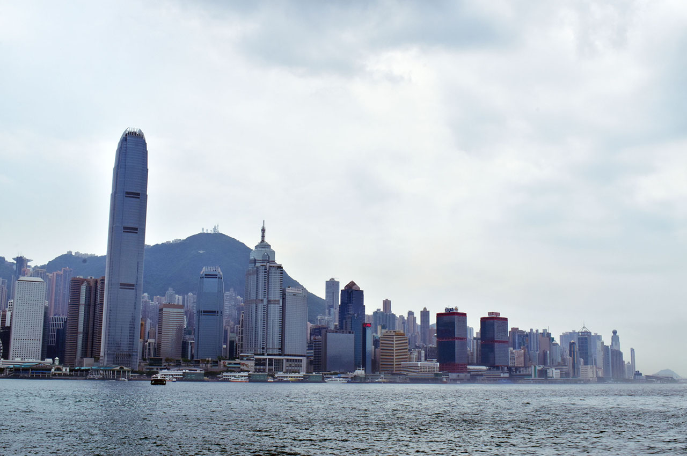
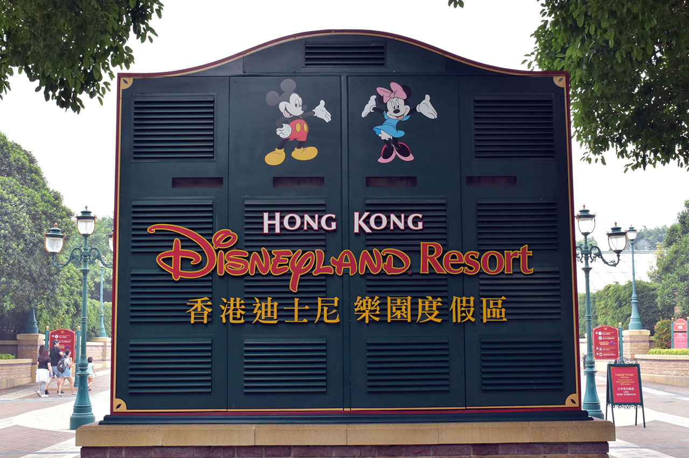

**2017年5月4日から5月7日まで、ゴールデンウィークを利用して香港に旅行してきた。**早いもので、旅行から2週間も経ってしまった。

海外旅行はほとんど初めてで、準備に戸惑ったこと、旅行中に遭遇したハプニング、次回行くなら改善できそうなことなど、旅行を通じて得た発見が色々あったので、それらを何回かに分けてまとめてみようと思う。

初回は旅行に行くまでの話を書こうと思う。

## 自分の海外旅行歴

自分のそれまでの海外旅行歴はというと、1998年、自分がまだ6・7歳だった頃に、家族に連れられて父方の親戚が住んでいるシンガポールに旅行したっきりだった。

シンガポールに行くには、飛行機には片道7時間ほどかかったと思う。その親戚の家に寝泊まりしていたのでホテルには宿泊しなかった。シンガポールからバスに乗って橋を渡るとマレーシアに入国できたので、マレーシアにも入国し、自分は一応「シンガポールとマレーシアに行ったことがある」と言える状態だった。

ただ、それらは何もかも両親と親戚が手配してくれたものだし、6歳のガキはただただ与えられたまま旅行するだけだった。

ちなみに国内旅行はというと、小さい頃から旅行好きの父に連れられて、毎週のように全国に旅行していた。クルマ移動がほとんどで、北海道にはフェリーで、沖縄には飛行機で行ったが、それ以外は全てクルマだった。そういう意味では、公共の乗り物を使って旅行することにはちょっと抵抗があるというか、パーソナルな空間が少ないのでちょっと苦手だったりする。自分でも運転するようになってからは、一晩で四国に行ったり青森に行ったり、長距離ドライブがちょっとした趣味だったりする。

## 旅行までの準備

準備に関する詳細はまた語ろうと思うので、軽く時系列順にやったことを触れておく。

1. パスポートを作る
    - 自分は去年の2016年に既に取得していた (結局その年は一緒に行く相手がお金ないとかでナァナァになって行かなかった)。10年タイプを取っておくといいと思う。
2. 旅行代理店に行く
    - 2月の頭ぐらいに [H.I.S.](http://www.his-j.com/) に行って、「香港に旅行したいんですよね～」と伝えると色々やってくれた。
    - 団体で回るツアーのプランではなく、飛行機とホテルだけ予約してもらうプランにした。そういう自由行動タイプのプランでも、空港とホテル間の送迎とかはやってくれたりする。
    - 今回は、香港といえば、な街並みが広がる九龍島の市内をブラっと観光したかったのと、香港ディズニーランドに行きたいと考えていた。そこで、香港島にある「ハーバーグランド香港」ホテルと香港ディズニーランド・リゾート内の「ディズニー・ハリウッド・ホテル」に泊まる、3泊4日のプランにした。*値段は一人22万円程度。*
3. 申込みをする
    - プランを決めたら H.I.S. の Web から申し込みをした。
4. 予約結果をもらって払込をする
    - H.I.S. がホテルと航空券を予約してくれたら予約の結果がもらえる。2月の下旬ぐらいに連絡がきた。月末だったせいか支払までの期日がシビアで慌てた。
5. 旅行に関する資料を受け取る
    - 3月中旬ぐらいに、H.I.S. から旅行に関する資料が自宅に郵送されてきた。行きの飛行機の E チケットだとか、ホテル情報とか旅行時の注意点とか色々ついているので読んでおく。
6. スーツケースをレンタルする
    - 旅行用のスーツケースを持っていなかったので、「[アイエルレンタル](http://www.ilrental.co.jp/)」でレンタルした。3月の頭くらいに申し込んだ。
    - 香港はコンセントの形状が「BF タイプ」というイギリスの形状が主流なのと、電圧も日本より高いので、*変換プラグと変圧器*を一緒にレンタルした。
7. Wi-Fi をレンタルする
    - 海外でもネットができたら便利かと思い、「[イモトの Wi-Fi](https://www.globaldata.jp/imotowifi/)」で 4G/LTE が使える Wi-Fi を申し込んだ。
    - Wi-Fi は成田空港で受け取れるので、当日の搭乗手続きの前に受け取っておく。空港はターミナルが別れているので、近いところの窓口を選んでおくこと。
    - 後で話すが、結果的には **Wi-Fi はレンタルしなくても良かったかな**と思う。
8. 海外旅行保険の申し込みをする
    - 保険の付いているクレジットカードとかを持っていなかったので、旅行直前、5月頭に申し込んだ。H.I.S. のサイトでも紹介している[「エイチ・エス損保」の「スマートネッと U」](http://web.hs-sonpo.co.jp/pc/?aid=08181)で申し込みした。
    - 申し込み直後の画面をプリントアウトして持ち歩いておく。何もなく帰宅すれば、旅行後に破棄して終わりになる。
9. 旅行前日は早めに寝る
    - 始発に乗って成田空港に向かう予定だったので、荷物の準備は終わらせて早めに寝ておいた。
    - 事前に成田空港の近くに行けたりとか、空港で寝泊まりとかもなくはないが、9時出発の飛行機であれば7時に成田空港にいれば全然間に合う。

必須の事前準備はこんなところか。その他持っていった荷物なども別途まとめようと思う。

## 旅行の日程はこんな感じ

そんなこんなで色々準備したが、全体的な旅行の予定は以下のようになった。

- 5/4 (木) : 1日目
  - 始発で成田空港に向かう。7時には成田空港に到着しておき、搭乗手続きを開始する。
  - 9時に飛行機出発。日本時間12時 (現地時間13時・以降現地時間で記載) に香港空港に到着。
  - 1時間程度かけて香港島にある「ハーバーグランド香港」ホテルに送迎してもらい、午後は自由行動。
  - 20時のシンフォニー・オブ・ライツをヴィクトリア・ピークという山の上で見ようかとか考えていた。
- 5/5 (金) : 2日目
  - 終日自由行動。
  - スタバのコーヒーエッグタルトを食べたり、九龍島に渡ってネイザンロードを歩いたり、「糖朝」という所の有名なマンゴープリンを食べたり、九龍城の跡地を見たりしようかと。
  - 夜は1日目と同じホテルに戻ってくる。
- 5/6 (土) : 3日目
  - 9時頃チェックアウトし、香港ディズニーリゾートに移動する。ココも H.I.S. のスタッフに送迎してもらう。
  - ホテルのチェックインが15時以降からになるので、ディズニーランドホテルに荷物だけ預けておき、先にディズニーランドで遊ぶ。
  - 閉園が20時半と少し早めなので夜はマッタリホテルで過ごす。
- 5/7 (日) : 4日目
  - 11時頃ディズニーランドホテルをチェックアウトし、香港空港まで送迎してもらう。
  - 飛行機に乗るのが現地時間15時頃で、到着が現地時間19時頃 (日本時間で20時、以降日本時間で表記)。
  - 20時半ぐらいには空港を出られるはずなので、[京成スカイライナー](http://www.keisei.co.jp/keisei/tetudou/skyliner/jp/index.php)に座って帰り、22時過ぎには自宅に到着。

んで翌 5/8 (月) は仕事に行く前にレンタルしたスーツケースをクロネコヤマトの営業所に持って行って集荷してもらい、月曜から飲み会に参加する予定、と…。ｗ

果たしてどれくらい予定どおりにコトが進んだのか、次回以降の旅行記をお楽しみに！

- [【香港旅行記】旅の記録 1日目 … 初日は悪天候に見舞われた](./21-01.html)
- [【香港旅行記】旅の記録 2日目 前半 … 香港島のスタバを満喫](./28-01.html)
- [【香港旅行記】旅の記録 2日目 後半 … 九龍島を探索・九龍城跡地にも行ってきたよ](./29-01.html)
- [【香港旅行記】旅の記録 3日目 … 香港ディズニーランドで遊び尽くす！](/blog/2017/06/12-01.html)
- [【香港旅行記】旅の記録 4日目 … 朝食バイキングのグリーティングと帰国](/blog/2017/06/13-01.html)
