ゴールデンウィークに3泊4日で行ってきた香港旅行。今回から1日ずつ旅の記録を書き綴る。今日は初日の話。

全体的な計画や準備のお話は以下の初回の記事をご参照のこと。

- [【香港旅行記】香港旅行に行ってきた](./19-01.html)

## 起床～離陸

朝は4時に起床。5時前の始発に乗って成田空港第2ターミナルを目指した。

6時半には空港に到着した。イモトの Wi-Fi をレンタルできる窓口は7時にならないと開かないので、しばし空港ロビーで待った。

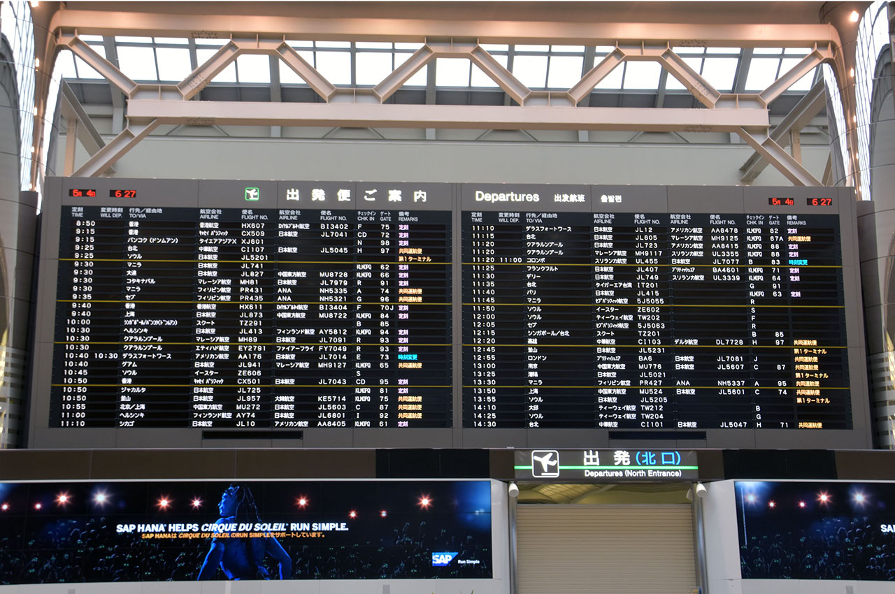

↑成田空港にて。

7時になってイモトの Wi-Fi をレンタル。空港も慌ただしく動き始めたので、搭乗手続きを始めることにした。

搭乗手続きのカウンタ付近に行くと、「E-チケットを持っている人は事前に航空券を払い出せる」とのこと。カウンタ付近にあるローソンのロッピーみたいな端末にパスポートを読ませると、座席指定をして航空券が払い出せた。HIS から E-チケットの紙をもらってたけどコレは使わずに済んだ。パスポート番号と乗る飛行機が予約の時点で紐付いているから楽チンねv

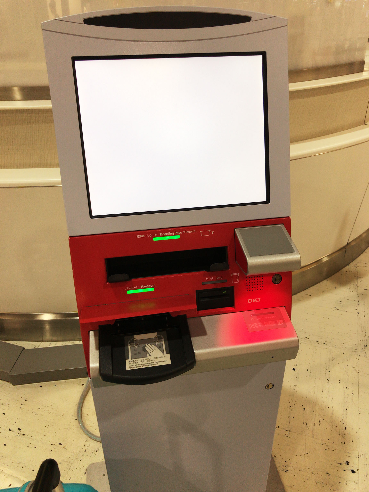

↑これがその、パスポートを読み込ませるだけで予約していた航空券を発行できる機械。「自動チェックイン機」というらしい。

そんでスーツケースを預け入れて、出国審査のゲートに並び始めたのだけど、看板などを見るとどうやら**バッテリーの類は手荷物で持ち込まないといけない**らしい。モバイルバッテリーとカメラの充電式バッテリーをスーツケースに入れていたので、「先ほど預け入れたスーツケースからバッテリーを取り出したい」旨を手続きカウンタで伝えた。すると何とか対応してもらえて、「搭乗口のそばにスーツケースを出しておくから乗り込む直前に対応してくれ」と言われた。助かったが慌てた…。

日本からの出国審査は X 線を通って手荷物検査をされるだけで特になし。搭乗開始30分前くらいにはスーツケースからバッテリーを取り出させてもらい、無事乗り込めた。

飛行機は9時過ぎに予定どおり離陸。

## キャセイパシフィック航空は悪くない

今回はキャセイパシフィックの飛行機に乗った。エコノミー席は少し古めな設備だろうか。しかし「LCC」と云われて覚悟していたよりは全然ちゃんとしていて特段不満はなかった。

座席に付いているモニタで映画や音楽を楽しめるが、起動に物凄く時間がかかっており、メモリ 512MB の Linux 端末として動いていることがブート中に確認できた。

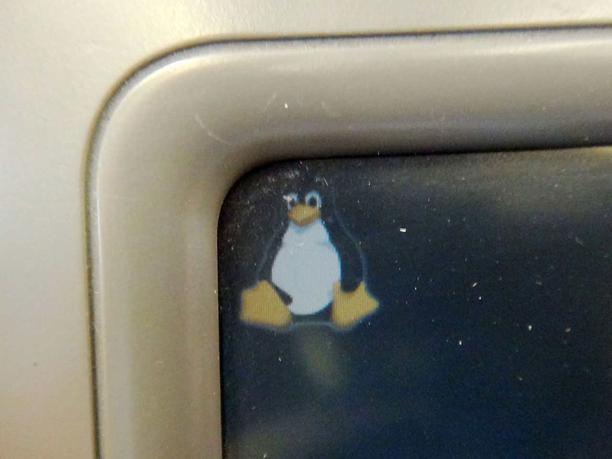

↑座席のモニタに映る[タックス](https://ja.wikipedia.org/wiki/%E3%82%BF%E3%83%83%E3%82%AF%E3%82%B9)くん。このあとサウンドドライバなどを読み込んでいるブート画面がしばらく映る。

映画は割と新しめのものもあるが、日本語吹き替え・日本語字幕が少なかったかも。また、一部の映画は StudioCX なるキャセイパシフィックお抱えの企業が_自前の吹き替えを用意しているらしく、棒読みの吹き替え声優の声を聞かされる映画も_あった。2017年5月時点でいうと、「セッション」「ラ・ラ・ランド」「ペット」「メッセージ」など、1・2年以内のソフト化されている映画もまぁまぁあり、それなりに本数は充実していた。自分は「セッション」の最後の部分をもう1回見た後、「トリプル X 再起動」を見た。

↑機内食は謎に美味しいシーフード麺だった。が、コーヒーは薄くてゲロマズだったので、素直にお茶を頼んだ方が良い。CA さんたちは英語で話しかけてくるので、よく単語を聞くこと。迷っていると「シーフードがグッドです」みたいなオススメを言ってくれるので「じゃあそれで」と頼めばいいかと。w

## 悪天候で6時間も遅延…

本来であれば日本時間9時出発で、現地時間13時頃 (香港は日本の1時間遅れなので日本時間だと14時頃) に到着、という5時間のフライトの予定だったのだが、香港に近付くにつれ悪天候が窓から確認できるようになり、着陸を試みたのかかなり揺れるときもあった。

残念ながら悪天候で着陸ができず、現地時間13時過ぎに、香港国際空港の隣にあるマカオ空港に一度着陸した。給油の上、天候の回復を待って再出発するということで、飛行機の中で待たされた。天候のせいなので仕方がないことではあるが、まさかこれが_現地時間17時頃まで機内に軟禁されることになる_とは思わなかった…。

機内ではドリンクや軽食のサービスがあり、自分は2本目の映画として、少し前に見て気に入っていた「マネーモンスター」を見た。

結局17時前後に再出発し、18時過ぎにやっと香港国際空港に到着した。予定より6時間遅れだった。

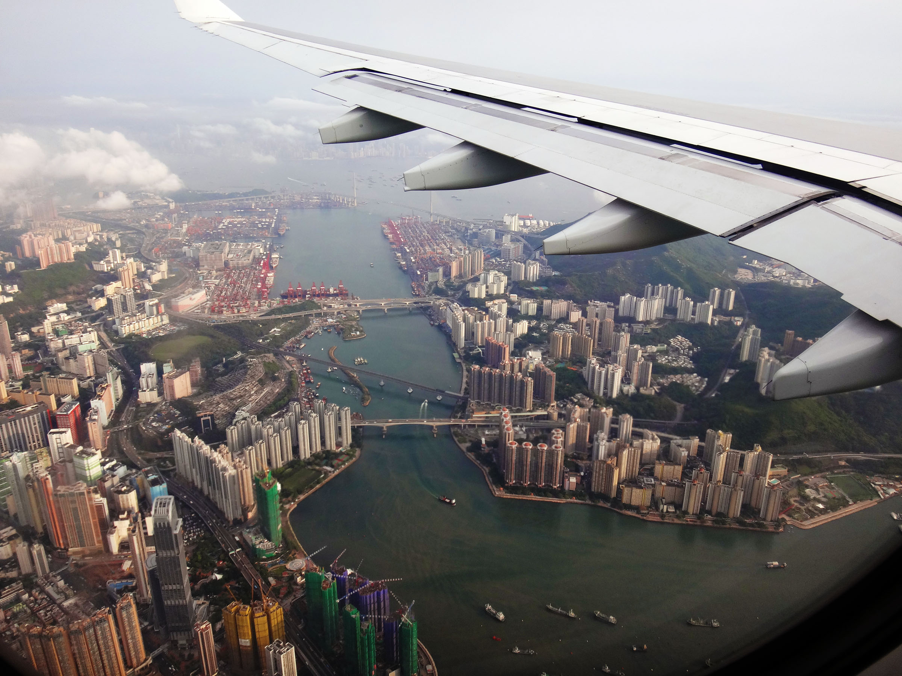

↑18時手前、着陸直前の景色。

## 入国審査でコケた

空港に着いて入国審査のところで引っかかった。

空港の人間が座っているところにパスポートを提示するのだが、何やら見たことのない紙を持ち、左手奥の方を指差している。中国語 (広東語) で応対され、何度か「Pardon me?」と聞き返したのだがまるで通じず。連れも左手奥に弾き出されていたのでとりあえず自分もそちらに出てみた。

すると何やら、**香港に旅行で入国する人は全員記入しないといけない「入出国カード」という紙**があるらしい。英語で項目が書いてあるので何を書いたらいいのかかなり迷った。回りにも困っている日本人が何組かいたので色々盗み見つつ書いたのは、_パスポートに記載の氏名・日本の住所・出身地、パスポート番号にパスポートの発行日、乗った飛行機や滞在するホテルの名称_ぐらい。以下のサイトに細かく書いてあるので、これから行く人はこちらを忘れずに見ておいて欲しい。

- 参考：[香港の出入国カードの記入例](https://www.uutravel.ne.jp/ed_html/ed_hongkong/ed_hongkong.htm)

「入出国カード」は下にカーボン紙が付いており、上の原紙が「入国カード」となっていて入国時に空港で預かられる。下のカーボンコピーの方は「出国カード」になっており、旅行中は自分の控えにもなる。出国カードは万が一なくしてしまったら出国手続きの時に書けるようだ。**香港に旅行に行く人は、この「入出国カード」のことを忘れずにおいていただきたい。**

## 現地スタッフに迎えられてホテルへ

そんなこんなで入国手続に時間がかかってしまったが、何とか18時半には空港のロビーに出ることができた。

ロビーには H.I.S. のマークを付けたスタッフ (男性1人、現地の人だが日本語はできた) がいて、彼も6時間強、余計に待っててくれたんだろうなぁと感謝した。

H.I.S. の現地スタッフに案内され、バスに乗り込んだのは自分たちを入れて3組。それぞれが違うホテルに泊まるので、道のりで1組ずつ下ろして行っていた。この最中に九龍島の市内をバスから少し眺めたりした。

バスの中で、現地スタッフが色々と香港の話をしてくれた。_「香港のクルマは全然止まらない」_「物価は日本より少し高め (大抵は日本の1.5倍くらいの値段)」「水道水は飲めない」「日本語はほとんど通じないので英語頑張って」などなど。後で「全然止まらない香港のクルマ」にヤラれるとは、この時想像もしていなかった…。

ホテルに着いたのは20時ちょっと前。我々が泊まったのは「**ハーバーグランド香港**」という、九龍島から海を渡った香港島の方にあるホテルだった。九龍島と香港島はフェリーで5分、地下トンネルをクルマでくぐっても5分で、あまり島が離れているという感覚はない。

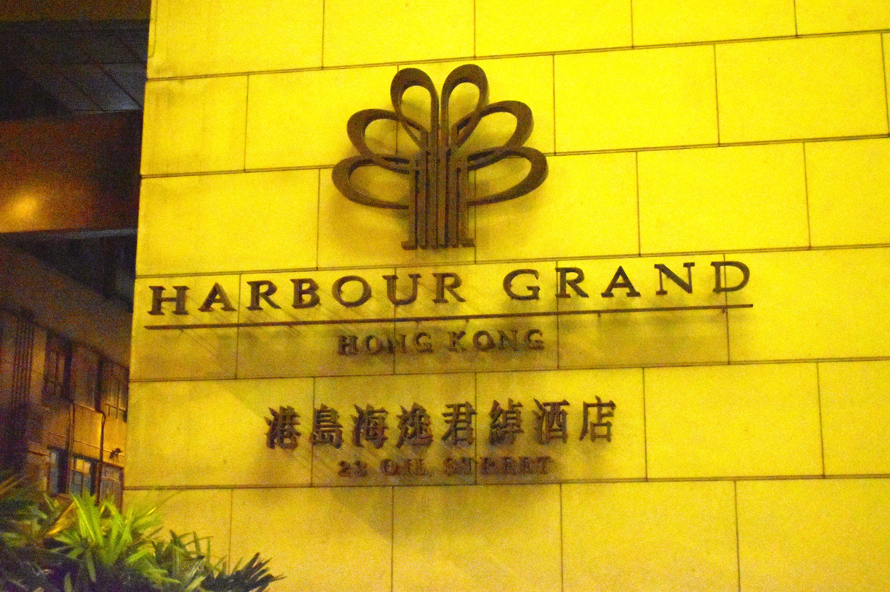

チェックインは英語で行ったが、こちらが日本人であることを見越してか、丁寧に対応してくれた。後で有料サービスを使った時とかに引き落とされるデポジットとして、クレジットカードを見せたりした。この辺のチェックインのやり方についても、バスで移動中に現地スタッフが話してくれるし、現地スタッフの緊急連絡先も教えてもらえるので、もし何かあればスタッフに電話して日本語で質問しても良いだろう。

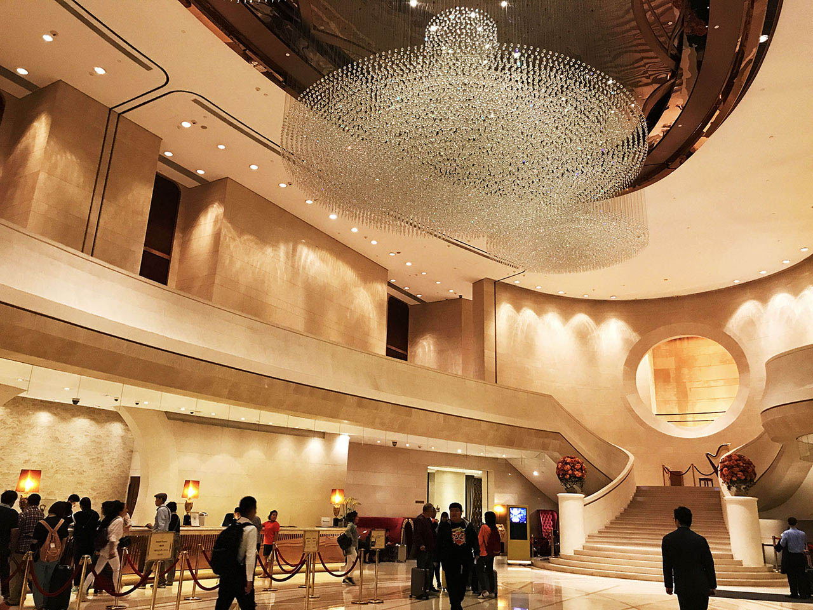

↑ハーバーグランド香港ホテルのロビー。綺麗。

20時から、九龍島のビルがライトアップされる「シンフォニー・オブ・ライツ」が始まるので、本当はそれを香港島の「ヴィクトリアピーク」という香港島にある山の上から見たかったのだが、飛行機遅延のために残念ながら叶わず、ホテルの部屋から遠目に眺めていた。

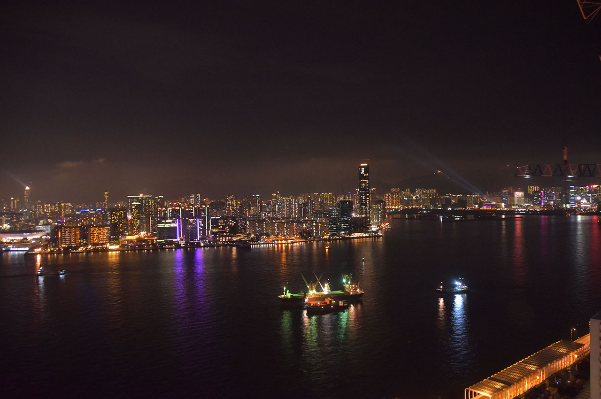

↑ホテルの窓から見える景色。一応九龍島の方が見えている。

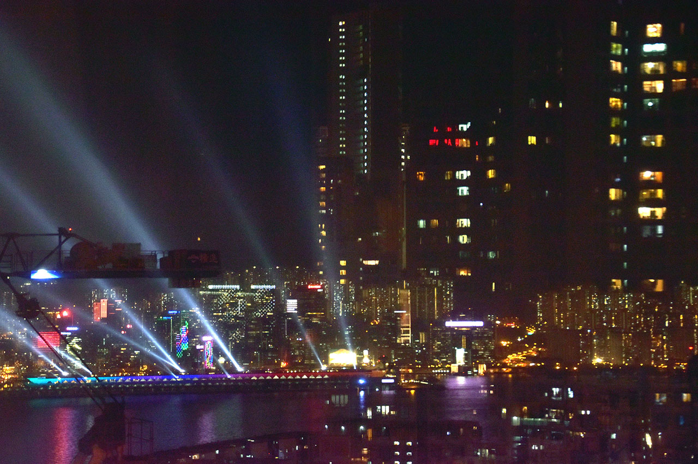

↑何やらキラキラしているのが「シンフォニー・オブ・ライツ」。

## 夕飯探し…

夕飯を食べようと思い、トリップアドバイザーに載っていたハーバーグランド香港ホテルの向かいにある飯屋に行こうと思ったのだが、ホテルを出ようとしたところで、**ホテルの敷地に入ってきたタクシーに轢かれそうになった。**

まさかホテルの真ん前で、歩道と繋がっている道路に入ってきたクルマが、人の往来を待たないとは思わなかった。香港のクルマはお構いなしに突っ込んできて、本当にノーブレーキでスレスレまで突っ込んできた。自分としてはこれがかなりのカルチャーショックで、まさかそこまでクルマが我が物顔するとは思っていなかったのだ。

要するに「クルマと人間、強いのはクルマ。だから弱い方の人間が避けていろ」ということのようだ。この後香港旅行を通じて色々な場面で感じたのだが、香港には「弱い者に配慮」などという日本の感覚はほとんどなく、「_強いものは偉い_」「**弱いヤツだろうと自分のことは自分でやれ**」という統一の価値観が街全体で共有されているようだった。

「轢かれて困るならどいてろ」と言わんばかりに突っ込んできたタクシーを何とか避け、目当ての店がホテルの向かいに…と思ったら、ホテルの向かいの一帯には建設中のビルしかない。どうやら最近潰れて新しいビルを建てようとしているようだった。

仕方がないので他の店を探すべくホテルの回りをウロウロしたが、何となく衛生的に不安な店が多かったので、香港初日の夜は「_テキサスバーガー_」でハンバーガーを食べた。広東語しか通じなさそうなお店も多い中、アメリカンなこの店ならギリギリ英語も通じるだろう、という期待も少しあった。頼んだ炭酸水のビンにはラベルの紙が浮いていた。

ホテルに戻る途中でコンビニに寄った。香港にはセブンイレブンしかなかった。商品を見ていると、日本語の書かれた商品が多いことに気が付いた。どうやら_「日本の商品は良い」みたいなイメージ_があるらしくて、あえて日本語を多用しているようだ。日本の企業の商品は表面だけ日本語を残し、裏面は英語と広東語で成分表記などをするような感じになっていた。だが現地では日本語が通じる人はほとんどいない。現地のガムとかレッドブルとかを買ったのだが、_レジ袋がもらえず_、そのまま持って帰れみたいな感じだった。どうやらレジ袋は有料っぽい。レジ袋については2日目も酷い目に遭うことになる…。

## ハーバーグランド香港ホテルについて

さて、宿泊した「ハーバーグランド香港」だが、自分たちが泊まったのは37階 (グランドフロアがある英国式なので日本でいう38階相当) で、ツインベッドが並ぶそれなりに広い部屋だった。

シャワーのお湯はちゃんと出るし、強風の出るドライヤーも完備。ホテル内で Wi-Fi も使えるのでネットもできる。テレビも色々映って、日本語が流れる NHK の海外放送が見られたりして少し安堵。香港の水道水は飲めないので、無料でペットボトルの水が置いてあった。他にも冷蔵庫にはドリンクがあったり、ティーセットもあった。

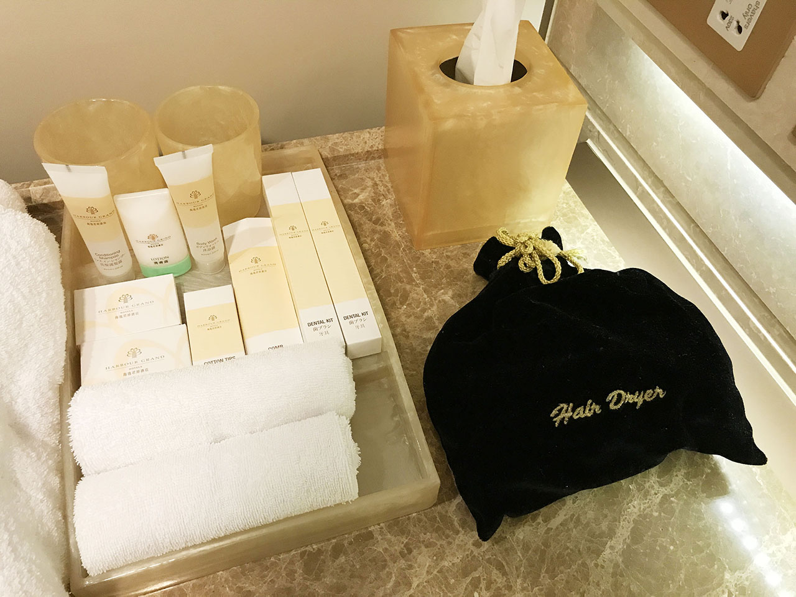

↑シャンプー、歯ブラシ、ドライヤーなど、日本の一般的なホテルと同等のアメニティ。アメニティやホテルのガイド含め、日本語も書いてあるが、スタッフには日本語は通じない感じ。

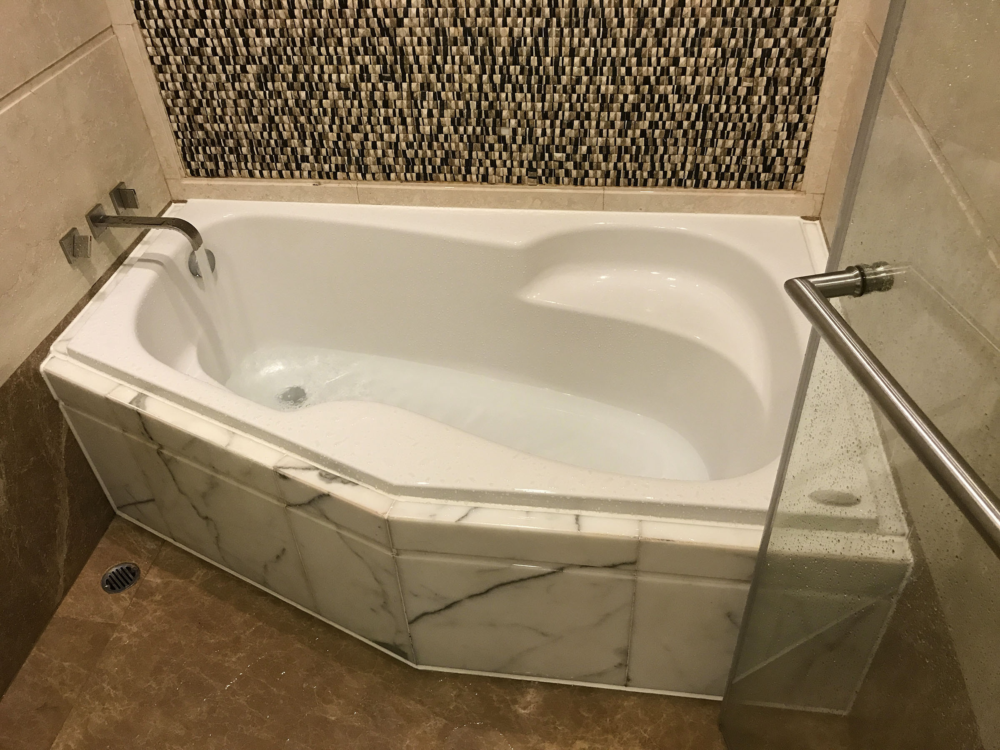

↑お風呂。広い。

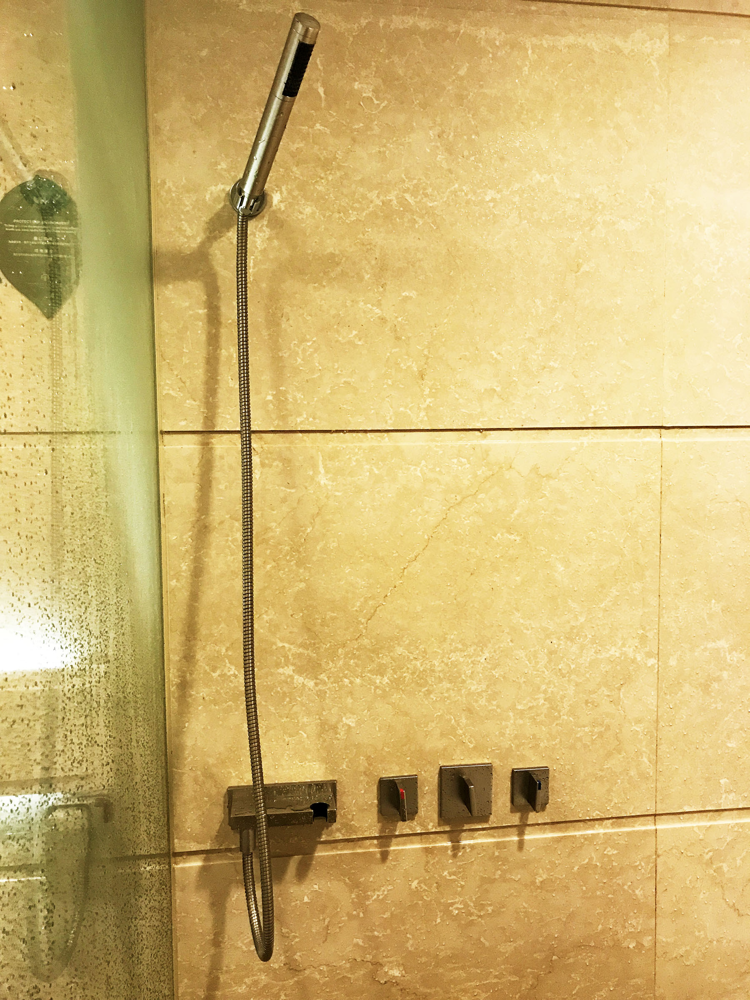

↑シャワーヘッドと蛇口のノブは革新的なデザインをしており、お湯と水で開栓する方向が逆というシンメトリ・インターフェース。正直混乱する。w

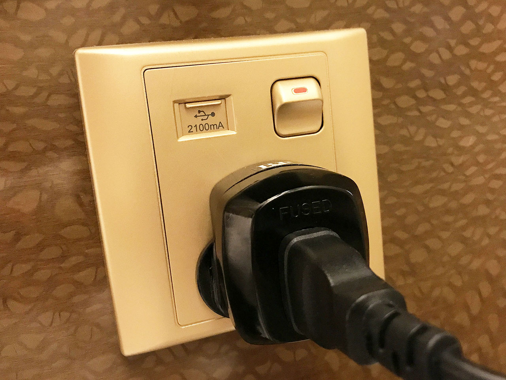

↑ベッドの隣にあるコンセント。「[アイエルレンタル](http://www.ilrental.co.jp/)」さんでレンタルした変換プラグと変圧器を繋いでいる。なんと USB を直接挿せるポートも付いていて、スマホの充電だけで良いなら普段使っている USB ケーブルを持っていくだけで良かったりする。

また、今回は行かなかったが、ホテル内にレストランがいくつか入っていたり、ジムがあったりして普通に良さげなホテルである。

…

部屋に戻ってイモトの Wi-Fi の接続確認をし、1日目は終了。フライトが遅れてしまい、夜の予定が狂ってしまったが、機内で映画は観られたし、シンフォニー・オブ・ライツも何となく見えたのでとりあえず良かったかなと。

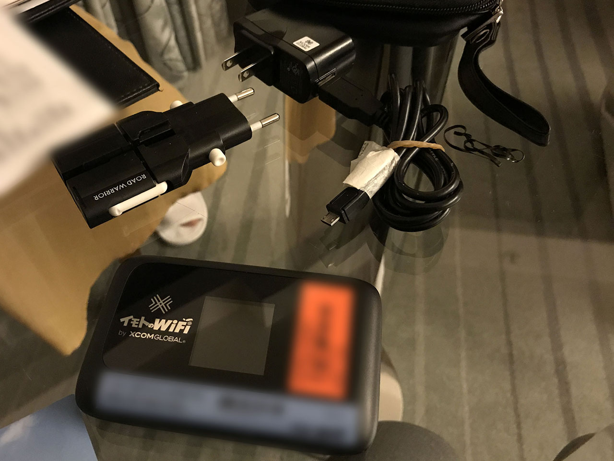

↑イモトの Wi-Fi。4G・LTE 接続ができるタイプで、変換プラグ一式も付属していた。

2日目はこの「イモトの Wi-Fi」を巡ってちょっとしたハプニングに見舞われる…。次回を乞うご期待！

- 次 : [【香港旅行記】旅の記録 2日目 前半 … 香港島のスタバを満喫](./28-01.html)
