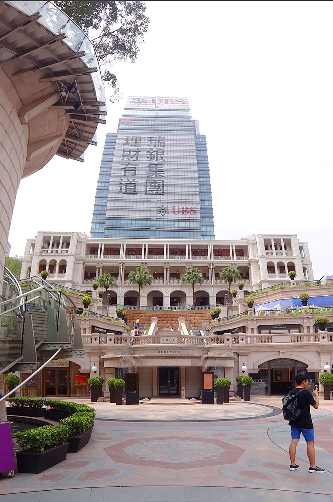
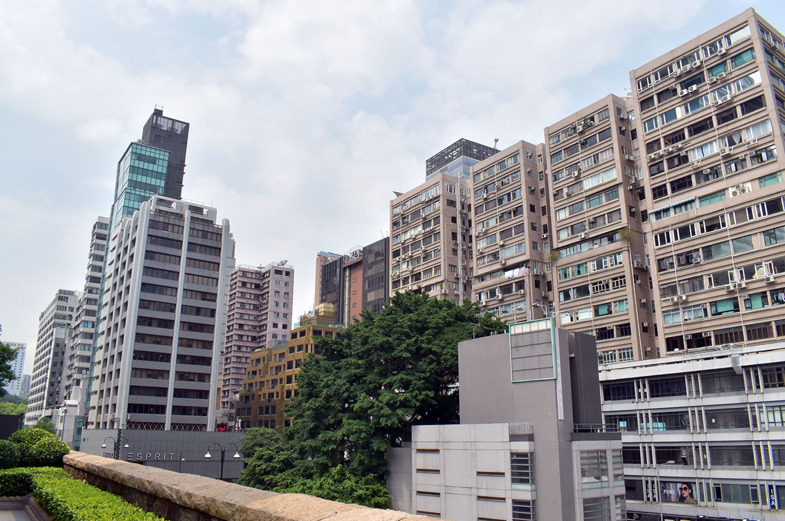
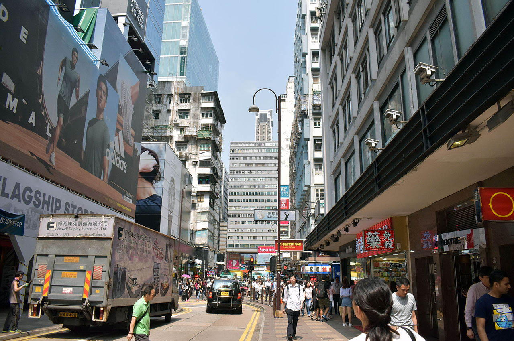
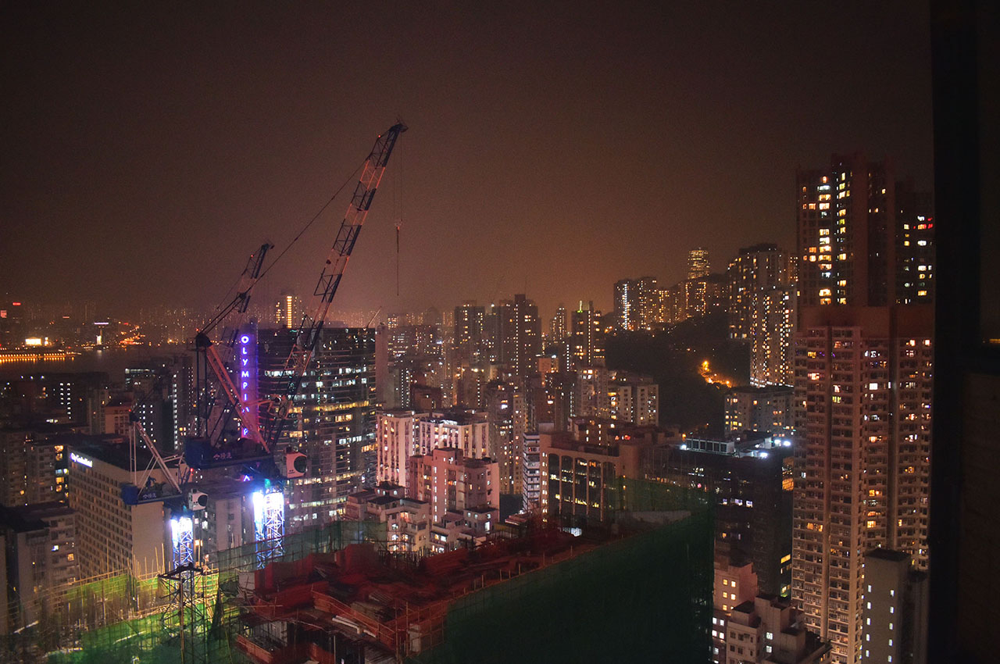

ゴールデンウィークに3泊4日で行ってきた香港旅行。今日は2日目、後半戦の模様をお届け。

全体的な計画や準備のお話は以下の初回の記事をご参照のこと。

- [【香港旅行記】香港旅行に行ってきた](./19-01.html)

1日目の旅行記はコチラ。

- [【香港旅行記】旅の記録 1日目 … 初日は悪天候に見舞われた](./21-01.html)

2日目前半戦の記事は以下。

- [【香港旅行記】旅の記録 2日目 前半 … 香港島のスタバを満喫](./28-01.html)

前回の記事では、香港島にある「ハーバーグランド香港」ホテルから電車で「セントラル」駅に行き、スタバのコーヒーエッグタルトを堪能。フェリーに乗って九龍島に到着した。

## 「プロジェクト A」の舞台となった「1881 ヘリテージ」へ

九龍島に着いて最初に行ったのは、**「1881 Heritage」**という建物。この建物は映画「プロジェクト A」で使用された建物で、元々は水上警察本部として1881年に建てられたもの。1996年に水上警察本部としての使用を止め、商業施設になったようだ。フェリーを降りたところからすぐ近くにあったので見てみた。「プロジェクト A」を復習してこなかったので「あぁ〜これか〜」という実感があまりないまま見てしまった。

しばらくブラブラしていたら14時半ぐらいになっていた。

↑1881 ヘリテージの裏手から。

## 「香港といえば」な町並みが広がるネイザンロードを歩く

そこから、「尖沙咀 チムサーチョイ」駅付近の観光地、_ネイザンロード_ (彌敦道・Nathan Road) をてくてく歩いた。

**「重慶大厦」、チョンキン・マンション**という怪しげな商業施設に入ってみたりした。インド人で賑わう昔の「ラジオ会館」みたいな感じで、こちらが日本人と分かると「シムカード！シムカードイッパイアル！」とかいって売り込まれたりしてた。ソニーならぬ「SQNY」とかも当然のように売ってた。怪し過ぎて1階を眺めるだけで終了。

しばしネイザンロードをウロウロ。

↑まさに「香港」という感じの通りがあちこちで見られる。

↑喉が渇いたので無印良品に寄ってお茶を買った。

↑謎のマンガキャラクターが展示された公園があったり。

ウロウロ歩きまくって、**「糖朝」、トウチョウ**というレストランに入った。

ココは_マンゴープリン_が有名で、これを目当てに入った。あとエビワンタンスープも頼んだけど、どちらも激ウマ。日本にも支店があるらしいのでまた行きたい。メニューには日本語もあって、理解しながら注文できた。

↑マンゴープリンが激ウマだった。

↑エビワンタンスープも最高。

- 参考：[糖朝 | 香港デザート(香港スイーツ)レストラン](http://t.rt-c.co.jp/) … 日本の支店の公式サイト。

糖朝で食事を終えたのが16時半ぐらいだった。

## 九龍城の跡地を見学に行く

16時半過ぎ、**「尖沙咀駅 チムサーチョイ」駅**から地下鉄に乗り、今度は_九龍城の跡地がある「楽富 ロクフ」という駅_に向かった。「尖沙咀」駅から乗る場合は、**赤い路線の「荃湾線 (せんわんせん)」**から、_緑色の路線の「観塘線 (かんとうせん)」_に乗り換えが必要なので注意。電車で30分ぐらいだった。

↑楽富駅の周辺。

駅から九龍城跡地まではほとんど迷うことなく、徒歩15分くらいで着いた。

九龍城の跡地は現在は商業施設と**「九龍寨城公園」**という公園になっていた。

↑九龍塞城公園の入口の向かい。

公園内に、かつての九龍城を再現した模型が置いてあるらしかったのでそれを探していたのだが、結構時間がかかってしまった。

九龍寨城公園の奥にその模型があり、他にもプロジェクターを使って当時の九龍城の中にいるかのような体験が出来る部屋とかが公開されていた。歴史的な写真もたくさんあって面白かった。

↑こんな風に九龍城の歴史を写真付きで紹介するコーナーがあったり。

↑九龍城内の様子を描いた「断面図」と模型。

↑かなり精巧にできているので、スマホや GoPro など小型カメラで寄って撮ると楽しいかも。

## 楽富駅の地元スーパーで洗礼を受ける

公園を探索していたら18時を過ぎた。周りはまだ明るい。

楽富駅に戻った時に、お土産を買おうということになり、駅前にあった現地のスーパーに入った。買い物をしてレジに入ったのだが、1日目の夜にコンビニで体験した「**レジ袋はデフォルトではもらえない**」ことを忘れていた。

レジ袋はたいてい50セントぐらいで有料なのだが、広東語しか喋れない店員には英語で話しかけても相手にされず、そのまま放り出されてしまった。向こうからしたら「郷に入っては郷に従え」というか、「香港に来たくて来たんだろ、言葉が通じねえとか知らねえよ、私の仕事はレジだけで、広東語で頼まれなきゃレジ袋も売らねえよ」ってな感じだった。

レジ袋が欲しいというのが通じず、仕方なくたまたま持っていたコンビニ袋に詰めて帰った。あの時レジ袋を持ってなかったら持って帰れなくてヤバかった…。

「楽富駅」からハーバーグランド香港ホテルがある「炮台山駅」までは、2回乗り換えて30〜40分程度だったろうか。19時半頃に炮台山駅に帰還。

## 「香港の渋谷」？銅鑼湾駅に行く

一度ホテルに荷物を置きに戻り、20時半頃、再度地下鉄に乗り込んだ。今度は_「香港の渋谷」と呼ばれる「銅鑼湾 トンローワン (Causeway Bay)」駅に行き、「そごう」に入る_ことにした。

自分はあんまり買い物がなくて、扁平足による足の痛みから連れの買い物をずっと待ってた。連れは元気そうだったが自分はもう疲れたので、「銅鑼湾」駅の周辺はそんなに探検せず帰った。

↑ヘコんだキンダージョイ (キンダーサプライズ・チョコエッグ) が平然と売られていたり…

↑下手に日本語を使って「メンマ」が「メソマ」になっていたり…

「糖朝」で食べたエビワンタンで中途半端な時間にお腹が膨れていたので、夕飯らしい夕飯は食べずに終えた。

↑山本太郎に似た俳優さんの広告。これも中途半端に日本語が使われている。どうやら「濃髪『の』魅」の「の」が、日本語だと分かり、イコール日本製、イコール高品質、みたいなことになってるらしい。

↑夜の炮台山駅周辺。

↑ハーバーグランド香港ホテルのすぐ隣の路地がこんな感じ。怖い。

22時半頃にホテルに戻り、就寝。

↑2日目終了。

---

2日目は香港を満喫した。写真もいっぱい撮れてよかった。

ちょっとしたハプニングの積み重ねで、なかなか予定どおりには行かないものだ。予定には「トイレに行く時間」や「買い物で目移りしている時間」まで正確に組み込んでおかないといけないし、それでも予定どおりに完遂することは難しそうだ。

香港の雰囲気は、強弱がハッキリしているというか、無神経で乱雑というか、遠慮がないというか、殺伐としているというか、そんな感じ。レジ袋がもらえなかったりして酷い目には遭ったのだが、自分はこうした「すべて自己責任で。」という見放され方が結構悪くないかもな？とも思った。

日本は何でもかんでも配慮してもらって当然、という過剰なサービスが多いから、クレーマーが付け上がるんじゃないかなと思う。このくらいハッキリ見放された世界だと諦めもついて、自分のことは自分でやる、という当たり前の感覚を少し取り戻せた感じがした。

1日で2万歩ほど歩いたので、普段運動していない自分はクタクタになった。

3日目はいよいよ香港ディズニーランドに向かう！「上海ヘッド」と呼ばれる新しい顔になっているミッキーさんを乞うご期待！

- 次 : [【香港旅行記】旅の記録 3日目 … 香港ディズニーランドで遊び尽くす！](/blog/2017/06/12-01.html)
