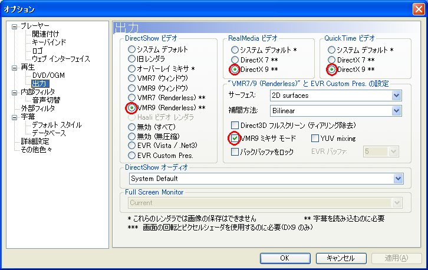

自分は普段、動画再生に Media Player Classic を使っている。SRT ファイルによる字幕を扱える軽量プレイヤーとして優秀だからだ。

先日、その SRT ファイルで表示される字幕のフォントサイズを変更したかったのだが、設定をいくらいじっても反映されなかった。

調べてみると、**「Output 出力」オプションの設定で「VMR9」を選択する**とフォントサイズの変更が反映されるようになった。

- 参考：[MPCの字幕表示設定 / 09.12.19](http://www.geocities.co.jp/bancodesrt/main/mpc-subtitle.html)
