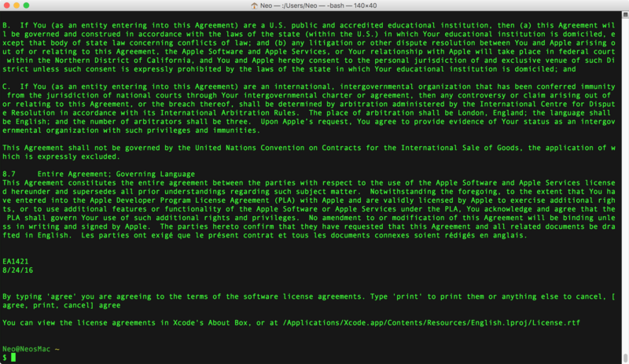
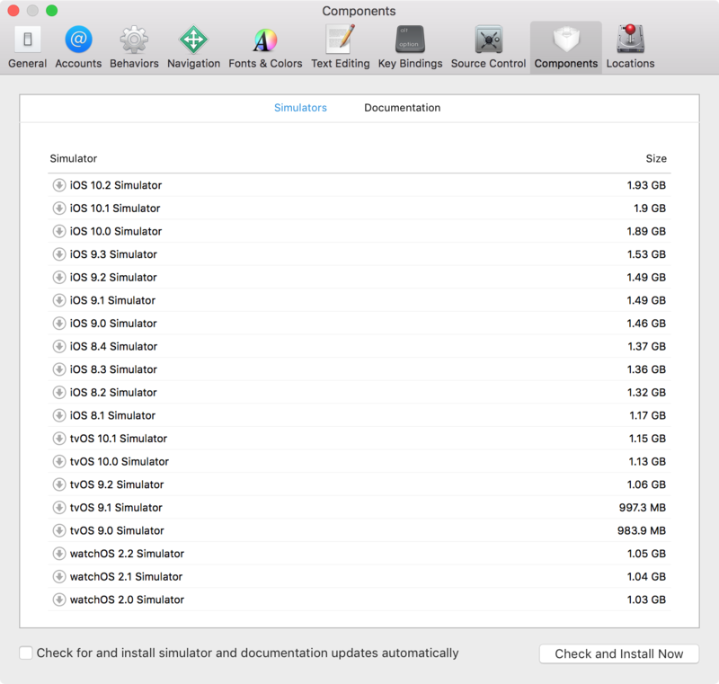
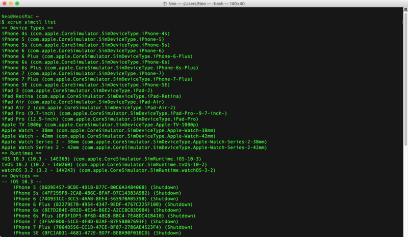

__Apache Cordova__ (コルドバ) というフレームワークがある。HTML・CSS・JS といったフロントエンド技術だけで iOS アプリや Android アプリが作れるフレームワークだ。フロントエンド技術だけでネイティブアプリが作れるという意味では、Electron に近い存在といえる。

通知機能など、モバイルのネイティブ機能に対しても、Cordova が提供するプラグインを使ってアクセスできる。コードとしては JavaScript でプラグインの API を叩くだけなので、対象の端末に依存しにくい実装が可能になる。

今回はこの Cordova を使って iOS アプリを作成し、iOS シミュレータで起動するところまでをやってみようと思う。

## 準備するもの (対象環境)

準備するものは以下のとおり。

- __MacOS (OSX) が搭載されたパソコン__
- XCode : v8.3.2
- Node.js : v6.10.3
- npm : v3.10.10
- Cordova : v7.0.1

パソコン上で iPhone や iPad などのシミュレータを動作させるには、XCode という Apple 製の開発環境が必要となる。そのため、MacBook や iMac など、Mac が必要になるのだ。Windows でもやりようがあるらしいが、今回は対象外とする。

Cordova は npm パッケージとして提供されるため、Node.js は必須。Cordova の開発は盛んに行われており、Node.js や npm のバージョン依存が激しい。Mac の場合は Nodebrew などで Node.js・npm のバージョンを管理しておこう。Node.js と npm の準備は以下の記事を参考に行ってほしい。

- [Node.js をバージョン管理できる体制でインストールする](/blog/2016/05/26-05.html)

## XCode をインストールする

まずは iOS シミュレータを動作させるため、XCode をインストールする。

AppStore から XCode を検索しインストールする。インストールには30分くらいかかるので気長に待つ。


インストールが終わったら一度 XCode を起動し、ライセンス規約に同意しておく。


そしたらターミナルを起動し、以下のコマンドを叩く。

```bash
$ sudo xcodebuild -license
```

すると何やら文章が出てくるので、Enter で続け、Space キーで読み進める。


以下の表記が出てきたら __`agree` と入力する__。

```bash
By typing 'agree' you are agreeing to the terms of the software license agreements.
Type 'print' to print them or anything else to cancel,
[agree, print, cancel] 【← ココで「agree」と入力する】

You can view the license agreements in Xcode's About Box, or at
/Applications/Xcode.app/Contents/Resources/English.lproj/Licens.rtf
```



これで XCode が使えるようになった。

- 参考：[Xcodeのライセンス同意をコマンドラインだけで切り抜ける - Qiita](http://qiita.com/tmknom/items/d60084edadfe1b7685ef)

## iOS SDK をインストールする

続いて、iOS シミュレータを動作させるために必要となる開発キット、iOS SDK をインストールする。

XCode を起動し、XCode メニュー → Preferences → 開いたウィンドウで Components タブを選択 と進み、本記事執筆時点で最新版の OS である「iOS 10.3 Simulator」の左の「↓」アイコンを押す。これで iOS 10.3 の SDK がインストールできる。



iOS SDK は OS のバージョンごとのインストールとなり、この OS のバージョンごとに、対象のデバイスが存在している。自分のパソコンにインストールした SDK の一覧を見るには、ターミナルで以下のコマンドを打つ。

```bash
$ xcrun simctl list
```



- 参考：[simctlコマンドを使ってみる - Qiita](http://qiita.com/tamaki/items/02eb43253193b950b08f#list)

これで iOS シミュレータを動作させるための準備が整った。

## Cordova をインストールする

いよいよ npm から Cordova をインストールする。Cordova は `cordova` コマンドであれこれ操作するので、グローバルインストールする。

```bash
# Nodebrew を使っている場合は以下で Node.js v6 系の最新版を入れておく
$ nodebrew install-binary v6.10.3
$ nodebrew use v6.10.3

$ node -v
v6.10.3

$ npm -v
3.10.10

# Cordova をインストールする
$ npm install -g cordova
```

Cordova のバージョンは本記事執筆時点では v7.0.1 だった。

## Cordova プロジェクトを作る

Cordova アプリを作るためのワークスペースを `cordova` コマンドで作成する。適当な作業用ディレクトリに移動し、以下のコマンドを叩く。

```bash
# Cordova プロジェクトを作る。引数の順番は「ディレクトリ名」「識別子」「アプリ名」
$ cordova create HelloCordova com.example.hello HelloCordova
```

すると「HelloCordova」フォルダができるので、そこに移動する。これが Cordova プロジェクトの基底フォルダとなる。

```bash
$ cd HelloCordova/
```

「識別子」はドメインを逆から書くのが一般的。iOS アプリを実際に AppStore で配布したりする際の申請で必要になるもので、ココでは適当で良い。識別子とアプリ名はこの後紹介する `config.xml` に記載される。

さて、「HelloCordova」フォルダに移動すると、既にいくつかのフォルダができている。


それぞれのフォルダの役割は以下のとおり。

```bash
HelloCordova/
├ hooks/     … cordova コマンドをカスタマイズする際に使う
├ platforms/ … iOS や Android など、プラットフォームに応じたビルド成果物が格納される
├ plugins/   … インストールしたプラグインが格納される
├ res/       … アプリのアイコンなどを格納しておく
├ www/       … ここがメイン。この下にある HTML・CSS・JS などがアプリとしてビルドされる
└ config.xml … アプリ情報、プラットフォーム・プラグインに関する情報などが記載される
```

基本的には `./www/` フォルダ配下にビルドしたいモノを入れていく。ビルド後に少し触ることがあるのが `./platforms/` で、それ以外のフォルダは基本触らない。少なくとも今回は対象にしない。アプリに関する情報は `config.xml` に記載され、これがあれば Cordova プロジェクトを元に復元したりもできる。

- 参考：[Cordovaのフォルダ構成について - Qiita](http://qiita.com/katsu_suzuki/items/ee606a198020a0fe27df)

## ターゲットプラットフォームを追加する

Cordova プロジェクトができたら、iOS 向けのビルドができるようにターゲットプラットフォームを追加する。ターミナルにて、Cordova プロジェクト直下で以下のコマンドを叩く。

```bash
$ cordova platform add ios --save
```

`--save` オプションは、このプラットフォーム情報を `config.xml` に追記するというもの。以下が追記されるのが分かると思う。

```xml
<engine name="ios" spec="~4.4.0" />
```

これで iOS 向けのビルドができるようになった。

## iOS アプリをビルドしてみる

`cordova create` コマンドで Cordova プロジェクトを作成すると、`./www/` 配下に `index.html` などが生成されていることが分かる。これがそのままアプリとしてビルドできるサンプルになっているので、まずはこれをビルドしてみる。

ビルドするには、ターミナルで以下を叩くだけ。

```bash
$ cordova build

# 以下でも OK
$ cordova build ios
```

すると `./platforms/ios/` 配下にビルドしたブツが出来上がる。Finder から `./platforms/ios/HelloCordova.xcodeproj` をダブルクリックすると XCode が開くので、メニューから Debug → Run と押すと、iPhone シミュレータでアプリが開く。__これで出来上がり__だ。


↑iPhone シミュレータ上で、フロントエンド技術だけで実装された iOS アプリが動作している。

## その他の起動方法

XCode からアプリを起動すると、XCode 上でデバッグコンソールが確認できて便利ではあるが、`cordova` コマンドを使えばコマンドラインから起動できる。

```bash
$ cordova emulate

# 以下でも OK
$ cordova emulate ios
```

これで iOS シミュレータが開く。

起動させる iOS のデバイスを変更するには、以下のように `--target` オプションを指定すれば良い。

```bash
$ cordova emulate --target=iPhone-7
```

どんなデバイス名が指定できるかは、以下のコマンドで確認できる。

```bash
$ ./platforms/ios/cordova/lib/list-emulator-images

# もしくは以下でも同等
$ cordova emulate --list
```

また、本来は実機での確認用コマンドだが、Mac に USB 接続しているデバイスがなければ、以下のコマンドが `cordova emulate` と同様に動作する。

```bash
$ cordova run

# 以下でも同様
$ cordova run ios
```

- 参考：[CordovaでiOS simulatorを指定する - Qiita](http://qiita.com/kenfdev/items/74bdfcc65317a411df68)

## Mac のブラウザで表示確認する

単なるレイアウト調整など、iOS シミュレータ向けにビルドしたりしなくて良い場合は、以下のコマンドを叩けばブラウザ上で表示確認ができる。

```bash
$ cordova serve
Static file server running on: http://localhost:8000 (CTRL + C to shut down)

# 以下でも同じ
$ cordova serve ios
```

このコマンドを叩くと、簡易 Web サーバが起動し、`http://localhost:8000` にアクセスして表示確認ができる。終了する時はサーバを起動したコンソールで `Ctrl + C` で終了できる。


↑`cordova serve` コマンドを叩いたところ。


↑Mac の任意のブラウザ上からページを確認できる。

## ひとまず以上

ソースを見てもらえば分かるが、実装されているのは `./www/index.html` と CSS・JS だけ。それが iOS シミュレータで動作する iOS アプリとしてビルドできた。

手軽に iOS アプリの開発が始められるフレームワークとして、Cordova を使ってみてはいかがだろうか。

次回はフロントエンド実装に関する諸注意をまとめようと思う。

- [Cordova 開発に関する Tips](/blog/2017/06/07-01.html)
