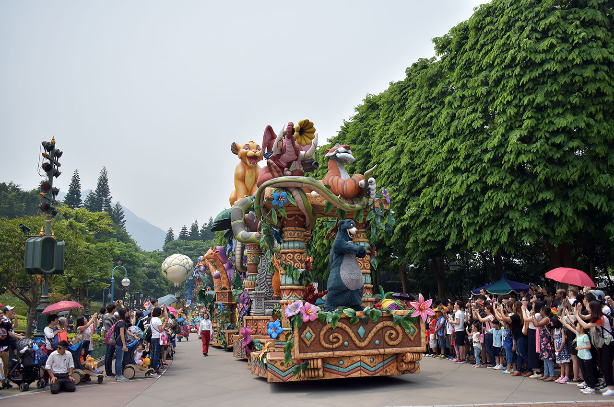
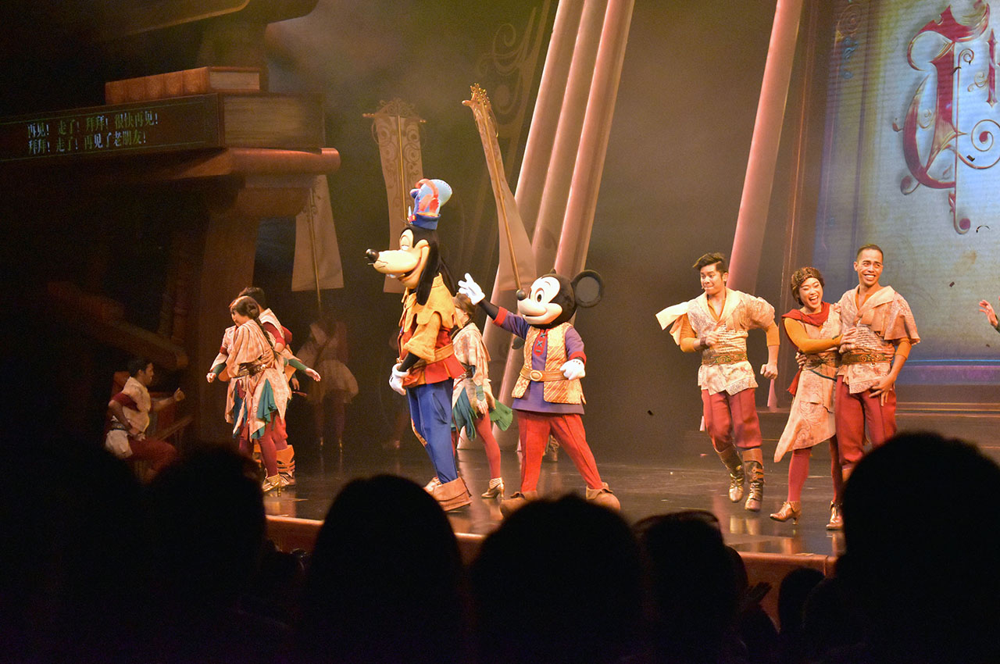
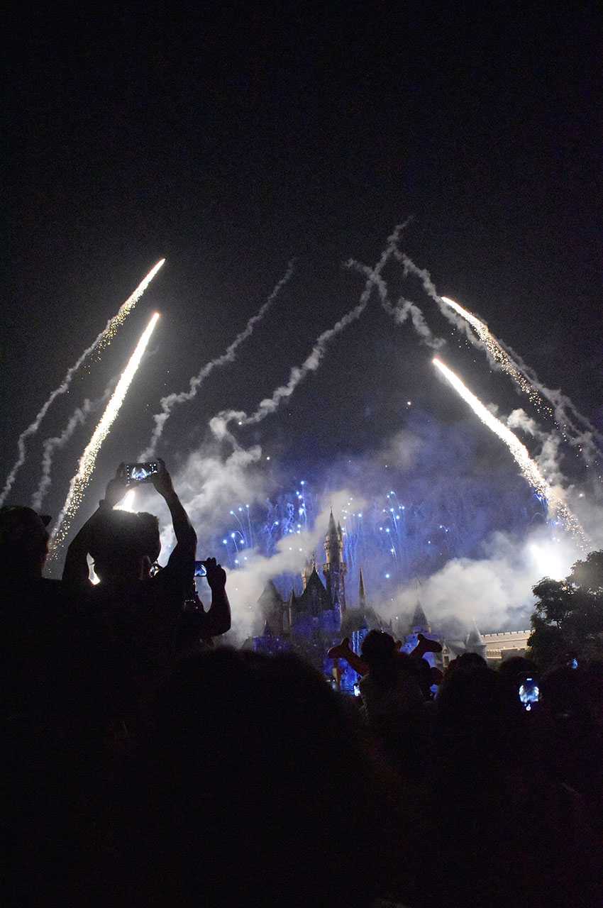

ゴールデンウィークに3泊4日で行ってきた香港旅行。今日は3日目、**香港ディズニーランドリゾート**に行って泊まった模様をお届け。

全体的な計画や準備のお話は以下の初回の記事をご参照のこと。

- [【香港旅行記】香港旅行に行ってきた](/blog/2017/05/19-01.html)

2日目までの記事はコチラ。

- [【香港旅行記】旅の記録 1日目 … 初日は悪天候に見舞われた](/blog/2017/05/21-01.html)
- [【香港旅行記】旅の記録 2日目 前半 … 香港島のスタバを満喫](/blog/2017/05/28-01.html)
- [【香港旅行記】旅の記録 2日目 後半 … 九龍島を探索・九龍城跡地にも行ってきたよ](/blog/2017/05/29-01.html)

3日目は曇り。晴れていると暑いからこのくらいが良いかな、と思った。

## ホテルをチェックアウトして香港ディズニーランドへ

朝9時にハーバーグランド香港のチェックアウトを行った。事前にクレジットカード番号を控えられているので特にその場での支払いはなかった。

H.I.S. の現地スタッフが既に迎えに来ていた。1日目の人とは違うおじさんで、この人も現地の人だが日本語が達者だった。

バスに乗り込むと、乗員は自分たちのだけ。貸し切り状態で香港島と九龍島の朝の景色を眺めた。

香港ディズニーランドは、初日に降り立った香港国際空港に近い「青衣 ランタオ」島という島にあり、バスで40分くらいだった。初日のバスでは段々と九龍島に入っていく方向から景色を見ていたので、港の夜景がビルに変わっていく様子として捉えていたが、逆に青衣島に向かう時は、高層ビル群が減っていき、港の景色が通り過ぎ、日本でいう瀬戸大橋を渡って四国に入るような感覚でどんどん何もなくなっていった。香港ディズニーランドはド田舎もド田舎、山を削ったような場所に作られていたようだ。

## チェックインまで時間があるので先に遊ぶ

10時半ぐらいに香港ディズニーリゾートのエリアに入っただろうか。自分たちが泊まる「香港ディズニーランド・ハリウッドホテル」の入口でスーツケースだけ預け入れた。現地ガイドのおじさんとともにチェックインカウンターに行き、後でチェックインできるようにとカードやパンフレットなどをもらって、現地ガイドさんとはここでお別れ。チェックインが15時からできるので、先に香港ディズニーランドに入ることにした。

ディズニーランドホテルは3軒ほどあり、ホテルとパークを行き来する無料の送迎バスが運行している。これに乗って5・6分でパークに到着した。手荷物検査があったりと東京ディズニーランドとあまり変わらない。事前にもらっていたチケットで入場。

入口付近からミッキー・ミニーとのグリーティングスポットがあったりしてなかなか面白い。まずは作戦会議ということで、ホットドッグを食べながら見たいショーや乗りたいアトラクションを考えた。

最初はライオンキングのショーを観ようということになったのだが、ショー開始まで30分くらいある。ウロウロしているとジェットコースターの待ち時間が5分となっていたので、これに乗った。人が全く並んでおらず、「乗り口まで徒歩5分」という感覚だった。

サクッと乗って15分経過。もう少しウロウロしてライオンキングを見た。派手なアクションはそこまでないが、円形のスタジアム状になっていて、四方からキャラクターや演者が出てきて中々面白かった。

次は昼のパレードを観ようと思っていたが、道ですれ違う人がほとんどまばら。どのアトラクションも5分待ちで、ディズニーランドとは思えないほど閑散としていた。

昼のパレードになるとそれなりに人だかりができたが、東京ディズニーシーなんかと比べたら全然混んだうちには入らないレベル。やる気のないイーヨーが可愛かった。

それから「ミッキー・アンド・ザ・ワンダラス・ブック」というショーを観た。「トーキング・ヘッド」と呼ばれる、口や目がパクパク動くミッキーを初めて見た。舞台の左右に字幕が表示されるスクリーンがあり、英語と広東語が同時に表示されていた。

- 参考 : [ミッキー・アンド・ザ・ワンダラス・ブック | 香港ディズニーランドのクチコミ・感想](http://tdrnavi.jp/park/hkdl/show/979/)

## ディズニーハリウッドホテルは広くて綺麗

お土産を選んだりしていたら15時をとうに過ぎていたので、ハリウッドホテルに戻ることにした。バスで10分ちょっとでホテルに到着。事前にもらっていたカードでそのまま部屋に入れるようで、特にチェックイン作業が要らなかった。

部屋はセミダブルサイズのベッドが別れておいてあり、ユニットバスではあったが綺麗だった。部屋のテレビでディズニーチャンネルがたくさん見られる。

↑ベッドとベッドの間にはミキミニのイラスト。

↑ミッキーの形のシャンプー・ボディソープ。

## 再度パークへ

買ったお土産や荷物を置いて身支度をし直して再度パークに入場。再入場については、ブラックライトに反応するスタンプを腕に押すタイプの、日本でも見る仕組み。

本当は夕方のイースターのショーを見たかったが、お土産を選んでいる時間が長くて見逃してしまった。T シャツとかチプデーのピンバッチとか買った。

ミッキー・ミニーとのグリーティングに2時間ほど並んだ。暑い中、ミッキーたちは30分おきに5分休憩をとり、本来のグリーティングの時間帯を過ぎても並んでいる人たちを捌き切っていた。スタッフが持参のカメラで撮ってくれる他、後でスマホからダウンロード購入できるようにとスタッフのカメラでも撮影してくれた。撮影後に手渡されるカードの QR コードからアクセスして写真を買ったりできるのである。有料でちょっと高かったので買わなかったが。

グリーティングに並んでいたら18時頃になっていたので、香港ディズニーランドがいち早く導入した「アイアンマン」のアトラクションに乗った。

↑乗り方案内のビデオにスタン・リーがまさかのカメオ出演ｗ。

3D のライド型アトラクションで、日本でいうと USJ のスパイダーマンみたいな感じか。香港ディズニーランドを飛び出して九龍島の市街地で暴れまわっていて楽しかった。

アイアンマンから出てきてベーグルを食べたりドーナツを食べたり。ウマウマでした。

それから夕飯。H.I.S. から「マンゴープリンの引換券」をもらっていたので、これでマンゴープリンを食べた。2日目に食べた「糖朝」のマンゴープリンには敵わなかったな…ｗ。

↑これが引換券。

## 夜は早めに閉まる

夜のパレードを観てた。カーズとか出てた。

↑ミニーちょっとこわい。

夜のパレードを見て、行こうと思っていたアトラクションに向かったら、20時前後で既にそのエリアは閉め切りになっていて、追い出されてしまった。閉園は20時半だが、出入口から遠いエリアは20時過ぎには閉鎖してしまうようだ。

残念だな〜と思いつつも、閉園前の花火が始まるまでの間にメダルを作ることに。しかし5ドル硬貨がなく、近くのショップでパイナップルの香りがするツムツムチップデールのぬいぐるみを買うことに。お釣りで5ドル硬貨を手に入れ、アイアンマンのメダルを作った。15ドル。

20時半頃、花火が打ち上がる。綺麗であった。

花火が終わると、ゾロゾロと帰る人の波に飲まれつつ、送迎バスでホテルに戻った。

前述のとおり、香港ディズニーランドは青衣島という、香港市街地からは離れた場所にあるので、公共の交通機関で帰ることを考えると、20時半と少し早めに閉園するようだ。客というよりはスタッフの帰宅時間を考慮してのことと思われる。

ホテルに着いたのは21時半頃。ホテル内のお土産屋を見たり、ホテルの敷地内にあるプールや「HOLYWOOD HOTEL」マークを眺めたりブラブラして部屋に戻った。

↑口を閉じた珍しいドナルド。

↑ゲームセンターの子供用のプレイグラウンドに置いてあったグーフィ。頭の毛がむしられてる。

シャワーを浴びて就寝。

↑ココナッツとパイナップルの香りがするチプデーのぬいぐるみ。帰国後1ヶ月経つが、まだ香っている。

<ins class="ins-block">

2020年11月現在、もう3年以上経つが、未だ香りがする。どうなってるんだコレ？

</ins>

-----

アトラクションは本当に待っている人が少なく、どれも5分待ち。多少並んでいても15分待ち程度なので、パレードを捨ててアトラクションに絞れば1日で全て乗ることも可能だ。パレードやショーになるとそれなりに客が集まるので、それまでどこに潜んでいたんだろう？とすら思う。

上海ヘッドと呼ばれる新しいミッキーの顔は、動いている実物を見るとそこまで違和感がなかった。どちらが良いかといわれれば東京の顔の方が好みだが、そこまで最悪なものでもなかった。

香港にしてはスタッフの人たちは親切で、英語もちゃんと通じる。一つ面白かったのが、スタッフの名札が「Angel」だとか、どれも英語の通名を利用していたのだ。「お前明らかに『エンジェル』じゃねえだろ！」と思うような純・中国人でもカッコ付けた通名を使っていた。

4日目、最終日はいよいよ帰国の最終回。朝食のグリーティングを乞うご期待！

- [【香港旅行記】旅の記録 4日目 … 朝食バイキングのグリーティングと帰国](./13-01.html)
