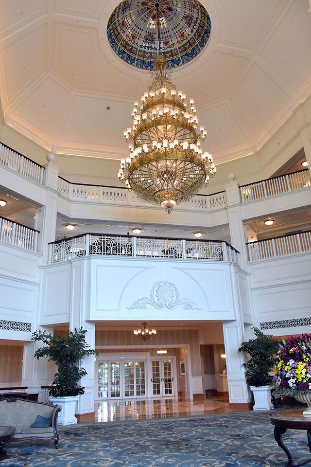
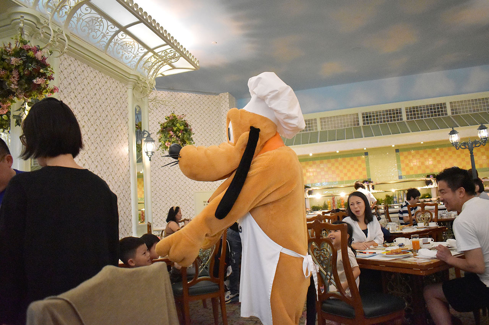
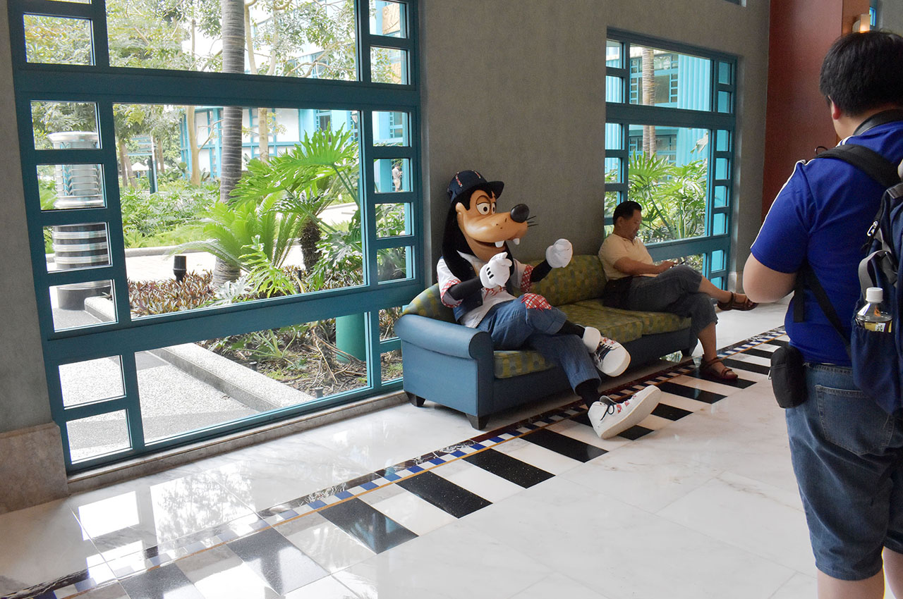
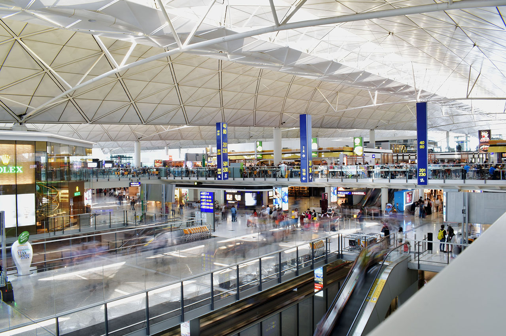
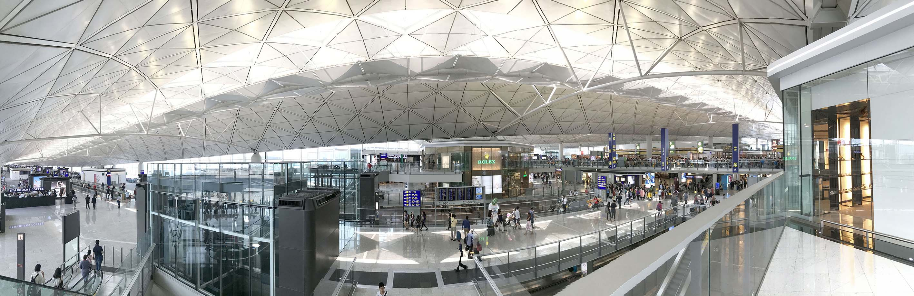

ゴールデンウィークに3泊4日で行ってきた香港旅行。今日は最終日である4日目。朝食をディズニーランドホテルのグリーティング付きバイキングでいただき、残りは帰国に費やす1日。

全体的な計画や準備のお話は以下の初回の記事をご参照のこと。

- [【香港旅行記】香港旅行に行ってきた](/blog/2017/05/19-01.html)

3日目までの記事はコチラ。

- [【香港旅行記】旅の記録 1日目 … 初日は悪天候に見舞われた](/blog/2017/05/21-01.html)
- [【香港旅行記】旅の記録 2日目 前半 … 香港島のスタバを満喫](/blog/2017/05/28-01.html)
- [【香港旅行記】旅の記録 2日目 後半 … 九龍島を探索・九龍城跡地にも行ってきたよ](/blog/2017/05/29-01.html)
- [【香港旅行記】旅の記録 3日目 … 香港ディズニーランドで遊び尽くす！](./12-01.html)

4日目も雨は降らず、晴れと曇りの間くらい。滞在中は天候に恵まれたと思う。

↑この人は…？！

## 朝食バイキングにディズニーキャラがやってくる！

今回 H.I.S. で申し込んだプランのメインイベントともいえる、グリーティング付きの朝食バイキング。「グリーティング」というのはディズニーキャラと間近で会えて写真が撮れたりすることを指していて、ホテルのバイキングレストランで食事をしていると、ミッキーやミニーが席に来てくれて一緒に写真が撮れるのだ。

朝食バイキングは自分たちが泊まった「ディズニー・ハリウッド・ホテル」ではなく、「*香港ディズニーランド・ホテル*」という別のホテルにある「**エンチャンテッド・ガーデン・レストラン**」になる。そのため朝7時頃から送迎バスで香港ディズニーランドホテルに移動。

- 参考：[エンチャンテッド・ガーデン・レストラン | 香港ディズニーランド・リゾートのクチコミ・感想](http://tdrnavi.jp/park/hkdlr/dining/1030/)

最初エンチャンテッド・ガーデン・レストランの場所が分からずウロウロしてしまったが、エントランスからみて下の階、地下1階にあった。

↑香港ディズニーランド・ホテルのエントランス。

バイキングは品数が多く、大変満足だった。ご飯を食べていると、デイジー・プルート・ミッキー・ミニーが各席をくまなく周り、写真撮影やサインに応じていた。~~中の人の休憩のため~~30分程度すると一度ハケるが、必ず全席を回るし、大人がいなくて子供だけがいた席には後で戻ってきて家族全員と写真撮影をするなど、ファンサービスは完璧。前日ランド内で見かけたカメラスタッフも付いて回って写真を撮ってくれていて、QR コードから有料で写真を購入できるサービスもやっていた。

↑レストランに現れたプルート。~~犬やネズミが歩き回っているレストランって不衛生なのでは…~~

そんなワケで、デイジー・プルート・ミッキー・未ニートそれぞれ一緒に写真撮影できた。デイジーとプルートがかわいくて再評価。w

- [スリーショット撮ってもらいました(´▽｀)](https://www.instagram.com/p/BTxg4z4gMJG/)

## H.I.S. のスタッフを待つ

9時頃までたっぷり食事し、自分たちのホテルに戻る。10時チェックアウトなので10時にはチェックアウトをしたのだが、空港に送ってくれる H.I.S. のスタッフは12時半にならないと来ない。そこでホテルのロビーでしばらく待つことに。

するとグーフィがホテルをウロウロしていたので一緒に写真撮影。こういうファンサービスが多く、それでいてそこまで人でごった返したりしないので助かる。

↑新聞を読むフリをするグーフィさん。

それでも時間があったので、ホテルのロビー近くにあったカフェ・バーに入ってお茶をして待った。どれもかなり高かったので、コーヒーとお通しのおつまみだけでしのいだ。ディズニー・チャンネルで短編アニメを見てゲラゲラしたりしてた。

H.I.S. のスタッフさんは12時半を少し過ぎたところでようやく現れた。どうやら自分たち以外の人たちも別のホテルでピックアップして来ていたらしく、バスは満席だった。1時間くらいで香港国際空港に到着。

## 滅茶苦茶広い香港国際空港で搭乗手続き

行きに香港国際空港に降り立った時は、フライトの遅れで周りをあまり見ていなかったのと、入口とは違う階に出たことで、あまりその広さを実感していなかったが、香港国際空港、めちゃくちゃ広い。空港に向かうまでのバスでガイドさんも案内していたが、搭乗ゲートが物凄く多く、下手すると出国検査の後に電車移動とかあるみたい。

まずはキャセイパシフィック航空のチェックインカウンターで座席を取ってもらい、スーツケースを預け入れる。その場で航空チケットを貰う。H.I.S. のスタッフに座席番号を連絡して、現地スタッフとはここでお別れ。次に出国審査だが、出国審査の際は、入国時に書いた「入出国カード」をパスポートとともに見せる必要がある。手荷物検査は日本みたいに水の持ち込みがどうとか言われず、カバンに入ってたペットボトルの水はそのまま持ち込めたけどアレ大丈夫だったんだろうか…？(多分ターミナル内でも売ってた水と同じブランドだったからかな？とも思ったが)

- 参考：[香港国際空港の案内図・帰国ガイド](http://hongkong.7as.net/airport/) … 香港国際空港からの出国ガイド。写真付きで、大体このイメージどおり。

出国審査を終えてターミナルに移ってから2時間弱ヒマがあったので、ブラブラ買い物などをしていた。

15時頃搭乗し、離陸。行きと同じキャセイ・パシフィックなので、サービスの感じは同じ。帰りは映画「メッセージ」を観たが、これ何が面白いんだ…。周りで聞く高評価が全く信じられないぐらい退屈で見え透いた映画だった。「素晴らしきかな、人生」(ウィル・スミス主演の2016年版) を続けてみたが、エンディングに辿り着く前に日本に到着してしまった。

日本に着く前に、飛行機内で「携帯品・別送品申告書」という黄色い紙を貰う。事前に書いておき、入国時に提出する必要がある。**一世帯一枚**書かないといけないので、結婚していないカップルはお互いで1枚ずつ書く。

日本に着いたのは予定どおり20時頃。手続きの類はほとんどないが、荷物が出てくるのに時間がかかり、空港を出られたのは20時半過ぎになった。あ、そうそう、イモトの Wi-Fi はスーツケースを受け取った後、所定の返却ボックスに投函して返した。ホント全然使わなかった…。

この時間にスーツケースを持って JR に乗るのはダルいので、京成スカイライナーに乗ることにした。幸い座席がまだ空いていて、その場でチケットを買って帰った。

行けるところまで京成スカイライナーで行き、あと数駅は JR に乗ったのだが、JR に乗るなり「お前邪魔なんじゃ、そっちに詰めろや！人の気持ちを考えろ！」などと怒鳴り、中華系の人にケンカを売るバカな日本人に遭遇。その中華系の人は「何で私が詰めるの、自分が空いてるところに移動すればいいじゃない」と全くもって正しいことを言っていたが、「人の気持ち (笑)」とやらを尊重するバカな日本人は激昂するばかり。ちょうど香港の無慈悲な交通事情や文化を感じてきていた自分としては**「それが他人に『移動してくれ』と頼む態度か！他人に避けてもらわないと自分で電車に乗れないようなおぼっちゃはママと一緒に乗りな！！」**という言葉が喉元まで上がってきていたが、口で言って分かりそうな相手じゃなかったので無視していた。最後の最後に日本人ってこの程度なのか、っていうお里が知れてしまう感じが気分悪くなったなー。

なんだかんだ23時ぐらいには自宅に戻ることができた。すぐにスーツケースから荷物を出して中身を空にし、送られてきた段ボールに詰め直してキャリーカートにくくりつけた。明日の朝必ず送らないといけないので、ココまではどれだけ疲れていてもやらなきゃいけなかった。

しかし旅行で気を張っていたからか、なかなかすぐには寝る感じにならず、しばらく洗濯物を片付けたりして心を沈めてから眠りについた。

---

かくして、自身の人生でほとんど初と言って良い、3泊4日の海外旅行が無事終わった。小さなハプニングはあったが、ひどいトラブルや事故・怪我には見舞われず、旅行保険も使わずじまい、「無駄に終わって」くれたことが何よりである。

なんというか、当たり前だけど、「日本の常識が通用しない世界」というものを実感したし、「日本の常識って合ってんのか？」とか「日本はこういうところが気楽だよなぁ」とか考えるきっかけにもなったと思う。人によってどちらが良い悪いというのは変わると思うが、それ以前に「自分の当たり前」「自分たちの普通」を今一度疑って、それに合致しない人を前にしても否定はしないようにする、違いを受け入れることって大事だなぁとか思った。

一緒に旅行に行く人との呼吸の合わせ方というのもなかなか思うことがあった。たとえ毎日生活している家族であったとしても、日常とは違うイレギュラーな環境で果たしてどれだけちゃんと相手のことを考えられるか、自分だけでなく同行者の安全まで考えて行動できるか、ってことを物凄く意識すると思う。**自分一人で行動しているワケじゃない**し、何かトラブルがあったときに「自分だけは無事でした」では済まされないのだから、楽しいだけでなく安全も考えないとなと思った。それから相手の疲労を考えて行動すること。ついつい自分のテンションが上がっていると周りが見えてなくて迷惑をかけてしまう。今一度注意しないとなと思った。

旅行に行ってから旅行記を書き終えるまでに1ヶ月かかってしまったが、とりあえずこれにて旅行記は完成。以降は旅行に関するアドバイスやトラブルシューティングといった視点から記事を書こうかなと思っている。
