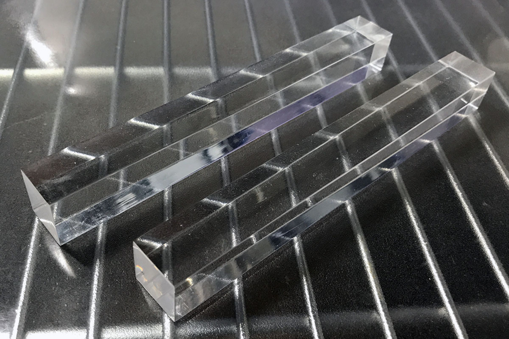
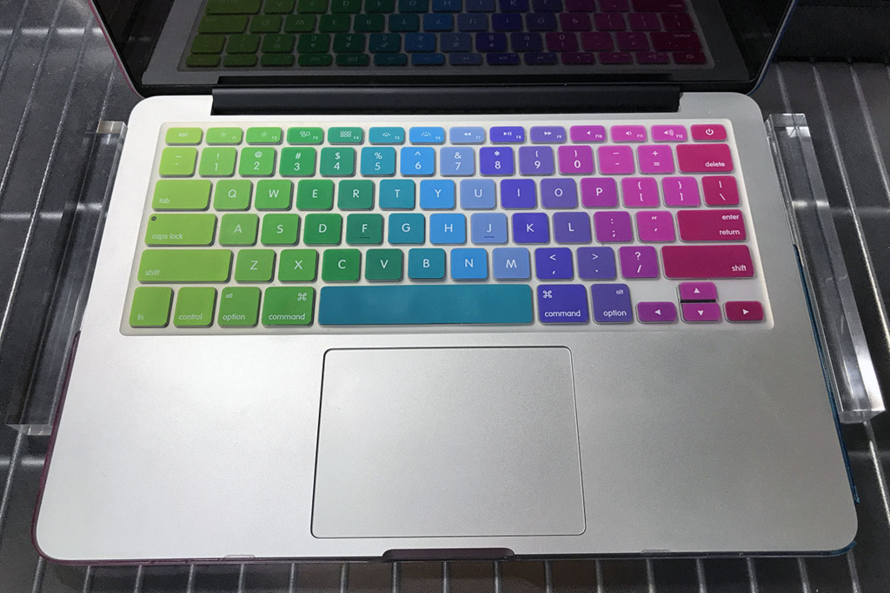
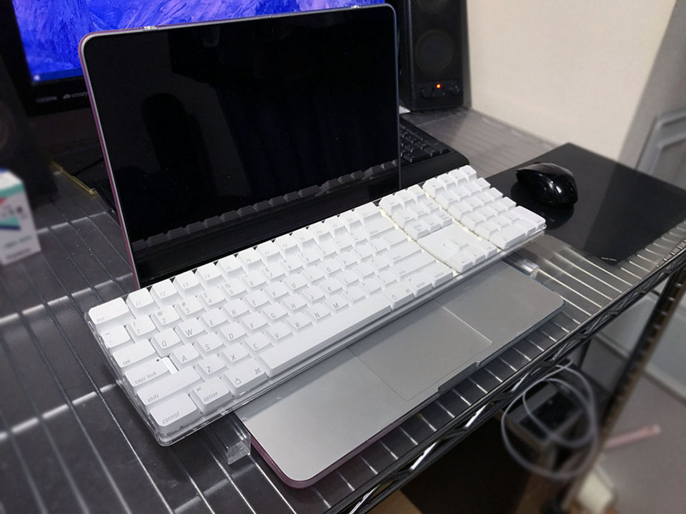
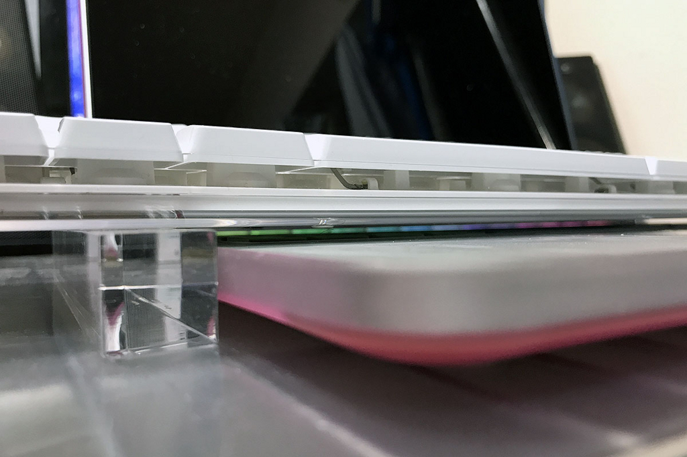

会社支給の Windows ノート PC のキーボードが気に入らず、家から Logicool MK275 という外付けキーボードを持って行っていたり、会社支給の MacBook が日本語配列なのが嫌で、英字配列の Apple Wireless Keyboard を持って行ったりしている。

↓ Logicool MK275 について書いた過去記事。

- [初のワイヤレスマウス・キーボード「Logicool MK275」を買った](/blog/2016/05/03-01.html)

↓ Apple Wireless Keyboard について書いた過去記事。

- [Apple Wireless Keyboard (A1016) M9270LL/A を買った](/blog/2017/03/05-02.html)

2台のノートパソコンに2台のキーボード、2つのマウスにデュアルモニタ用のディスプレイ。職場の机の上はいっぱいいっぱいだ。

その時ふと、**ノートパソコンを開いた時のキーボード部分**が、使っていないのにやたら面積を食っていることに気が付いた。

「*この上に外付けキーボードを載せられれば…*」と思い、「キーボード スタンド」などで調べてみると以下のような商品を発見。

- 参考：[キーボードスタンド(ノートPC用)TOK-K1の販売商品 |通販ならサンワダイレクト](http://direct.sanwa.co.jp/ItemPage/TOK-K1)

コの字型の金具をノート PC の左右に置き、その上にキーボードを置くことで、ノート PC のキーボードに干渉させず、外付けキーボードが使えるという寸法だ。

だがしかしこの商品は完売していてもう売っていない。

その他だと、ノート PC を譜面台みたいなのに載せるタイプのスタンドしか見当たらず、省スペース化を目的とした良い商品がなかった。

…

*「そんじゃあ自分でなんとかすっか。」*

ということで、こんなモノを買った。

…

アクリルの角棒である。18×18mm の正方形で、長さが 150mm (15cm) という直方体だ。東急ハンズで1本600円程度で買える。

  

    
  

  

    

      <a href="https://www.amazon.co.jp/dp/B0091FZ7KS?tag=neos21-22&amp;linkCode=osi&amp;th=1&amp;psc=1">光 アクリル角棒 クリア 18mm角×150mm AE071</a>
    

  

  

    
  

  

    

      <a href="https://hb.afl.rakuten.co.jp/hgc/g00powo2.waxyc5db.g00powo2.waxyd78d/?pc=https%3A%2F%2Fitem.rakuten.co.jp%2Ftuzukiya%2Fh14-5771%2F&amp;m=http%3A%2F%2Fm.rakuten.co.jp%2Ftuzukiya%2Fi%2F10555746%2F">光 アクリル角棒 クリア 18mm角×150mm AE071</a>
    

    

      <a href="https://hb.afl.rakuten.co.jp/hgc/g00powo2.waxyc5db.g00powo2.waxyd78d/?pc=https%3A%2F%2Fwww.rakuten.co.jp%2Ftuzukiya%2F&amp;m=http%3A%2F%2Fm.rakuten.co.jp%2Ftuzukiya%2F">DIY FACTORY ONLINE SHOP</a>
    

    
価格 : 452円

  

- 参考：[アクリル角棒 透明 150×18×18mm｜【東急ハンズネットストア】](https://hands.net/goods/4977720888316/)

*これを開いたノートパソコンの両隣に置き、外付けのキーボードを載せる*。こうすることで、外付けキーボードをノート PC のキーボードの真上に置けるようになるので、机の上の省スペース化を狙えるのだ。

↑こんな風にノートパソコンの両側にアクリル角棒を置いて…

↑その上にキーボードを載せる。

この写真は、Early 2015 モデルの MacBookPro にカラフルなケースがハメてあり、少し底の高さが出来てしまっている。モニタを開いた状態だと底からキーボード部分までの高さが約 15mm 強となる。18mm の角棒でギリギリ本体キーボードに触れない高さを確保できている。

↑かなりスレスレだが、ノート PC のキーボードとは空間が確保できているので、ノート PC の方のキーが意図せず押されてしまうことは回避できている。

…

角棒の上で外付けキーボードのバランスを取らないといけないので、キーボード底面の「ツメ」を立てて使っている人は、18mm 角だと置き場所の調整が難しいかもしれない。

アクリルにこだわらなければ、ゴムとかアルミとか木材とかで、色々なサイズの角棒が売っているので、30mm×30mm×200mm などの、少し大きめの角棒を買っても良いと思う。

Amazon や楽天にも商品はあるので、東急ハンズで実物を眺めて強度や質感などが合うか確認し、家に帰ってきたらキーボードのサイズを測って適切な大きさの角棒をネット注文すると良いだろう。

ちなみに。このようなスタイルは、リチャード・ストールマンが始めたことから「*尊師スタイル*」と呼ばれていたりする。このワードで検索するとまた雰囲気が変わった。

- 参考：[MacBookPro で HHKB 尊師スタイル - Qiita](https://qiita.com/midorinokimi/items/8da9f234e96f1fa0f9e0)
