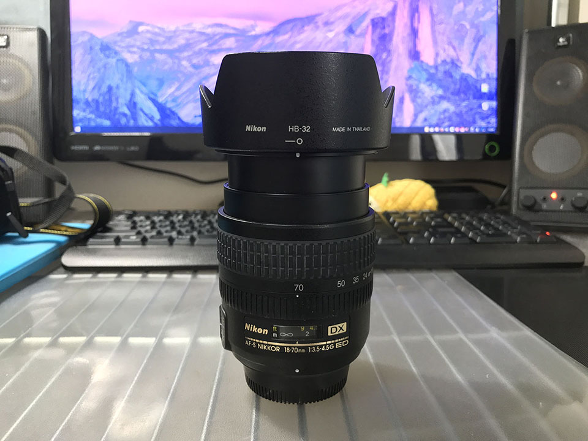
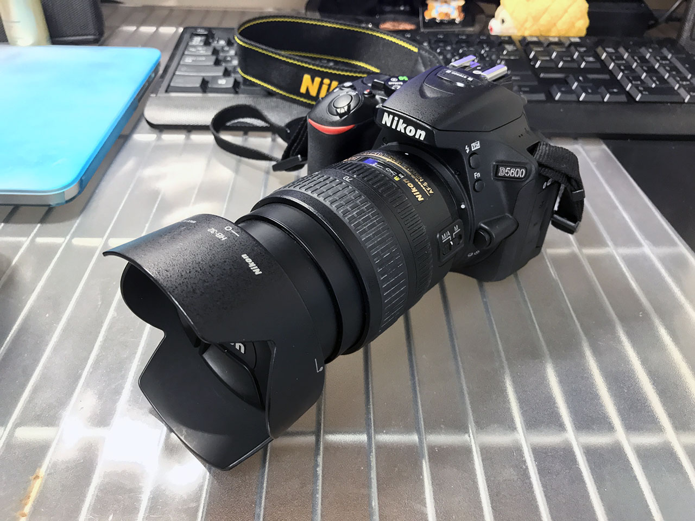
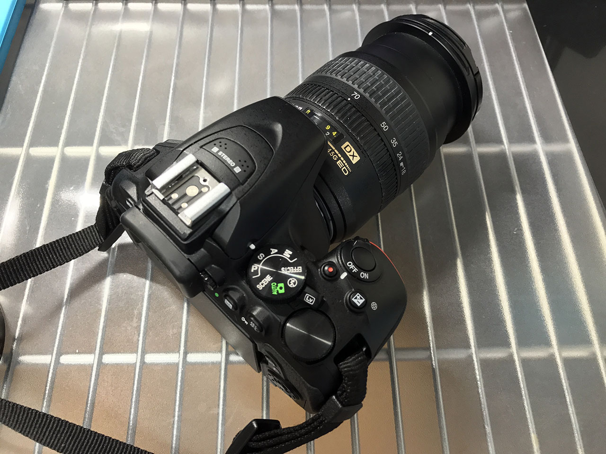

2017年3月末頃の話になるが、**Nikon AF-S DX Zoom-Nikkor 18-70mm f/3.5-4.5G IF-ED** というレンズを買った。ヤフオクで中古を選び、送料込みで9000円なり。

  

    
  

  

    

      <a href="https://hb.afl.rakuten.co.jp/hgc/g00qdzy2.waxyc0c1.g00qdzy2.waxyde54/?pc=https%3A%2F%2Fitem.rakuten.co.jp%2Fotakara-100%2F105-200822-mi009%2F&amp;m=http%3A%2F%2Fm.rakuten.co.jp%2Fotakara-100%2Fi%2F10041903%2F">Nikon ニコン AF-S DX Zoom-Nikkor 18-70mm f/3.5-4.5G IF-ED レンズ ※中古</a>
    

    

      <a href="https://hb.afl.rakuten.co.jp/hgc/g00qdzy2.waxyc0c1.g00qdzy2.waxyde54/?pc=https%3A%2F%2Fwww.rakuten.co.jp%2Fotakara-100%2F&amp;m=http%3A%2F%2Fm.rakuten.co.jp%2Fotakara-100%2F">お宝ギターズ</a>
    

    
価格 : 7150円

  

レンズ口径は 67mm。

これまで Nikon D3100 の標準レンズ 18-55mm と、D5600 のダブルレンズ AF-P 18-55mm と70-300mm しか持っておらず、初めてセットレンズ以外のレンズを買った。

18-70mm という中望遠に差し掛かるこのレンズは、テレ側の F 値が 4.5 と明るめで、おまけに安かったので試しに買ってみた次第。

以下、撮りながら感じた特徴をば。

  

    
  

  

    

      <a href="https://www.amazon.co.jp/dp/B0002DRL8E?tag=neos21-22&amp;linkCode=osi&amp;th=1&amp;psc=1">Nikon AF-S DX Zoom Nikkor ED 18-70mm F3.5-4.5G (IF) ニコンDXフォーマット専用</a>
    

  

## VR がない

お値段が安い理由は、*VR が搭載されていないこと*。つまり手ブレ補正がないので、その分レンズの明るさを利用してシャッタースピードを稼がなくてはならない。

その分、レンズは軽いので、サブレンズのようにして持っておくのもいいかも。

## 距離計窓が付いている

レンズに距離計窓が付いているので、ちょっと高級感。使いこなせてないけど。ｗ

フードも付属してるし、見た目がカッコイイってのは気分が良い。

## AF はかなり速い

AF-P レンズとの比較になるとどうしても敵わないが、AF-S レンズの中ではオートフォーカスの速度はかなり速い方。もたついたり迷ったりすることもなく優秀。

それでいてフルタイム MF にもできるので、マニュアルで使いたい人もオススメ。

レンズの切り替えスイッチ類は M (マニュアル) と M/A (マニュアル優先オートフォーカス) の切り替えスイッチのみ。

## 暗所での撮影

VR がなく、ワイド側が F4.5 というところでいくと、夜での撮影はギリギリ。VR に頼りきっている程度の腕では、普段よりキッチリ構えてないと手ブレしてしまう。逆にこれが写真撮影時のフォームだったり、カメラ設定の練習になるところもあるかも。

-----

撮れる写真としては、明るく写るのと、絞って撮ると標準レンズよりはシャープかな？という感じ。全体的には柔らかく写るレンズ。

キットレンズの 18-55mm だともう少し望遠が欲しいなぁ、という人が、まずとりあえず手を出してみるのであれば、値段も画質も最適なレンズだと思う。
