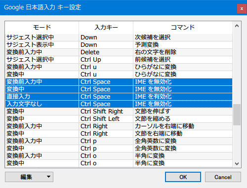

以前この記事で紹介したとおり、自分は*英字配列の Mac なら左右の Cmd キーで直接入力・日本語入力を切り替えていて*、

- [US キーボードの MacBook Pro に行ったキーボード周りの設定変更](/blog/2016/05/09-01.html)

会社で使うことがある*日本語配列の Mac だと左右の Cmd キーだけでなく「英数」「かな」キーを押したときも直接入力・日本語入力を切り替える*ようにしている。

- [日本語キーボードの MacBook で英数・かなキーと Cmd キーにお互いの機能を持たせる](/blog/2017/04/26-02.html)

そんなことをしていたら、最近**日本語配列の Windows** に戻ってきた時に、(Mac の Cmd キーのつもりで) 無意識のうちに「無変換」「変換」あたりのキーに親指が伸びていることがあるのだ。当たり前なのだが、これが思ったような動きをしてくれなくてモヤモヤしていた。

だいたい自分が使う時は IME の切り替えは左上の「半角 / 全角」と相場が決まっていて、「無変換」や「変換」、「カタカナ / ひらがな / ローマ字」キーは「時々誤って押してしまってどうやっても全角入力に戻せなくなる罠」としか思っていなかったので、この際 **Google 日本語入力**でカスタマイズしてやろう、と考えた。

`Ctrl + F12` で Google 日本語入力の設定ウィンドウを開いたら「キー設定の選択」の「編集」ボタンを押す。ココから以下のキーたちに対して同じ設定をしてやった。

- 入力キー
  - Muhenkan (無変換)
  - Henkan (変換)
  - Hiragana (カタカナ / ひらがな キー)
  - Katakana (Shift + カタカナ / ひらがな キー)
  - Kana (これだけどう押しても再現できなかったのでプリセットにあるものだけ直した)
- 入力モード → コマンド
  - 直接入力 → *IME を有効化*
  - 入力文字なし → IME を無効化
  - 変換前入力中 → IME を無効化
  - 変換中 → IME を無効化

「無変換」「変換」「カタカナ / ひらがな」キーに対して、直接入力のときだけ IME を有効化し、それ以外の時に押したら IME を無効化するように設定した。これで、これらのキーをいつどのように押しても、IME の無効化・有効化切り替えだけになってくれた。位置的にも Mac の Cmd キーや「英数」「かな」キーに近いので、感覚でデタラメにこの辺のキーを押して IME を切り替えられるようになった。
