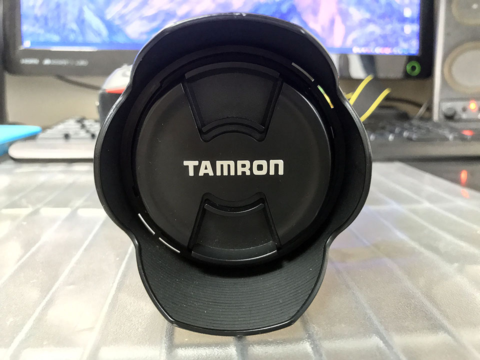

前回 Nikon 18-70mm というレンズを買ったが、同時期に **Tamron 18-270mm F/3.5-6.3 Di II VC PZD** というレンズを買った。ヤフオクで1万9000円なり。

  

    
  

  

    

      <a href="https://hb.afl.rakuten.co.jp/hgc/g00r8mv2.waxyc831.g00r8mv2.waxydde7/?pc=https%3A%2F%2Fitem.rakuten.co.jp%2Fr-kojima%2F3010417%2F&amp;m=http%3A%2F%2Fm.rakuten.co.jp%2Fr-kojima%2Fi%2F10436058%2F">タムロン 交換レンズ 18−270mm F／3．5−6．3 Di II VC PZD（Model B008TS）【ニコンFマウント（APS−C用）】</a>
    

    

      <a href="https://hb.afl.rakuten.co.jp/hgc/g00r8mv2.waxyc831.g00r8mv2.waxydde7/?pc=https%3A%2F%2Fwww.rakuten.co.jp%2Fr-kojima%2F&amp;m=http%3A%2F%2Fm.rakuten.co.jp%2Fr-kojima%2F">コジマ楽天市場店</a>
    

    
価格 : 40224円

  

高倍率ズームレンズで、現在使っている Nikon AF-P の 18-55mm・70-300mm の2本の焦点距離をほぼほぼカバーできるので、コレ一本でいけっかな！？なんて思ってた。

香港旅行にも持っていったので、色々と気付いた感想をば。

  

    
  

  

    

      <a href="https://www.amazon.co.jp/dp/B08NT2MX2T?tag=neos21-22&amp;linkCode=osi&amp;th=1&amp;psc=1">[セット品]レンズフィルター2点セット タムロン 18-270mm F/3.5-6.3 Di II VC PZD ニコン用 B008TSN (保護フィルターセット)</a>
    

  

## 「便利ズーム」と揶揄されるだけあって、便利ではある

高倍率ズームレンズは、

- 画質が悪い
- オートフォーカスが遅い
- ボケにくい

などの理由から「便利ズーム」と揶揄されるが、逆にいえば、確かに便利だった。

18-55mm だともっと寄りたい時、70-300mm だともっと引きたい時、それぞれのストレスを感じることなくササッとズームイン・ズームアウトできるのはやはり楽。

ココから…

ココまで伸びる。

## …でもやっぱり画質が…眠たい画質になる

「タムロンは全体的にどこにピントが合っているのか分かりにくい、眠たい画質になる」「シグマはそれと比べてシャープに写る」といった評判が広く聞かれるが、確かにそのとおりで、どれだけちゃんとフォーカスを合わせたとしても、どこかピンボケしているような、輪郭がボヤけて甘いような感じがある。画質・シャープさは AF-P 18-55mm なんかの方が良いと感じる。

## Nikon D5600 で使う時は「シングル AF サーボ」にすること

最初、Nikon D5600 で「コンティニュアス AF サーボ」のまま使っていて、シャッターを半押しした時にやたらフォーカス合わせがギコギコなるなぁと思ったのだが、何やら「コンティニュアス AF サーボ」だとそういうことになる模様。**「シングル AF サーボ」に切り替えて使う**と大丈夫だった。

同じ事象のことを指しているのかイマイチ分からないが、タムロンの 18-200mm という別の製品の、ソニー用のレンズの注意点として、以下のように記載されている。

> ■コンティニュアスAF（AF-C）時のご注意（ソニー用レンズ）
> 
> シーンセレクションの「スポーツ」モードでご使用になる場合、当社レンズの特性により、フォーカスサーチを続ける動作によって画像の大きさが小刻みに変動し続けることがあります。  
> このような場合、そのままシャッターを切っても撮影画像には問題ございません。  
> 他の撮影モード（P、A、S、M）で、フォーカスモードをコンティニュアス（AF-C）にする場合も、同様の現象が発生することがありますが、撮影画像には問題ございません。
> 
> ※液晶モニターやビューファインダーでの見え方が気になる場合は、フォーカスモードをワンショット（AF-S）、もしくはダイレクトマニュアルフォーカス（DMF）に切り替えてご使用ください。

- 参考 : [TAMRON | 18-200mm F/3.5-6.3 Di Ⅲ VC](http://www.tamron.jp/product/lenses/b011.html)

## 手ブレ補正は優秀

タムロンの手ブレ補正 *VC (Vibration Compensation) はかなり優秀*。オン・オフで明らかに像がピタッと止まる。Nikon の VR でココまで効きを実感したことがなかったので、かなり優秀なんだと思う。

## オートフォーカスは便利ズームにしては早い方？

オートフォーカスの速度は AF-P レンズや、前回紹介した Nikon 18-70mm と比べると劣るかな、という感じだが、遅くて使い物にならない、というレベルではない。さすが超音波モーターの PZD (PieZo Drive)。

望遠にしたりすると若干迷う時があるので、動体や撮り直しが利かない被写体には向かないかも。

スイッチ類は AF/MF 切り替えと、VC の On/Off 切り替えの2つ。

## 近くのものが撮れない

例えば椅子に座って、机の上の料理を撮る、なんて時に、全然ピントが合わず写真が撮れなかった。これまで使っていた AF-P 18-55mm では問題なく撮れたのに？

と思って調べてみると、AF-P 18-55mm の最短撮影距離が 0.25m (25cm) であるのに対して、この**タムロン 18-270mm の最短撮影距離は 0.49m (49cm)** だった。49cm というと、一般的な成人男性の手の先から肘までの長さよりもう少し離れないといけない感覚だ。この距離は「椅子に座って机の上のモノを撮る」というシチュエーションだと少し切ってしまっている。つまり*近すぎてピントが合わせられない*のだ。

焦点距離としては 18mm をカバーしているので、ついつい AF-P 18-55mm でできることも出来るんだろうと思ってしまいがちだが、こういった「近くのものが撮れない」問題は結構困った。

## 地味に便利な気遣い

便利ズームは鏡胴が長く重たいので、持ち運んでいる時にレンズが自重でズルズルっと伸びてしまうことがある。これを避けるため、ワイド側いっぱい (18mm) に寄せたところでロックできるスイッチが付いている。これが意外と便利。

また、付属のレンズキャップはフードを付けていても外しやすいよう、*ロゴに近い内側の円の部分をつまんでも外せる*ようになっている。Nikon のレンズだとこういう機構がないので、これも地味に便利。

-----

総合的に見て、値段を考えたら十分優秀なレンズ。「便利ズーム」はやはり1本で済ませられるという便利さがある。

しかし通常のズームレンズと比べると、どうしても画質的に劣る。感覚的には「**コンデジから一歩進んだ程度の画質**」という印象になってしまうので、便利さと画質はトレードオフだ。

使い物にならないというワケではなく、一眼ならではのボケ味も残っているし、平均点には達している、という感じだ。店頭などで実際に試してみて、自分で画質や機能性に違和感を抱かなければ買いだと思う。
