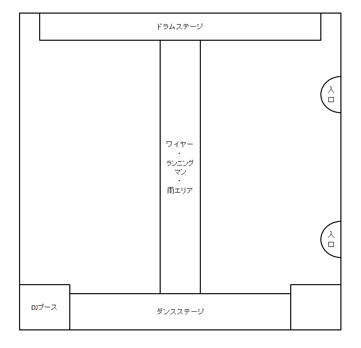

これは2014年6月22日に某所で執筆したブログ記事の再掲です。当時の記事そのまんまです。

---

「フエルサブルータ」ご存知ですか？「体感せよ！」というコピーで、ちょろっと CM やってますな。  
赤坂サカスでやってる舞台？イベントで、公演が 6/29 (日) までなんですね。あと1週間しかやってないんですが、それを昨日見てきたのでご紹介したいなと。  
前半はネタバレなし、後半はネタバレアリで解説したいと思います。

フエルサブルータ (以下フエルサ) に関する知識が全くない人は、「フエルサブルータ 公式サイト」にある以下の動画を見て頂きたい。

- [【衝撃の】フエルサ ブルータ【6/29(日)まで絶賛上演中!!】 on Vimeo](https://vimeo.com/95932522)

なんか走ってる人がいる？泳ぐ女性を下から見てる？客が濡れてる？よく分かんないですね、よく分かんないんですよこれ。でもぼくはこの映像を見ただけで実物を見に行きました。

ぼくは普段、演劇というか、劇団四季みたいなヤツとかなんかああいう感じのって全然見たことなくて、小さい頃にアレグリアを見に行った記憶があるだけ、レベルの人間です。んでフエルサについても、見に行ってもなおよく分かってないまま、ただ感じたことを話したいと思います。

といっても、ネタバレなしだと、上の動画が全てで、「板が垂直にくるくる回ってるパートだけやって無かったなぁ」ぐらいでしょうか。動画は海外での公演なので、行ってみての印象は若干違いました、とだけ。

フエルサが気になって、あまり事前知識を入れずに楽しみたいという方は、この先を読まずに公式サイトからチケットを探すか、当日券で赤坂サカスに見に行ってください。身構え方としては、「言語で意味を考えようとしないこと」「積極的に体感しにいくこと」という感じでしょうか。他人の夢を見ているつもりで、本当に何も知らないまま行ってみましょう。

見に行った感じ、年齢層は若い人オンリーじゃなくて、けっこう年配の方たちもいました。バブルの香りが残るオバサンとか、カバンを持ったまま仕事帰りに来たサラリーマンとかもいました。色んな客層がいたので、決して若い人向けってワケじゃないです。

最終週は水量を倍にする「エクストリーム・レイン公演」になる、という話だったので、ぼくが昨日見たヤツよりも凄いことになるかもしれないです。気になったらぜひドウゾ。

---

ここからは、徐々にネタバレ第1段階。楽しみ方や見に行くための準備について。

赤坂サカスに特設テントがあって、そこでやってます。場所によっては濡れますし、盛り上がれば汗だくになるので、荷物はクロークに預けた方が良いでしょう。テントの外、隣あたりにパンフレットを売っている場所があるのですが、ここに荷物を預けられます。500円です。ぜひ荷物は預けると良いでしょう。

前売券・当日券のチケットもこの辺で売ってます。公式サイトの「テント周辺図 (PDF)」を見てみると良いでしょう。

会場はオールスタンディング。あちこちで色んなことが起こるので、積極的に見に行きたい人は人混みをかき分けてその方向に行くと良いでしょう。あまり絡まれたくない人は端の方に退避して俯瞰することもできます。このあたりはみなさんの積極性にかかっています。

どこで何が起こるか知りたい方は、このあとネタバレ解説するのでそちらをご覧ください。

公演は撮影OK。SNS への投稿もOKということで、ブログや Twitter、Instagram などにたくさんの投稿があります。気になる方は見てみても良いでしょう。公式ブログではダンサーたちの舞台裏や、プロデューサーインタビューなどがありますので、裏側が知りたい人、「意味を言葉で知りたい人」は読んでみるといいと思います。

一人で行くのがどうも…、という方は、「ガイド de フエルサ」というサービスがあって、スタッフがオススメポイントをツアーガイトしてくれるようです。

その他お得な情報やスペシャルイベントは「公式ブログ お得な情報」を見てみると良いでしょう。

いよいよ内容ネタバレ。

---

ここからは、ぼくが見に行った時の公演で何があったかを書きます。同時に、どこで何が見られるか分かると思うので、見に行った際に場所を狙いに行ったりできると思います。

ではまず、特設テントの中の簡単な間取り図を作りましたので載せます。これを元に説明していきます。

図にはいくつか画を書きましたが、テントの中には何もありません。ただのだだっ広い会場です。図の右側の2つの入口からテントに入ります。

あ、今気付きましたが右下の四角に説明書き忘れましたな…。まぁでも簡易図なので別にいいです。ｗ

会場の広さは小学校の体育館ぐらいでしょうか。全部で1000人ぐらい？動画で見える海外公演よりはこじんまりしてます。思ったより狭いかもしれませんが、それを利用して演者がとても近くに体感できるので臨場感があります。

ではいよいよ中身に入っていきます。「ドラムステージ」と書いた側を「会場の上側」として説明します。

まずはこの「ドラムステージ」にパフォーマーが現れ、演奏が始まります。この音楽は何と言うんでしょう、ハウスミュージックに民族音楽を合わせたような感じで独特です。その途中で、「ワイヤー」と書いた会場中央に、ワイヤーで吊られたパフォーマー数人がブランコします。ドラムステージを見ていると後ろから突然現れることになるので、ビックリします。ｗ

ひとしきりワイヤーパフォーマーとドラムステージが暴れ終わったら、次は「ランニングマン」シークエンスに移ります。ドラムステージの方から会場中央に向かって、動く床を歩くランニングマンが移動してやってきます。会場中央に付いたらランニングマンが全速力になります。ランニングマンが会場後方から2発ほど撃たれて流血したり、動く床に人が乗ってきたり椅子や机が置かれたりして、この辺は意味が分かりません。意味が分かりませんが、それが楽しいのです。ｗ

ランニングマンが走る床にベッドが置かれると、ランニングマンはベッドで寝てしまいます。すると会場左上から会場を反時計回りに多い囲むように、銀色のギラギラしたカーテンが流れてきます。これに色々な色のライトがあたり、光が反射しながらカーテンがゆらゆら揺れることで、海中のような、幻想的な空間が現れます。

そして同じく会場左上の天井付近に、美女2人が吊られています。カーテンを蹴りながら会場を1周回ります。なんか二人は言い合いしながらくるくる回ってます。ランニングマンの夢なのでしょうか。

美女2人がハケると、ランニングマンが再び走り、ハケていきます。次は会場下側から、「ダンスステージ」がせり出してきます。大きく足を回すキックのような動きが印象的なダンスを、パフォーマー5・6名が見せます。ランニングマンのパートでもそうでしたが、とにかく発泡スチロールをぶち壊して紙吹雪を散らかします。このダンスパートでもパフォーマーが紙吹雪入りの段ボール板みたいなのを持ち出して会場に降りてきて、適当な観客を捕まえては頭にこの段ボール板を叩きつけて会場を散らかします。これは会場各所で起こるので、下手したら巻き込まれるかもです。冒頭に書いた「カバンを持ったままの仕事帰りのサラリーマン」風な男性が、目の前で段ボール叩きつけられてました。ｗ

途中謎にパフォーマーたちが観客を座らせて、また立たせて盛り上がらせたり、美女2人パートで使っていたような銀色のカーテンが横から流れてきたりします。観客も一緒になって体感する、というのが目的なのでしょう。ぼくの後ろにいた大学生二人組みたいなのが「意味が分かんねぇよ！」と怒っちゃってましたが、むしろ意味なんてものを超越したエンタテイメントなんだなと、諦めて目の前の出来事に脊髄反射していくしかないです。そしてこの「現状分析に脳がフル回転していながら脊髄反射していく」感じがとても面白いです。つい考えてしまいますが、考えるより感じるのです。

ダンスステージは一度引っ込んだり、またせり出したりしてきます。「DJ ブース」と書いたのは会場の上の方にあって、この辺に大きな送風機があります。水を多少捲いてました。あと空白になってしまった会場右下の部分、ここではダンスパートの後半で、パフォーマーたちめがけて天井板 (例の発泡スチロール) が落ちてきて散らかす、というパフォーマンス？をやってます。なんていうんでしょう、このダンスパートはパフォーマー同士が怒って言い合いをしてます。怒りのエネルギーを感じます。

ダンスパートが終息すると、今度はドラムステージ側の天井から、会場中央に向かって巨大なガラス板みたいなのがせり出してきます。これが、動画で美女たちが泳いでいたパートになります。これはガラス板ではなくて、べこべこした巨大な樹脂の床になっています。そこに水が張ってあって、美女たちが泳いでます。なんと表現したらよいのか分からないので「水槽」としておきます。ｗ

この水槽パートは、水槽全体が降りてきて、最後は観客たちが触れるぐらいに近づきます。会場の左右をほぼカバーするぐらいの幅がありますが、会場上下に対する縦幅はそんなにないので、ホントに会場中央、ランニングマンが走ってた位置ぐらいにいると良いと思います。

水槽が傾き、美女がそれに合わせて流れたりします。音楽はアンビエント系に変わって、幻想的な雰囲気です。水槽の真下で見ると楽しいでしょう。頑丈な樹脂で出来ていそうですが、そのうえで美女がとび跳ねたり、全力で倒れてみせたり、バンバンひっぱたいたりします。怖くはないけど凄いｗ あと、別に水槽の水はこぼれたりしないのでここでは特に濡れません。ｗ

この水槽パートはまぁまぁ長いので、まったり楽しめます。そのあとは再びランニングマンパートになります。場所は変わらず、ドラムステージから会場中央に出てきます。今度はワイヤーがついた人が2人いて、3人で走ってます。

するとさらに、3人のランニングマン・ランニングウーマンに向かって大きな「階段」が出てきます。3人はそれをのぼり、頂上の扉を開けます。当然凄い高さですが、3人はそこから飛び降り、発泡スチロールの壁を突き破り、ワイヤーに任せてブランコします。そしてまた動く床に降り立ち、全速力です。この辺はもうワケが分からず感動します。全体に言えることですが、「うわ～凄いパフォーマンスだ！」というよりは、「スゲー楽しそう！俺もやりたい！！」ってなるような感じです。ｗ

ランニングマンパートが終わるとまたドラムパートに戻り、ワイヤーパフォーマーたちがまた出てきます。そしてクライマックス、会場中央の縦ラインに雨が降ります。「雨エリア」と書いた図の部分です。ここ以外は濡れません。濡れたい人は会場中央ラインに行きましょう。雨エリアから少し離れた位置から見てましたが、照明が照らす雨が素敵だな～というのと、その雨に打たれてものすごい暴れてるスキンヘッドの外人観客がいました。ｗ　足元は水浸しで、薄い靴だと浸水するかもしれないです。コンバースでギリギリ濡れずに済んだ感じでした。

ここでもまた謎にカーテンを頭上に引いてみたり、一度なぜか座らされたり意味不明なことをさせられますｗ。何語か分からない歌も中毒性があります。どうもアルゼンチンで始まった公演みたいなので、英語とかじゃないみたいです。そういや音はそんなに大きくなかったので、もっと大音量でノセてくれても良かったかなぁ、とも思います。

最後はパフォーマーたちがドラムステージから下りてくるので、「雨エリア」のラインでハイタッチができます。イケメン、美女に触りたい人はここでぜひ。ｗ

---

公演は60分ちょっとですかね。1時間ノンストップでこれらが待ち受けています。 ホントに「意味」とか「脈絡」とか、そういうものを言語的に考えようとしちゃダメですな。他人の夢を見ているような、と冒頭で書きましたが、そのぐらい、意味なんてものはない、言葉では説明できない空間に連れ込まれます。でも怒りとか、今を打破したい破壊衝動とか、前進したいエネルギーみたいなのは感じました。元気になれて心地良い、そんなパフォーマンスでした。月並みな表現ですが「体験しないと分からない」というヤツですかねぇ…。

幸いなのか、あまり知られていないのか、ぼくが行った金曜夜でもそこまで激混みではありませんでした。押し入ろうと思えばどんどん中央にいける感じで、まぁ余裕があると思います。公演最終週ですが、ホントに最終日でない限りは多分超満員ではないと思うので、とにかく全てを最前列で楽しむこともできそうです。

あと、テントを出たところで、提供の「パワードコーヒー」を配ってました。興奮のあまり一気飲みして缶を握りつぶしました。ｗ

物販ありますが、袋には入れてもらえないので、持参するか、トートバッグ一緒に買いましょう。ｗ

---

ぜひムチャクチャになりに行ってください。ぼくも1日経ってもまだ余韻が残ってて、もう1・2回ぐらい行きたいです。来週行こうかな…!!!

以上です!!!

---

…ということで再掲でした。2017年のフエルサブルータも早く参加せねば！

[フエルサブルータWA! 初日ダイジェスト映像](https://youtube.com/watch?v=-iHaZv4bd7U)
