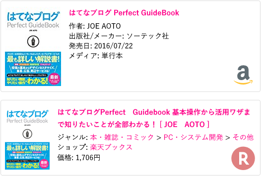

追記：第2弾も作ったのでコチラもドウゾ。

- [はてなブログの Amazon と楽天の商品リンクにアイコンを付けた 第2弾](/blog/2018/04/12-01.html)

---

はてなブログの Amazon と楽天の商品リンクは、一見するとどちらが Amazon なのか楽天なのか、見分けが付かない。

そこで、商品リンクの枠の右下に Amazon と楽天のアイコンを表示するようにしてみた。

実際の様子は以下の画像のとおり。



こんな感じ。

## 実装方法

実装は CSS のみで実現している。アイコンは Base64 形式でエンコードし、Data URI 形式で埋め込んである。

```css
/* Amazon 商品リンク 背景アイコン */
.hatena-asin-detail:not(.hatena-rakuten-detail) {
  background:
    linear-gradient(to right, rgba(255, 255, 255, .2), rgba(255, 255, 255, .2)),
    url('data:image/png;base64,iVBORw0KGgoAAAANSUhEUgAAADAAAAAwCAYAAABXAvmHAAACkElEQVRoge2YybGjMBCGOwRCIARdbHHUxRYn6BAcgjMgBEJwCFRZfmdCIARCIISeg9ozeJEMBci8GrqqTyD4P/WiBWCzzTbb7G5CYbQ/ZoXU+UXqvJY6b6TOO6nzVuq8ss/wLBRG39b6YEmKSuqsZLE00KtVgEiN5xGin71LUlS/VXwfIv6t4u/efgEgb2YEoKBRsEXrFVTvDiiEwihJMR4Srf0xK4IBcJt0iMlKB/TpU1cKCdCOLUihMFpNHeyPiPLfYtWHufjGecBJ6rwLpf+tCYXRp4Vp1QBDbNUAdh+EyFuKmttsy971fF0AtjhH74PWAcD9farw7wDMvJUIC8Bt1DfzrdRZmaR42h1QJCnGA9aBcABcpC4htaudrgKAZ98lwntIWQUAd5y3IvZHRNe43QHFSgDyyiXCtyUeUvShANqxAFzAvrr5OAFzAjiFuPb0vrR7dDwHAPgkxl6bCIWRzfuh4m0dLB6FBRawlza8KMCAbjLZA0TBd6T0pwjf3Pne8R6KZjHuKs5u5BZv1wn3+Tgrg93WMcTQSNS7A4r+ePm4nnRBOtA7ezofs5i8kzpv9seseBbeNx7TJSmeAkpe1qiCiAwUZKAhAx0ZILpBSwaG3xuRgZpu8PZ+Z2mjG1zYS7pBSQaqO8TYD5U88CsgD1psNJrxA69wIgPEXpEB525zLiMDqpdCDQDA6BR6+OAPCP4Y/XUbHUUVTG55nPPYE33/T00/IPj/RD/gbAbDfnSFE88EPXnH0Sk4YorhYvaIKohZCPI7BRmoXybGetOPNBkoZk1jusLZATLVa7rC+TmqdIPLHJF+BbmHfRpMQwaKyekxGaaCmCNz4dSoe2Ade0MGKq4fXGRWN9vsP7Q/PeTs283e6DMAAAAASUVORK5CYII=')
      no-repeat right 10px bottom 10px;
  background-size:48px 48px;
}

/* 楽天商品リンク 背景アイコン */
.hatena-rakuten-detail {
  background:
    linear-gradient(to right, rgba(255, 255, 255, .5), rgba(255, 255, 255, .5)),
    url('data:image/svg+xml;base64,PHN2ZyBpZD0iTGF5ZXJfMSIgZGF0YS1uYW1lPSJMYXllciAxIiB4bWxucz0iaHR0cDovL3d3dy53My5vcmcvMjAwMC9zdmciIHZpZXdCb3g9IjAgMCA1MC41OCA1MS4wNiI+PGRlZnM+PHN0eWxlPi5jbHMtMXtmaWxsOiNiZjAwMDA7fS5jbHMtMntmaWxsOiNmZmY7fTwvc3R5bGU+PC9kZWZzPjx0aXRsZT7jgqLjg7zjg4jjg5zjg7zjg4kgMTwvdGl0bGU+PHBhdGggY2xhc3M9ImNscy0xIiBkPSJNNTAuNTgsMjUuNzhBMjUuMjksMjUuMjksMCwxLDEsMjUuMjkuNDgsMjUuMjksMjUuMjksMCwwLDEsNTAuNTgsMjUuNzhaIi8+PHBhdGggY2xhc3M9ImNscy0yIiBkPSJNMjEuOTQsMzkuMzZWMzAuOTNIMjUuNmw2LjMyLDguNDNoNi40N0wzMC43NSwyOS4xOWE5LjM3LDkuMzcsMCwwLDAtNS40My0xN0gxNi43OFYzOS4zNmg1LjE2Wm0wLTIyaDMuMzdhNC4yMSw0LjIxLDAsMSwxLDAsOC40M0gyMS45NFoiLz48L3N2Zz4=')
      no-repeat right 10px bottom 10px;
  background-size:48px 48px;
}
```

以下、このコードを実装するまでの詳細。

## 詳細

Amazon のロゴは以下で配布している PNG 形式 48x48px のものを利用。

- 参考：[Amazon Icon - free download, PNG and vector](https://icons8.com/icon/16781/amazon)

楽天のロゴは以下の WikiMedia Commons から SVG 形式のものを利用。ロゴ部分のみ抜き出して Base64 形式でエンコードした。

- 参考：[File:Rakuten logo 2.svg - Wikimedia Commons](https://commons.wikimedia.org/wiki/File:Rakuten_logo_2.svg)

Base64 形式でエンコードした時のデータ量を増やさないように工夫した。

CSS はこれを Data URI 形式で埋め込み、右下に配置するようにした。SVG は `background-size` で表示サイズを指定しないと要素のサイズに合わせて広がるようだ。もしかしたら SVG 側で表示サイズを指定したりできるのかもだけど詳しく知らないのでコレで…。

```css
background:url('data:image/【Base64 文字列】') no-repeat right 10px bottom 10px;
background-size:48px 48px;
```

このままだと色が濃い目に出てしまうので、`linear-gradient` で単色の透過色を作り、上から被せた。

というワケでこういう構成。

```css
background:linear-gradient(to right, rgba(255, 255, 255, .5), rgba(255, 255, 255, .5)),
           url('data:image/【Base64 文字列】') no-repeat right 10px bottom 10px;
background-size:48px 48px;
```

Amazon と楽天の商品リンクには、`.hatena-asin-detail` というクラス名が振られている。Amazon はこのクラスだけで、楽天の方は `.hatena-rakuten-detail` というクラスも振られている。そこで、

- `.hatena-asin-detail` というクラス名かつ、`.hatena-rakuten-detail` というクラスを持たない要素 → Amazon
- `.hatena-rakuten-detail` というクラス名の要素 → 楽天

と振り分けることにした。

```css
.hatena-asin-detail:not(.hatena-rakuten-detail) { /* Amazon */ }

.hatena-rakuten-detail { /* 楽天 */ }
.hatena-asin-detail.hatena-rakuten-detail { /* 楽天・コレでも大丈夫 */ }
```

これで Amazon・楽天それぞれの商品リンク要素を特定できた。イイカンジ。
