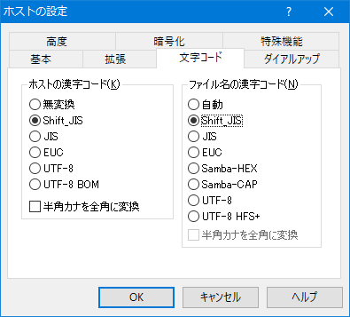

XREA サーバにファイルをアップロードするのに、未だ FFFTP を使用している。

以前誤って「*`●.jpg`*」という名前のファイルをアップしてしまったのだが、これを削除しようとしたら「●」が文字化けして正しく認識されず、「存在しないファイルを削除する命令」と誤解されてしまいファイルが消せなくなった。

色々試行錯誤していて削除の仕方を見つけたので紹介。

- 参考：[文字化けしたファイルデータを削除したい - Mami9memo](https://sites.google.com/site/mamilinememo/zuo-yememo/wenzihuakeshitafairudetawoxuechushitai)

接続前の「ホストの設定」より、「文字コード」タブを開き、ホストとファイル名の文字コードをアレコレ変えてみると、「●.jpg」が正しく認識される文字コードが見つかる。自分の場合は「**Shift-JIS**」を選択すると上手くいった。

あとはこれで接続し、「●.jpg」を削除すれば良い。
