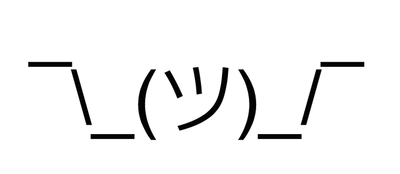

たまにはお遊び。

マイクロ npm パッケージと呼ばれる、ごくごく短いコードで構成される npm パッケージがよく提供されている。以前 npm 界隈で話題になった left-pad などがこれに該当する。

- 参考：[NPMとleft-pad : 私たちはプログラミングのやり方を忘れてしまったのか？ | プログラミング | POSTD](http://postd.cc/npm-and-left-pad/)

今回はその中でも、ジョーク的なマイクロパッケージを紹介しようと思う。

## shruggie

- [GitHub - wolfika/shruggie: Indicate your lack of knowledge with the one and only shruggie emoticon](https://github.com/wolfika/shruggie)

shrug (シュラッグ) とは、両手を上にあげて肩をすくめる動作のこと。よく外人が「なんてこったい」「まいったまいった」的な時に手を上にあげる、あの動作だ。



__shruggie__ という npm パッケージは、この shrug を表現した顔文字を出力するだけのパッケージだ。

```javascript
const shruggie = require('shruggie');

console.log( shruggie() );
// => '¯\_(ツ)_/¯'
```

- 参考：[🤷 Shrug `¯\_(ツ)_/¯` Emoji](https://emojipedia.org/shrug/)

これだけなのに依存パッケージが5つもあり、インストールするとやたらに容量を食う。ｗ

## nope

- [GitHub - hasantayyar/nope: Npm package that generates random words and phrases to say "no" in different ways.](https://github.com/hasantayyar/nope)

__nope__ は、英語で様々な「No」の言い方を返してくれる npm パッケージ。

英語表現は `en.json` に配列で定義されており、この配列から `Math.random()` を使って1つの文言を取り出すだけのパッケージだ。

```javascript
const nope = require('../index.js');

console.log( nope() );
// => Absolutely not とか。
```

こちらは依存パッケージがなく、大変シンプル。

---

ジョークパッケージだけど、そこでも npm というエコシステムに対する姿勢やコーディングスタイルが見え隠れして面白い。
