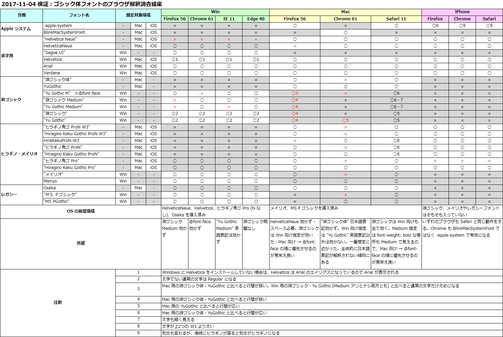

時折話題にしてきた、CSS での `font-family` 指定のベスト・プラクティスだが、様々な検証を経てようやく設定が落ち着いてきたので、__オレオレパーフェクト設定__を共有しておく。

## 目次

## ゴシック体 (サンセリフ) のフォント指定

__2017年時点で、Mac でも Windows でも、システム標準のフォントを使ってイイカンジに Web ページを表示する `font-family` 指定は以下で決まり。__

```css
/* Windows 用 Medium 指定の游ゴシック */
@font-face {
  font-family: "Yu Gothic M";
  src: local("Yu Gothic Medium");
}
/* font-weight: bold の時は通常どおり Bold 書体を使わせる */
@font-face {
  font-family: "Yu Gothic M";
  src: local("Yu Gothic Bold");
  font-weight: bold;
}

/* ゴシック体指定 */
font-family: -apple-system, BlinkMacSystemFont, "Helvetica Neue", HelveticaNeue, "Segoe UI", "游ゴシック体", YuGothic, "Yu Gothic M", "游ゴシック Medium", "Yu Gothic Medium", "ヒラギノ角ゴ ProN W3", "Hiragino Kaku Gothic ProN W3", HiraKakuProN-W3, "ヒラギノ角ゴ ProN", "Hiragino Kaku Gothic ProN", "ヒラギノ角ゴ Pro", "Hiragino Kaku Gothic Pro", "メイリオ", Meiryo, Osaka, "ＭＳ Ｐゴシック", "MS PGothic", sans-serif;
```

それぞれのフォントを指定した理由は以下のとおり。

- _`-apple-system`_
  - Apple 用の英字フォント指定。「San Francisco」が適用される。
  - iOS9 以降の iOS や、Mac Safari・Mac Firefox で適用される。
  - iOS の場合はこの指定で和文フォントも変化する (Mac はしない)。しかし、後続に「ヒラギノ角ゴ」の指定があると和文のみヒラギノになり、英字にのみ `-apple-system` が適用された状態になってしまう。コレを回避するには iOS 判定をして別途ヒラギノを指定せず `-apple-system` のみを指定した `font-family` を当てる必要があるだろう。現状、和文がヒラギノで表示されてもそこまで違和感はないし、Mac ではそう表示されているため、特に OS 判定はせずこの `font-family` 指定だけで行こうと思う。
- _`BlinkMacSystemFont`_
  - Blink 系ブラウザ向けの `-apple-system`。同じく「San Francisco」が適用される。
  - Blink 系なので、Mac Chrome とその派生である Mac Opera で適用される。
- _`"Helvetica Neue"`_
  - 上述の2つが認識されなかった時の Apple 向けの英字フォント。Helvetica の上位バージョン。
  - Mac 向けの指定。
- _`HelveticaNeue`_
  - 上述の Windows 向け指定。Windows に Helvetica Neue をインストールした時は、スペースなしで指定しないと認識されなかった。
- _`"Segoe UI"`_
  - Windows 向けの英字フォント。メイリオや游ゴシックと馴染むので、Helvetica Neue の代わりに指定しておくと良いかと。
- _(その他の英字フォントを指定するとしたら)_
  - Helvetica、Arial、Verdana あたりを入れても良いかもしれない。
  - Windows で Helvetica を未インストールの場合は、Helvetica というフォント名は Arial のエイリアスになっていて、Arial で表示される。
- _`"游ゴシック体", YuGothic`_
  - ココからは游ゴシック関連の指定。最近のバージョンであれば、Windows にも Mac にも游ゴシックが入っているので、基本は游ゴシックを使うようにしたい。
  - Mac の場合は「游ゴシック__体__」、英語の場合はスペースを開けず「YuGothic」と表記しないといけない。こちらの指定は Windows では適用されない。
- __`"Yu Gothic M"`__
  - __`@font-face` でカスタマイズした游ゴシック Medium フォント__。
  - 以前、`font-weight: 500;` を指定することで、`"游ゴシック", "Yu Gothic"` (Medium 表記なし) と書いた時に細い字体 (Regular) が適用されないようにする方法を紹介した。
      - 過去記事：[Windows で游ゴシックが細く見えないようにする CSS](/blog/2016/02/12-01.html)
  - この方法は、他のフォントが適用された時に `font-weight: 500;` が悪影響を与えることがあるため、この次に書いた「Medium 指定の游ゴシック」や、この `@font-face` を使用するテクニックが出始めた。
  - 「Medium 指定の游ゴシック」が有効にならないブラウザでも、この `@font-face` が有効になる場合があるので、併用しておく。逆に `@font-face` 指定が有効にならないブラウザもあるので、「Medium 指定」との__併用__が必要なのだ。
  - `font-weight: 500` の場合は Medium フォント、`font-weibht: bold` の場合は Bold フォントが使われるように指定している。
- _`"游ゴシック Medium", "Yu Gothic Medium"`_
  - Windows 向けの游ゴシック指定。
  - これより後ろに `"游ゴシック", "Yu Gothic"` など Medium 指定のないフォントを指定してしまうと細い字体になってしまうので書かないこと。
  - この Medium 指定は、有効になるブラウザとならないブラウザがあるので、前に説明した `@font-face` 指定と併用しておく。
- _`"ヒラギノ角ゴ ProN W3", "Hiragino Kaku Gothic ProN W3", HiraKakuProN-W3, "ヒラギノ角ゴ ProN", "Hiragino Kaku Gothic ProN"`_
  - ココからは、游ゴシック指定をすり抜けてしまった場合のフォールバックとして「ヒラギノ」と「メイリオ」を指定している。
  - まずは游ゴシック体をすり抜けた場合の Mac 向けのフォントとしてヒラギノを用意する。
  - Windows にヒラギノをインストールしている場合、Windows のヒラギノはあまり綺麗に見えないらしいので注意したい (レアケースな方だろうけど)。
  - いくつかの表記があるが、ブラウザによって有効になる表記、ならない表記にバラつきがあり、さらに Mac Safari だと文字の太さが W3 になるモノ、ならないモノがあったりとなかなか混乱する。上述の記述順は、_それらを全て加味して程よく見えるように調整したもの。_
- _`"ヒラギノ角ゴ Pro", "Hiragino Kaku Gothic Pro"`_
  - 上述の「ヒラギノ角ゴ _ProN_」とは違う、「ヒラギノ角ゴ __Pro__」。N なしのコチラは、一部の文字が略字体で表示されるため、基本的には N アリの方が指定される。まれに N なしのヒラギノのみをインストールしている Windows ユーザがいたりするので、そういう人向けに。略字体で表示される漢字はそう多くないので十分代用可能だろう。
  - 参考：[ProとProN、StdとStdNの違い - フォント専門サイト fontnavi](http://fontnavi.jp/zakkuri/205-N_fonts.aspx)
- _`"メイリオ", Meiryo`_
  - 游ゴシック (とヒラギノ) をすり抜けた場合の Windows 向けのフォント。
- _`Osaka`_
  - ヒラギノが存在しないレガシーな Mac 向けのフォント指定。Mac 向けのフォールバックもココまで。
- _`"ＭＳ Ｐゴシック", "MS PGothic"`_
  - メイリオが存在しないレガシーな Windows 向けのフォント指定。Windows 向けのフォールバックもココまで。
- _`sans-serif`_
  - 最後に総称ファミリを指定。

コレで以上。

Windows・Mac・iPhone の各種ブラウザで検証した結果、以上の記載順が最適と判断した。英語表記や日本語表記は、片方しか認識しないブラウザもあったりしてなかなか大変だった。以下に検証結果の Excel 画像を置いておく。



大方針は「英字フォント → 和文混在フォント」の順かつ、「__Mac 向け指定 → Windows 向け指定__」の順で指定し、その中でも「_日本語表記 → 英語表記_」で指定することで良い感じになった。

## 明朝体 (セリフ) のフォント指定

あまり明朝体は使わないのだが、せっかくなので最適であろう設定を考えてみた。__明朝体は以下で決まり。__

```css
font-family: Georgia, "游明朝体", "YuMincho", "游明朝", "Yu Mincho", "ヒラギノ明朝 ProN W3", "Hiragino Mincho ProN W3", HiraMinProN-W3, "ヒラギノ明朝 ProN", "Hiragino Mincho ProN", "ヒラギノ明朝 Pro", "Hiragino Mincho Pro", "HGS明朝E", "ＭＳ Ｐ明朝", "MS PMincho", serif;
```

設定理由は以下のとおり。

- _`Georgia`_
  - Windows・Mac ともに採用されているセリフ体の英字フォント。
- _`"游明朝体", "YuMincho"`_
  - 明朝体も、ベースは游フォントの「游明朝」を使っていく方針。
  - Mac 向けの游明朝。
- _`"游明朝", "Yu Mincho"`_
  - Windows 向けの游明朝。
  - 「文字が細過ぎて、`font-weight: 500` 指定などで回避できないため、使用するべきではない」といった文献もあったが、自分が調べた限りだとそれなりに見えていたのでとりあえずコレで。
- _`"ヒラギノ明朝 ProN W3", "Hiragino Mincho ProN W3", HiraMinProN-W3, "ヒラギノ明朝 ProN", "Hiragino Mincho ProN"`_
  - 游明朝がない Mac ユーザ向けのフォールバック。ヒラギノ明朝。
  - ゴシック体と同じく、W3 ウェイトを指定したモノを手前に置き、ウェイト指定なしを後ろに置いている。
- _`"ヒラギノ明朝 Pro", "Hiragino Mincho Pro"`_
  - ついでに N なしのヒラギノ明朝も指定。
- _`"HGS明朝E"`_
  - 游明朝がない Windows 向けのフォールバック。ネットで調べたらこのフォントが奨められていたので採用してみた。
  - 「_HGS_」ではなく「__HG__」と指定する「__`"HG明朝E"`__」でも同じように見えるので、どっちでも良いかと (違いが分からなかった)。
- _`"ＭＳ Ｐ明朝", "MS PMincho"`_
  - 「HGS明朝E」は大抵の Windows マシンに入っているようだが、一応 OS 標準のフォントもフォールバックで用意。
- _`serif`_
  - 総称ファミリ。

以上である。

ゴシック体よりはスッキリしている。大方針もほとんど同じ。

## 等幅 (モノスペース) のフォント指定

__等幅フォントの場合の設定は以下で決まり。__

```css
/* 和文英文混在で表示する機会が少ない場合 … 英字フォントを優先する */
font-family: MeiryoKe_Gothic, "Ricty Diminished", "Courier New", Courier, Monaco, Menlo, Consolas, "Lucida Console", "Osaka－等幅", "Osaka-等幅", Osaka-mono, "ＭＳ ゴシック", "MS Gothic", monospace;

/* 和文英文混在で表示する機会が多い場合 … 混在フォントを優先して等幅表示を優先させる */
font-family: MeiryoKe_Gothic, "Ricty Diminished", "Osaka－等幅", "Osaka-等幅", Osaka-mono, "ＭＳ ゴシック", "MS Gothic", "Courier New", Courier, Monaco, Menlo, Consolas, "Lucida Console", monospace;
```

等幅フォントの場合は、_用途に応じて2パターン_を用意した。

- 和英混在表示の際、文字幅に多少のバラ付きが出ても良ければ、1つ目の指定を利用すると良いだろう。
- 和英混在表示時に等幅であること (全角1文字の幅 = 半角2文字分) を最優先したいのであれば、2つ目のフォント指定の方を利用すると良いだろう。

設定意図は以下のとおり。

- *`MeiryoKe_Gothic`*
  - メイリオをベースとした等幅フォント。Windows ユーザが自環境のメイリオフォントから生成してインストールしている場合を考えて指定した。個人的にはメイリオは好きな方なので、その等幅フォントで表示されるのは良いかなぁと思っている。
- _`"Ricty Diminished"`_
  - Windows・Mac ともにインストール可能な等幅フォント。コンソール・ターミナル向けのフォント。
  - 全角スペースが破線の四角記号みたいに表示されてしまうのが特徴的で、避けたい場面があるかも…？
- _`"Courier New"`_
  - ココから英字フォント。
  - Windows・Mac 向け等幅フォント。一番綺麗そうなヤツ。
- _`Courier`_
  - Windows・Mac 向け。
- _`Monaco, Menlo`_
  - Mac 向け。
- _`Consolas, "Lucida Console"`_
  - Windows 向け。
  - ココまで英字フォント。
- _`"Osaka－等幅", "Osaka-等幅", Osaka-mono`_
  - ココから和英混在フォント。
  - Mac における和英混在の等幅フォントは、この Osaka-等幅のみ。FontBook だと Osaka フォントのバリエーションの一つのようになっていて、デフォルトで等幅を利用するにはプロポーショナルフォントを無効にしないといけないが、このように指定すれば CSS で直接利用できる。
- _`"ＭＳ ゴシック", "MS Gothic"`_
  - Windows における和英混在の等幅フォントは、この MS ゴシックと MS 明朝ぐらいか。
- _`monospace`_
  - 最後に総称ファミリ。

コレ以外のサードパーティのフォント指定は各自のお好みで。今回は OS 標準もしくはそれに近いところで揃えてみた。

## フォントを動的に試せる Web アプリを作りました

こうしたフォントを動的に適用して試せる Web アプリを2種類作った。

一つは CodePen 上に作った__「Sans-Serif Fonts Test」__である。用意したサンセリフ (ゴシック体) フォントを自由に適用し、ドラッグ & ドロップで入れ替えて適用順を変更できる。jQuery UI Touch Punch を導入しているので、スマホでも動かせるのが特徴。

- __[Sans-Serif Fonts Test](https://codepen.io/Neos21/pen/jGKwjv)__

二つ目は、Angular4 製の Web アプリサイト_「[Angular Utilities](https://neos21.github.io/angular-utilities/)」_内に作った__「Font Family Tester」__というアプリである。コチラはサンセリフ以外にもセリフ (明朝体)、Monospace (等幅) フォントのプリセットを用意している他、自分で好きなフォント名を追加できる、「Sans-Serif Fonts Test」の上位バージョン。今のところ Angular4 系で jQuery UI Touch Punch 並に手軽な「ドラッグ & ドロップのスマホ対応ライブラリ」がなかったので、クリック (タップ) 操作でフォントを適用できるようにした。ぜひ試してみてほしい。

- __[Angular Utilities](https://neos21.github.io/angular-utilities/)__

---

こんな `font-family` 指定なら、2018年以降も乗り切れそう。ｗ
